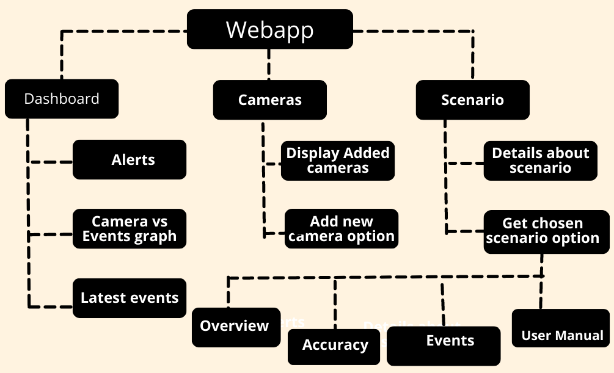
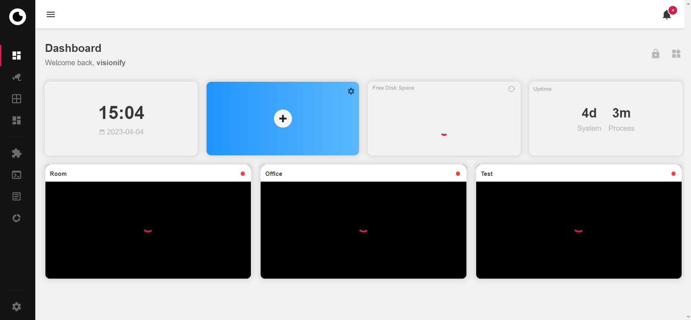
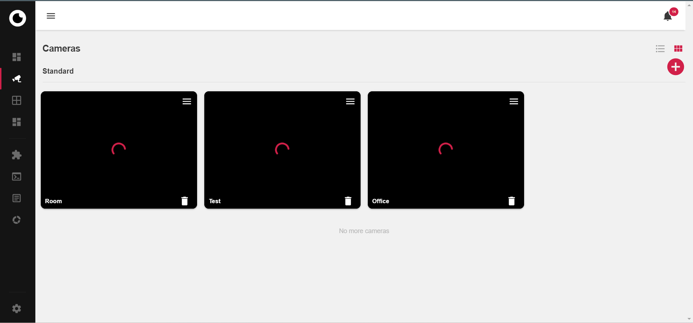
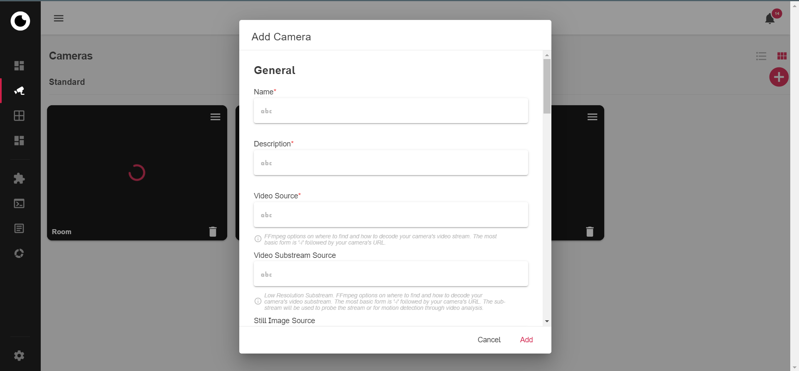
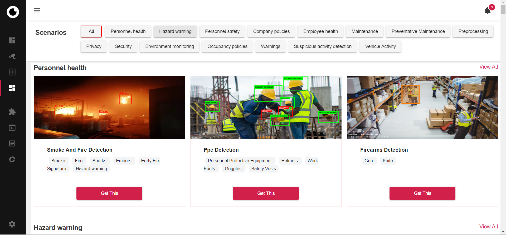
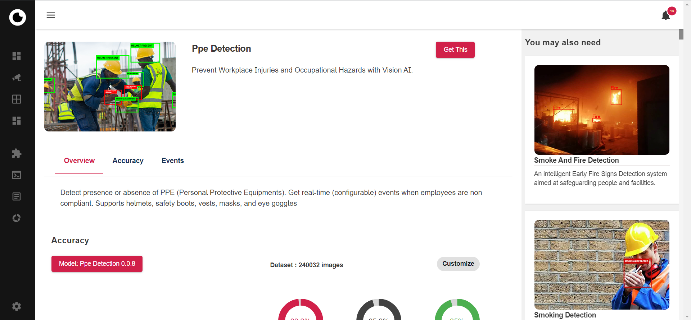
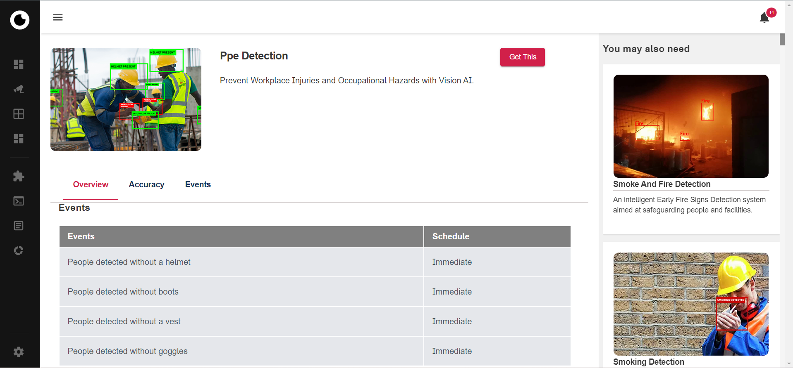

# VisionAI Web-app
> VisionAI web-app is a software application that runs in a web browser. It is designed to provide a user-friendly interface and functionality that can be accessed from any device with an intpernet connection, without the need for installation on the device.

The web-app primarily consists of parts including Dashboard, Cameras and Scenarios as shown below:

The main screen that appears when you open web-app is:

Let us see each of these parts in detail.

- Dashboard: Visionai Webapp's dashboard is a graphical user interface that displays important information about latest events in the right pane of the screen. It shows metrics such as total camera added, active camera, alerts generated on daily basis and available scenarios. It also presents a graph showing camera versus events triggered. This Dashboard's data analytics will help managers, analysts, or decision-makers quickly assess the performance and make informed decisions.

- Cameras:
 Cameras screen shows detailed information about added camera in the app. 
 
  It also has an option to add any new camera by providing its details such as:

 
- Scenario: Scenario page provides information about different scenarios available and added camera instance can be connect with these scenarios.

To get particular scenario in use, click on get this. It will open the following window:

Here, we can find detailed information about these scenarios such as their accuracy metrics, events generated and user manual for guided instructions.

