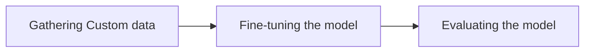

# Retraining

> We offer retraining of models, as we have a well-defined process for working with clients, which could include steps such as data collection and labeling, model fine-tuning, and evaluation. We also have a strong infrastructure in place to support the processing and analysis of large volumes of data.

Retraining steps would be:

## Overview
Retraining of computer vision models refers to the process of updating a pre-trained model with additional data or new labels. This is often done to improve the performance of a model or to adapt it to a new task or application.

The process of retraining a computer vision model typically involves the following steps:

- Collecting new data: This involves gathering new images or video data that is relevant to the new task or application.

- Labeling the data: The new data needs to be labeled to provide the model with the correct information about what is in the images. We have a dedicated team of annotators to accomodate this.

- Fine-tuning the model: The pre-trained model is then fine-tuned on the new labeled data. This involves adjusting the model's parameters to better fit the new data and labels.

- Evaluating the model: The retrained model is then evaluated to determine how well it performs on the new task or application.

Our team  is up-to-date with the latest techniques and best practices in the field, as well as the ethical and legal considerations related to working with sensitive data. 
They have a good understanding of the principles of computer vision and machine learning, as well as the specific requirements of the application, to ensure the retraining process is successful.

