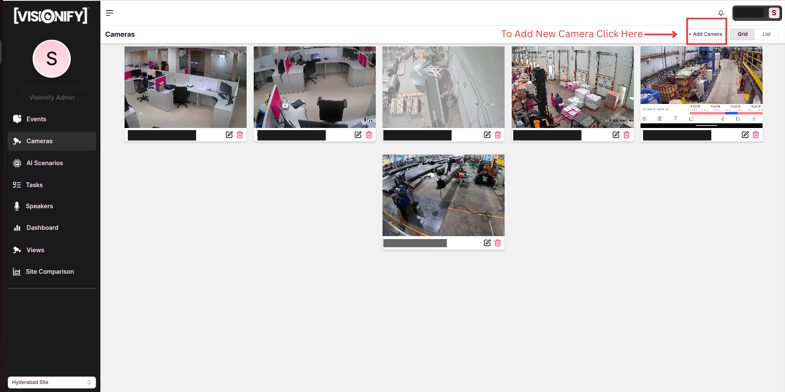
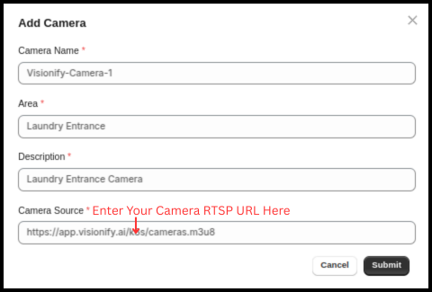
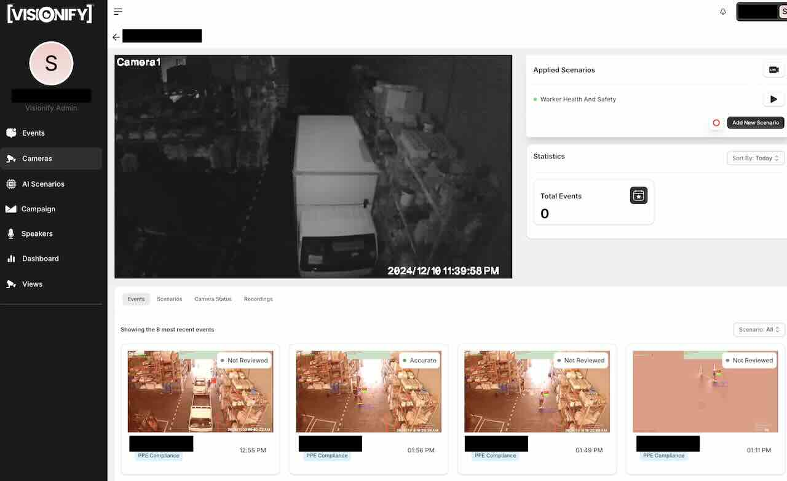
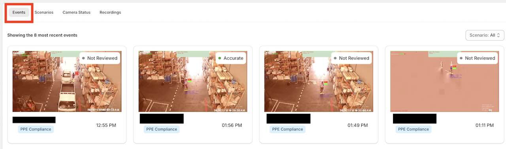
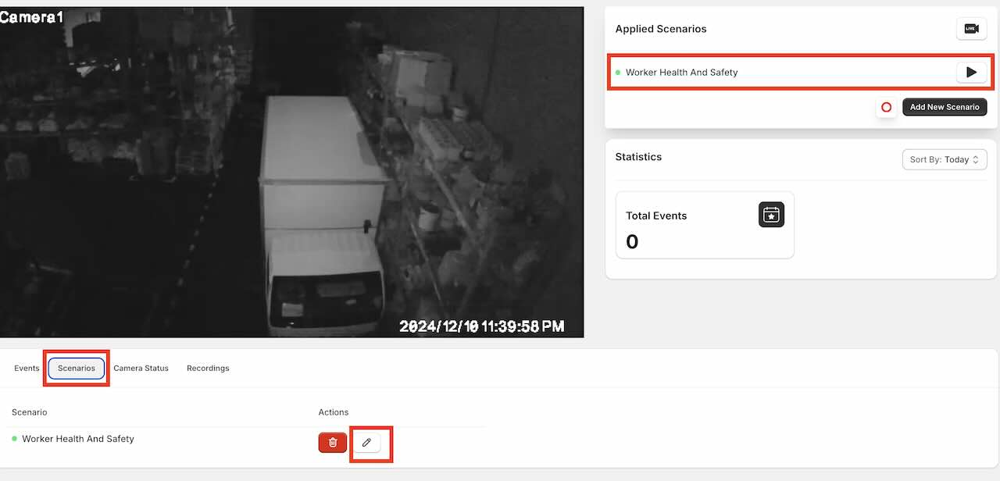
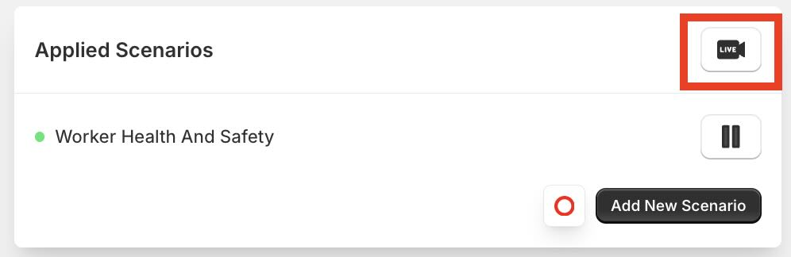
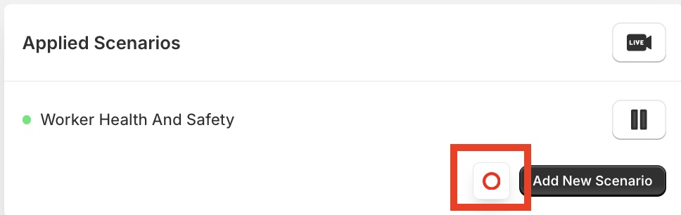
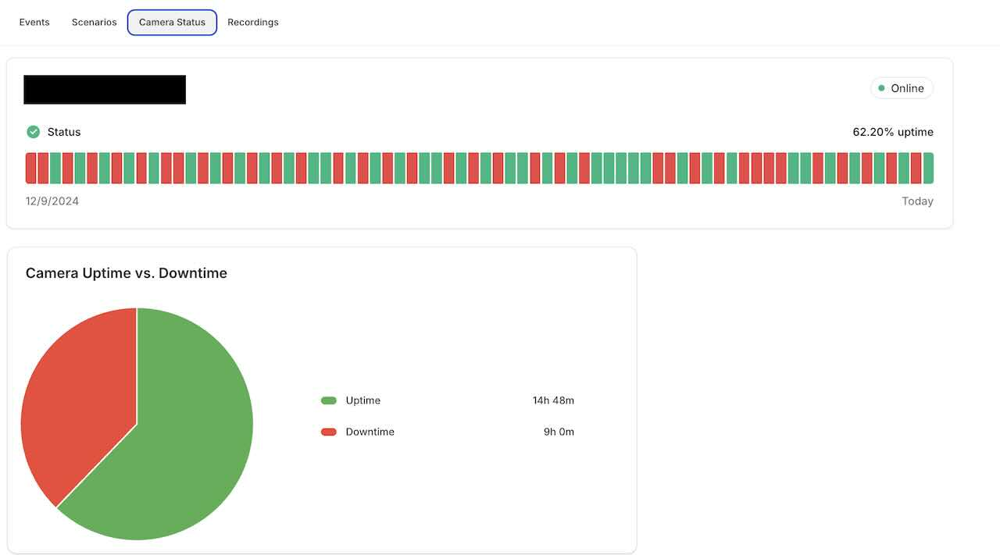
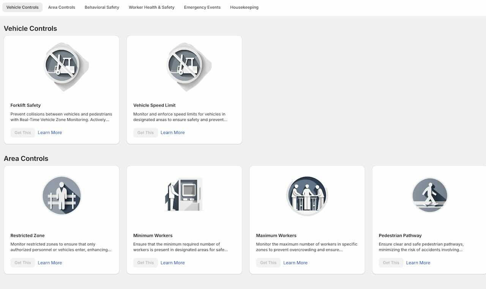

# Cameras

    <a href="#supported-cameras" class="flow-item">
        
1

        videocam
        <h3>Supported Cameras</h3>
        
View compatible IP cameras and required specifications

    </a>
    
    <a href="#adding-cameras" class="flow-item">
        
2

        add_circle
        <h3>Adding Cameras</h3>
        
Learn how to add and configure new cameras

    </a>
    
    <a href="#camera-details" class="flow-item">
        
3

        info
        <h3>Camera Details</h3>
        
View and manage camera information

    </a>
    
    <a href="#camera-scenarios" class="flow-item">
        
4

        view_agenda
        <h3>Scenarios</h3>
        
Configure detection scenarios for each camera

    </a>

    
    <a href="#camera-events" class="flow-item">
        
5

        event
        <h3>Events</h3>
        
View and manage detected events

    </a>
    
    <a href="#livestream" class="flow-item">
        
6

        live_tv
        <h3>Livestream</h3>
        
Access real-time camera feeds

    </a>
    
    <a href="#recording" class="flow-item">
        
7

        record_voice_over
        <h3>Recording</h3>
        
Configure and manage video recordings

    </a>
    
    <a href="#camera-removal" class="flow-item">
        
8

        delete
        <h3>Remove Camera</h3>
        
Learn how to remove cameras from the system

    </a>

## Supported Cameras {#supported-cameras}

VisionAI supports a wide range of IP cameras including:

- ONVIF-compliant IP cameras
- RTSP stream cameras
- HTTP stream cameras
- USB cameras (when connected to edge device)
- LTE Network Cameras

Please refer to [Supported Cameras Guide](../overview/finding-rtsp-urls.md) for more details on supported cameras. Regardless of the camera type, the following are the minimum requirements:

- Resolution: 1080p (1920x1080)
- Frame rate: 20 fps
- Intranet bandwidth per camera: 2MBPS
- Protocol support: RTSP, ONVIF, or HTTP
- Network connectivity: Ethernet, WiFi or LTE

## Adding Cameras {#adding-cameras}

Connecting your cameras to VisionAI is straightforward. Follow these steps to integrate your existing camera infrastructure:

    

        
        

            <h4>1. Go to Cameras Page</h4>
            
Navigate to the Cameras page from the main dashboard. Here you'll see all your connected cameras and their status.

        

    

    

        
        

            <h4>2. Add New Camera</h4>
            
Click on the "Add Camera" button to begin the integration process. VisionAI supports IP cameras, CCTV systems, and NVR/DVR setups.

        

    

    

        
        

            <h4>3. Provide Camera Details</h4>
            
Enter your camera details including name, RTSP URL, and location. Test the connection to ensure proper setup before saving.

        

    

!!! note
    1. Test your Camera RTSP URL to make sure it is playing. You can test it using [VLC Player](https://www.videolan.org/vlc/index.html).
    2. Initially, you will see a blank screen for camera. The screenshot for the camera will update once the camera is connected.

## Camera Details {#camera-details}

You can click on any camera to view its details.

    

        
        

            <h4>1. Click on a Camera</h4>
            
Click on a camera to view its details. The camera details page will show the status of the camera, the AI scenarios applied to the camera, recent events, livestream options, recording options and more.

        

    

    

        
        

            <h4>2. View Recent Events</h4>
            
On the camera details page - we show the last 8 events for the camera. We also show the total number of events in the last 24hrs, 7 days, or 30 days. To dig more into events, you can visit the Events page.

        

    

    

        
        

            <h4>3. View/Edit AI Scenarios</h4>
            
View or Edit the AI scenarios configured for the camera. Currently applied scenarios are highlighted on the right.

        

    

    

        
        

            <h4>4. View Livestream</h4>
            
Click on the view live-stream button to view the live-inference view of the camera.

        

    

    

        
        

            <h4>5. Record Inference Video</h4>
            
Record live inference video from the camera. The recorded video is available under the Recordings tab.

        

    

    

        
        

            <h4>6. View Camera Status</h4>
            
Sometimes cameras might not be streaming. This page will show you the status of the camera.

        

    

## Camera Scenarios {#camera-scenarios}

You can configure scenarios from the camera details page. 

    

        
        

            <h4>1. View/Edit AI Scenarios</h4>
            
Camera Details page shows all the AI scenarios avaialble for the camera. You can add a new scenario by clicking the "Add Scenario" button.

        

    

    

        
        

            <h4>2. Add AI Scenario</h4>
            
Adding AI scenario is a 3 step process. First, you select the scenario. We support a wide variety of scenarios. Once you click on Get this - it will walk you through setting up zones & detection parameters for the scenario.
        

    

## Camera Events {#camera-events}

Most recent 8 events for the camera are shown on the camera details page. You can view details about each event by clicking on the event. For filtering/sorting events from all cameras - please visit the Events page.

    

        
        

            <h4>1. Click on a Camera</h4>
            
Click on a camera to view its details. The camera details page will show the status of the camera, the AI scenarios applied to the camera, recent events, livestream options, recording options and more.

        

    

    

        
        

            <h4>2. View Recent Events</h4>
            
On the camera details page - we show the last 8 events for the camera. We also show the total number of events in the last 24hrs, 7 days, or 30 days. To dig more into events, you can visit the Events page.

        

    

## Livestream {#livestream}

Livestream allows you to access real-time camera feeds from the camera. We support inference live-stream - that way you can see what we are inferencing in real-time:

    

        
        

            <h4>View Livestream</h4>
            
Click on the view live-stream button to view the live-inference view of the camera.

        

    

## Recording {#recording}

Recording feature allows to record 10 minutes of video. Just click on the record video button at the right corner of the camera details page.

    

        
        

            <h4>Record Video</h4>
            
Click on the record video button at the right corner of the camera details page. The recorded video is available under the Recordings tab.

        

    

## Camera Removal {#camera-removal}

To remove a camera from the system, you can navigate to Camera Listing Page. From here, you see an option to remove the camera.

!!! note "Data Retention"
    Camera removal doesn't automatically delete historical data. Configure data retention policies separately.

---

## Next Steps

- [Quick Start](../overview/quick-start.md)
- [Camera Placement Guide](../overview/camera-placement-guide.md)
- [Supported Scenarios](../overview/scenarios.md)
- [Camera Management](../overview/cameras.md)
- [FAQs](../overview/faqs.md)

---

## Contact Information

    

        <h3>contact_phone Sales Inquiries</h3>
        
Get in touch with our sales team for demos and pricing information.

        <ul class="contact-list">
            <li>Email: <a href="mailto:sales@visionify.ai">sales@visionify.ai</a></li>
            <li>Phone: +1 720-449-1124</li>
        </ul>
    

    

        <h3>support_agent Technical Support</h3>
        
Need help? Visit our support portal or contact our technical team.

        <ul class="contact-list">
            <li><a href="https://support.visionify.ai">https://support.visionify.ai</a></li>
            <li><a href="mailto:support@visionify.ai">support@visionify.ai</a></li>
        </ul>
    

    

        <h3>calendar_month Schedule a Demo</h3>
        
See VisionAI in action with a personalized demo from our team.

        

            <a href="https://cal.com/visionify/30min" class="cta-button">
                event
                Book Your Demo
            </a>
        

    

    <a href="#" class="back-to-top-button">
        arrow_upward
    </a>

---