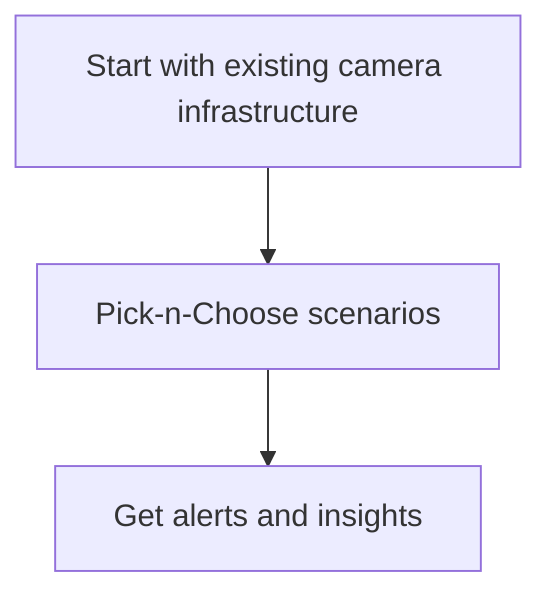

## **VisionAI**

The VisionAI application monitors employee activity, environment, and equipment in real-time. It uses cameras, sensors and other tools to detect any unsafe conditions or practices. The VisionAI application can also detect any hazardous materials or substances present in the workplace and alert the appropriate personnel.

With VisionAI toolkit employers can reduce risks and improve safety for their employees.

Workplace safety is an important issue in any business, and having a comprehensive workplace safety application can help to ensure the safety of employees, customers, and visitors. An effective safety application should be designed to integrate with existing security camera infrastructure, provide a wide range of scenarios to run, and enable users to configure their own alerting system. VisionAI toolkit is designed to meet these requirements.

VisionAI toolkit works in the following 3 simple steps:

## Existing camera infrastructure
The first step is getting started with your existing security camera infrastructure.
CCTV cameras should be located in all parts of the building, including high-traffic areas, exits, and entrances, as well as any areas that may be considered to be at higher risk. Having a comprehensive view of the building’s layout will enable the safety application to detect any potential safety hazards, such as intruders, or suspicious activities.

## Pick-n-Choose scenarios
Once the security camera infrastructure is in place, users can then pick-n-choose the scenarios they would like the application to run. These might include the detection of people entering restricted areas, slip-and-fall, or the monitoring of activity in high-risk areas. Furthermore, the application can raise alerts when certain activities are taking place, such as a person loitering in a particular area, or a large group gathering in a restricted area.

## Get alerts and insights
Finally, users can configure their alerting system within the web-app. This can include email notifications, text messages, or even automated messages sent to the relevant authorities. Users can also set the parameters for when the alert should be triggered, such as when the number of people in a certain area exceeds a certain threshold, or when a particular activity is detected.

In summary, having a comprehensive workplace safety application in place is essential for any business. Integrating the application with existing security camera infrastructure will enable users to detect any potential safety hazards, while setting up the right scenarios and alerting system will ensure that the safety application is always functioning as it should. With the right workplace safety application in place, businesses can enjoy peace of mind, knowing that their employees, customers, and visitors are safe and secure.
