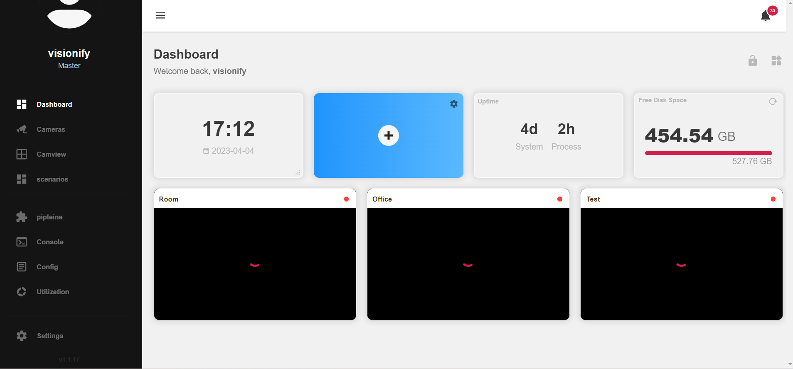
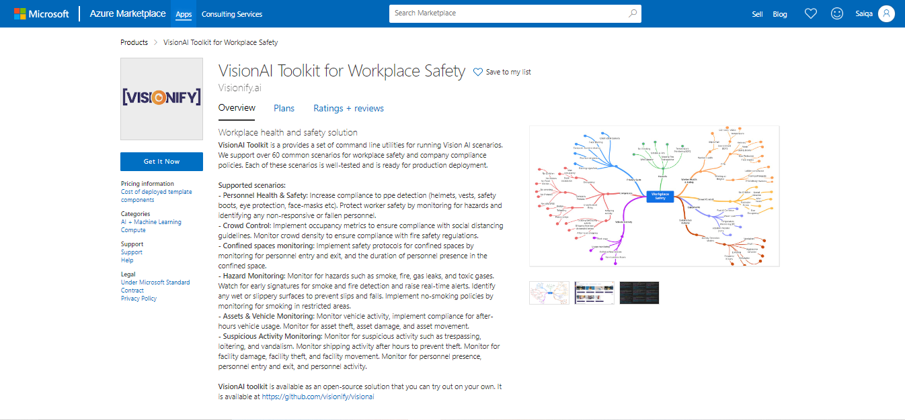

# Next steps
> This provides a comprehensive guideline for the VisionAI toolkit's access path.

-  ## Install the application
    To test this model & scenario, you can use the following steps:

     * Install the visionai package from PyPI
        
        ```console
        $ pip install visionai
       
        ```
        Test the scenario from your local web-cam by mentioning scenario name

        
        ```console
        $ visionai scenario test [OPTIONS] NAME
        ```

        **Arguments**:

        * `NAME`: [required]

        
        NAME can be any of the scenarios integrated in VisionAI
        

        - Example

        ```console
        $ visionai scenario test ppe-detection
        
        Downloading models for scenario: ppe-detection
        Model: ppe-detection: https://workplaceos.blob.core.windows.net/models/yolov5s-people/yolov5s-people-0.0.4.zip
        
        
        Starting scenario: ppe-detection..
        ```
        
        You should be able to see the events generated on your console window with the detections of safety gloves, goggles, helmet, mask, safety-shoes and vest within the camera field of view.
    

-  ## Access the visionAI Web-app
    
    VisionAI web-app, a software application that runs in a web browser and designed to provide a user-friendly interface and functionality that can be accessed from any device with an internet connection, without the need for installation on the device. It can be accessed by [here](https://webapp-msejccxdwi33c.azurewebsites.net/).

    The app has built-in functionality to accomodate different scenarios and wide range of camera instances.
    
    
    
    

-  ## Access the Azure Managed-app

    The VisionAI Azure Managed application is intended to provide customers with a quick and secure way to deliver applications and services while maintaining consistency and control.

    VisionAI Azure App is accessible by logging into **Azure Market Place**.
    
    
    The appeared screen shows its Overview, different plans and ratings. To access it, click on **Get it Now** and follow the sequence of steps. 

    Find more details about these sections [here](azure-managed-app.md).

In summary, the VisionAI toolkit is accessible via direct installation, web-app, and Azure managed app. This makes it more adaptable and dynamic.


    

