# Quick Start Guide

VisionAI is an enterprise-grade computer vision platform that transforms your existing camera infrastructure into an intelligent workplace safety system. This guide will walk you through the setup process and help you get started with your first safety monitoring deployment.

    <a href="#step-1-account-setup" class="flow-item">
        1
        login
        <h3>Sign In</h3>
        
Create your enterprise account and set up team access

    </a>
    <a href="#step-2-camera-integration" class="flow-item">
        2
        videocam
        <h3>Cameras</h3>
        
Connect your existing camera infrastructure

    </a>
    <a href="#step-3-scenario-configuration" class="flow-item">
        3
        settings_suggest
        <h3>AI Scenarios</h3>
        
Select and customize safety monitoring scenarios

    </a>
     <a href="#step-4-scenario-configuration" class="flow-item">
        4
        settings_suggest
        <h3>Tasks</h3>
        
Detailing the tasks assigned, their progress, and recommendations for improvement

    </a>
    <a href="#step-5-scenario-configuration" class="flow-item">
        5
        settings_suggest
        <h3>Views</h3>
        
It allows administrators to create custom views that provide a structured way to monitor surveillance data efficiently

    </a>
    <a href="#step-6-alert-configuration" class="flow-item">
        6
        notifications_active
        <h3>Alerts</h3>
        
Set up notifications and response workflows

    </a>
     <a href="#step-7-scenario-configuration" class="flow-item">
        7
        settings_suggest
        <h3>Sites for Comparison</h3>
        
This report provides a summary of site comparison insights

    </a>
    <a href="#step-8-dashboard-access" class="flow-item">
        8
        dashboard
        <h3>Dashboard</h3>
        
Monitor safety metrics in real-time

    </a>

---

## Prerequisites
- Active enterprise subscription or trial account. [Contact Sales](https://visionify.ai/contact).
- Access to your organization's CCTV/camera infrastructure.
- RTSP URLs for your cameras. You can test RTSP URLs using [VLC Player](https://www.videolan.org/vlc/).

---

## Step 1: Sign In {#step-1-account-setup}

Getting started with VisionAI is simple. Here's how to activate your enterprise account:

    

        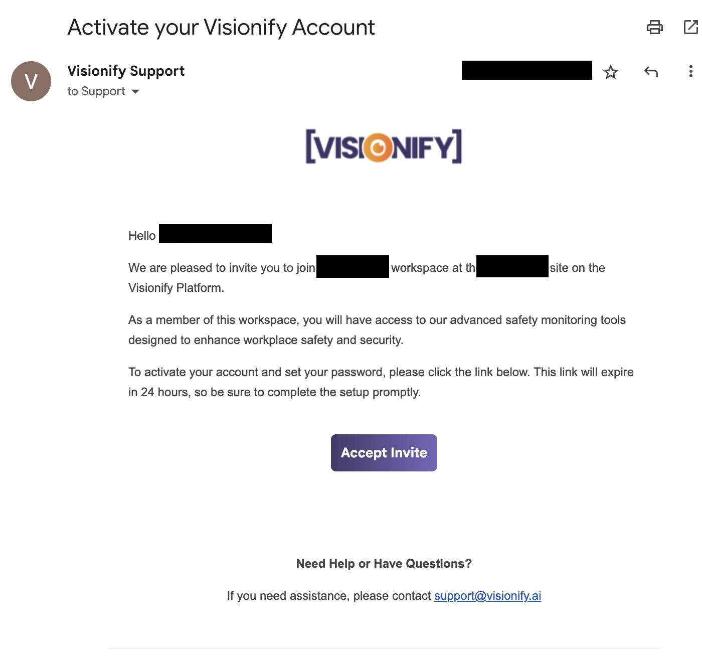
        

            <h4>1. Activate Your Account</h4>
            
Once you've signed up for enterprise account, you will receive an activation email from Visionify team. Accept the invite from email & activate the account. Set your own password here.

        

    

    

        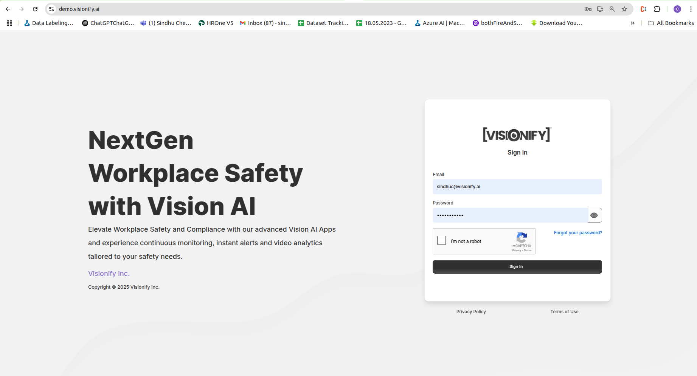
        

            <h4>2. Sign In</h4>
            
Login with your username & password.

        

    

    

        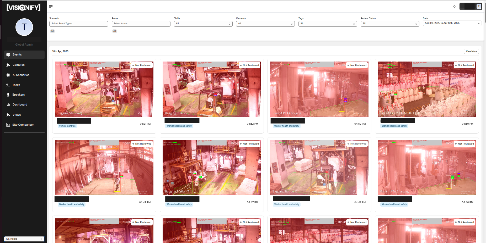
        

            <h4>3. Access Dashboard</h4>
            
You will be directed to events dashboard page.

        

    

---

## Step 2: Camera Onboarding {#step-2-camera-integration}

Connecting your cameras to VisionAI is straightforward. Follow these steps to integrate your existing camera infrastructure:

    

        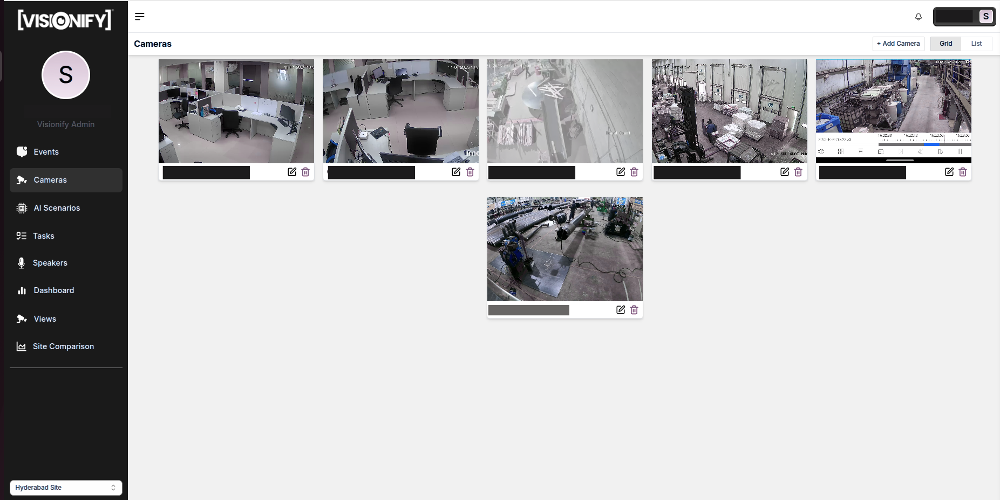
        

            <h4>1. Go to Cameras Page</h4>
            
Navigate to the Cameras page from the main dashboard. Here you'll see all your connected cameras and their status.

        

    

    

        
        

            <h4>2. Add New Camera</h4>
            
Click on the "Add Camera" button to begin the integration process. VisionAI supports IP cameras, CCTV systems, and NVR/DVR setups.

        

    

    

        
        

            <h4>3. Provide Camera Details</h4>
            
Enter your camera details including name, RTSP URL, and location. Test the connection to ensure proper setup before saving.

        

    

!!! note
    1. Test your Camera RTSP URL to make sure it is playing. You can test it using [VLC Player](https://www.videolan.org/vlc/index.html).
    2. Initially, you will see a blank screen for camera. The screenshot for the camera will update once the camera is connected.

---

## Step 3: Configuring Safety Monitoring Scenarios

Setting up safety monitoring scenarios in VisionAI is straightforward. Follow these steps to configure your first scenario:

    

        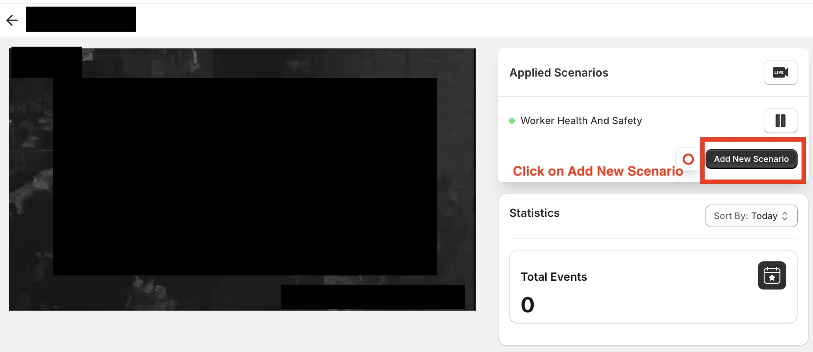
        

            <h4>1. Initiate Scenario Setup</h4>
            
On the camera details page, click the "Add New Scenario" button to start configuring safety monitoring for your camera.

        

    

    

        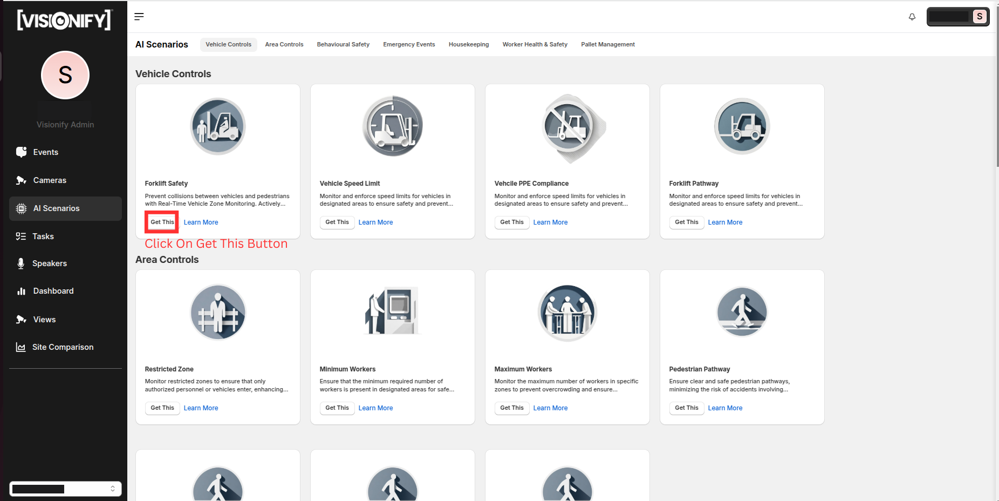
        

            <h4>2. Select a Scenario</h4>
            
Browse through available safety scenarios and select the one that fits your needs by clicking "Get This." Each scenario is tailored to specific safety monitoring requirements.

        

    

    

        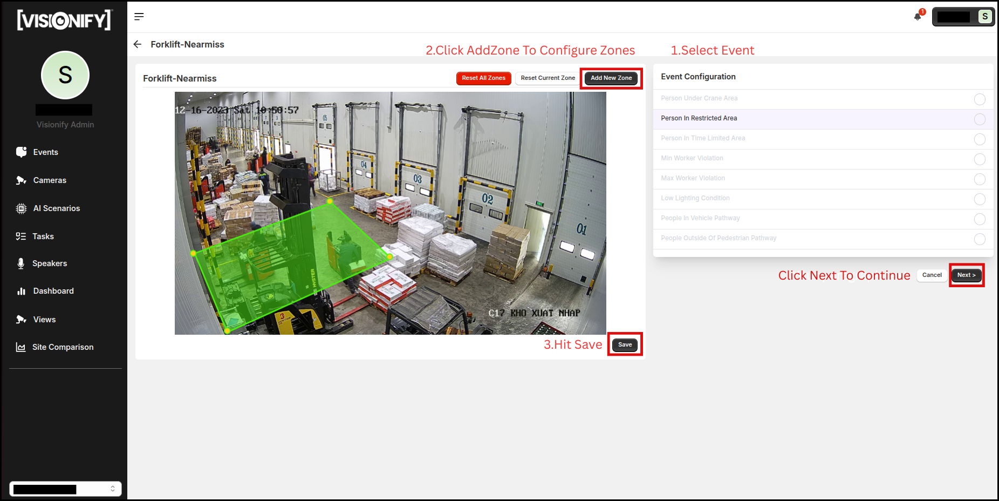
        

            <h4>3. Set Up Monitoring Zones</h4>
            
Define the zones you want to monitor by drawing and adjusting them directly on your camera feed for precise safety monitoring.

        

    

    
    

        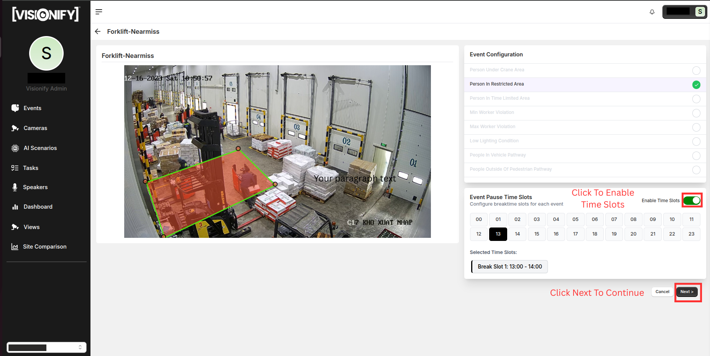
        

            <h4>4. Configure Event Pause Time Slots</h4>
            
Use the Event Pause Time Slots feature to set break periods when event detection is paused, preventing unnecessary alerts during scheduled downtimes like lunch breaks or maintenance.

        

    

    

        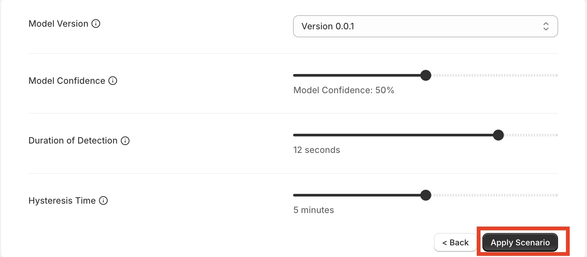
        

            <h4>5. Fine-tune Settings</h4>
            
Adjust parameters such as model confidence thresholds and event duration to meet your safety requirements. Once satisfied, click "Apply" to activate the scenario.

        

    

!!! tip
    Start with the default parameters and adjust them later based on the specific needs of your environment. These settings can always be modified at any time.

---

## Step 4: Alert Configuration {#step-4-alert-configuration}

Configure comprehensive notification settings through your dedicated observability platform at `customername.visionify.ai/observability`. VisionAI offers multiple alert types to ensure your team stays informed of safety events:

    

        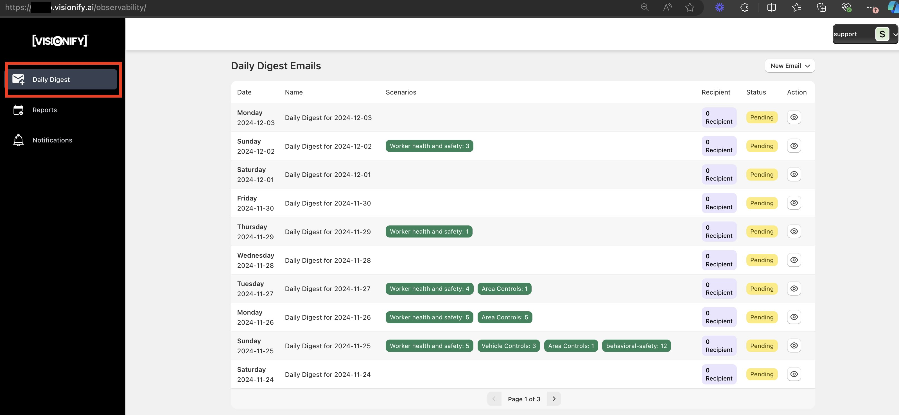
        

            <h4>1. Daily Digest Emails</h4>
            
Set up automated daily summaries of safety events, incidents, and compliance metrics. Perfect for management oversight and trend analysis.

        

    

    

        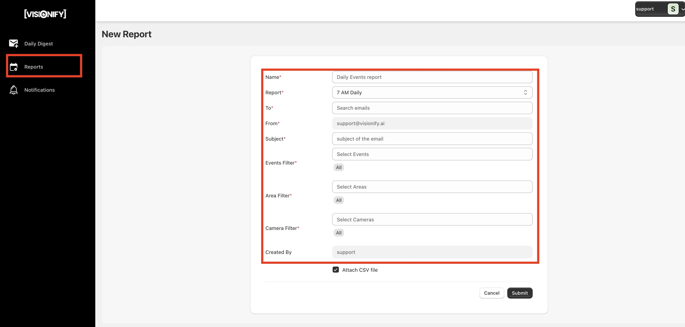
        

            <h4>2. Periodic Reports</h4>
            
Schedule detailed reports with CSV attachments, delivered via email or Microsoft Teams. Customize reports by area, camera, or specific event types for targeted insights.

        

    

    

        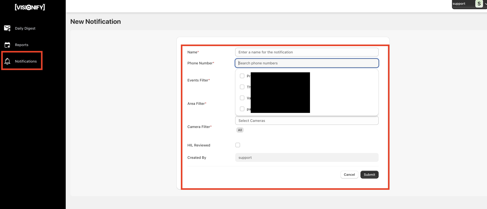
        

            <h4>3. Text Message Alerts</h4>
            
Enable real-time SMS notifications for immediate awareness of critical safety events. Ideal for urgent situations requiring immediate attention.

        

    

    

        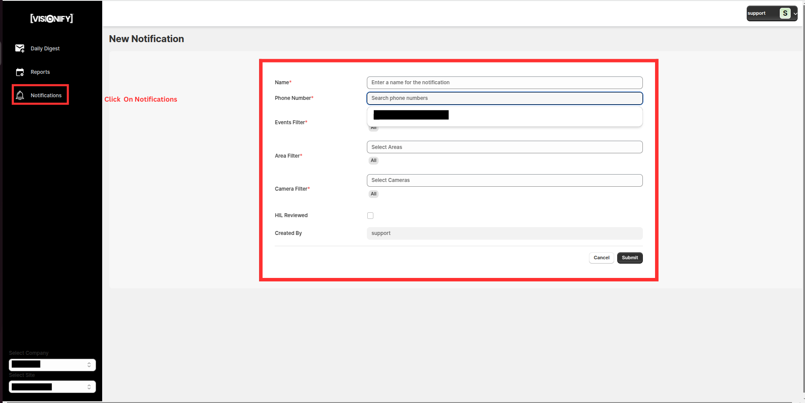
        

            <h4>3. Whatsapp Message Alerts</h4>
            
Enable real-time Whatsapp notifications for immediate awareness of critical safety events. Ideal for urgent situations requiring immediate attention.

        

    

    

        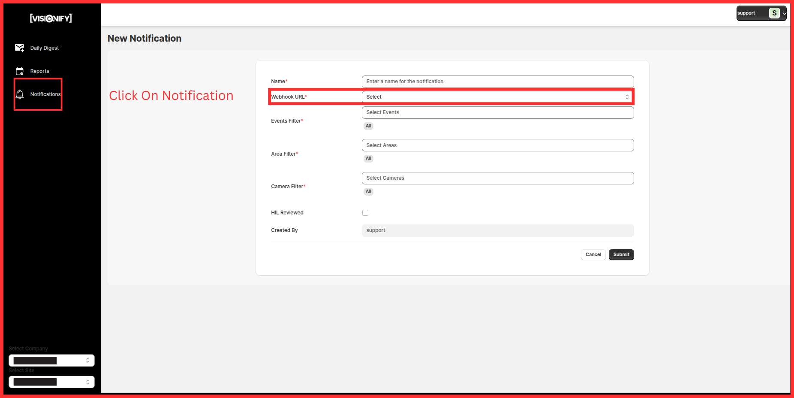
        

            <h4>3. Teams Alerts</h4>
            
Enable real-time Teams notifications for immediate awareness of critical safety events. Ideal for urgent situations requiring immediate attention.

        

    

        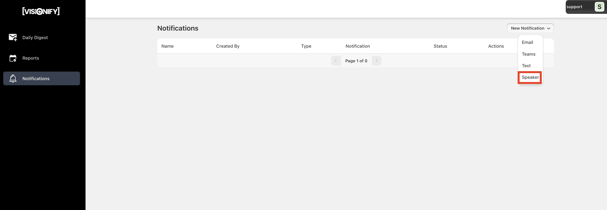
        

            <h4>4. Speaker Based Alerts</h4>
            
Configure automated audio announcements for real-time safety notifications in your facility. Perfect for immediate on-site response to safety events.

        

    

!!! tip
    Combine multiple alert types for comprehensive coverage. For example, use speaker alerts for immediate on-site response, while keeping management informed through daily digests and periodic reports.

---

## Step 5: Dashboard Access {#step-5-dashboard-access}

The VisionAI dashboard provides comprehensive insights into your safety metrics and events. Here's how to navigate and utilize the dashboard effectively:

    

        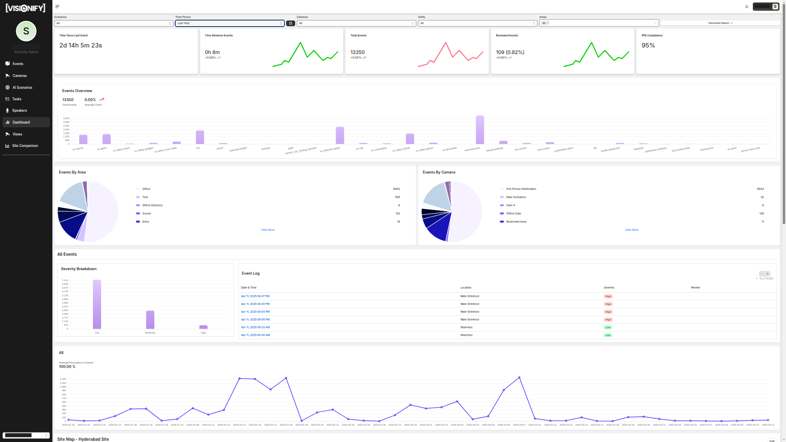
        

            <h4>1. Safety Metrics Overview</h4>
            
Access the Dashboard from the left navigation menu to view key safety metrics. Select custom time ranges to analyze trends across weeks, months, or specific date ranges. Track compliance rates, incident counts, and safety improvements over time.

        

    

    

        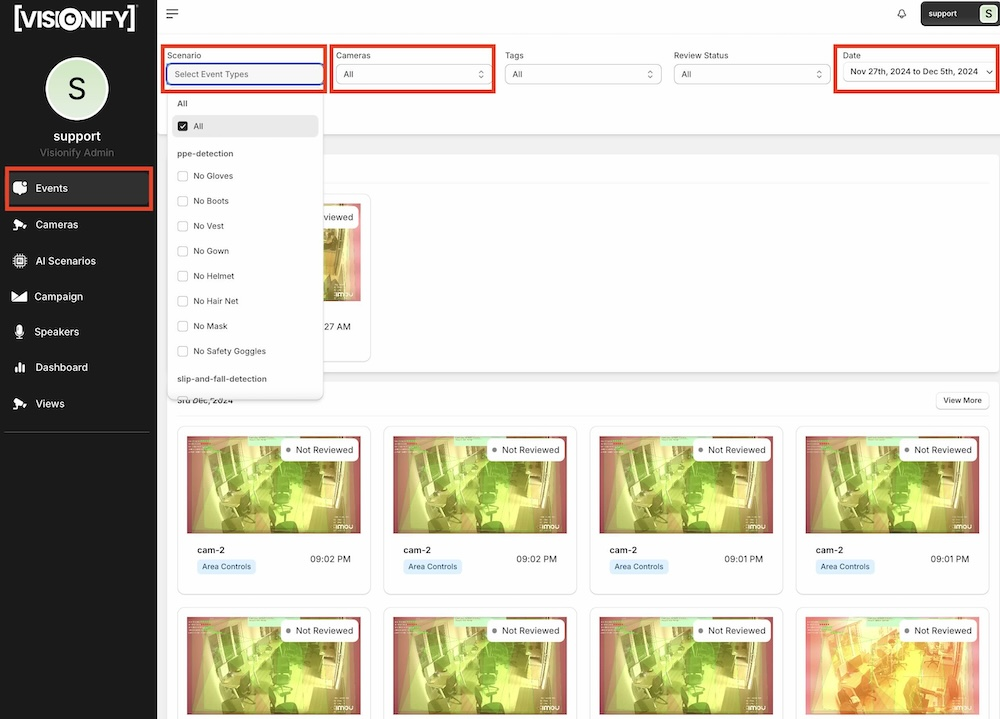
        

            <h4>2. Events Listing</h4>
            
Navigate to the Events page to review specific safety incidents. Filter events by time range, scenarios, event types, or specific cameras & Area Wise ,Shift Wise. Each event includes a 12-second video clip for detailed investigation and analysis.

        

    

    

        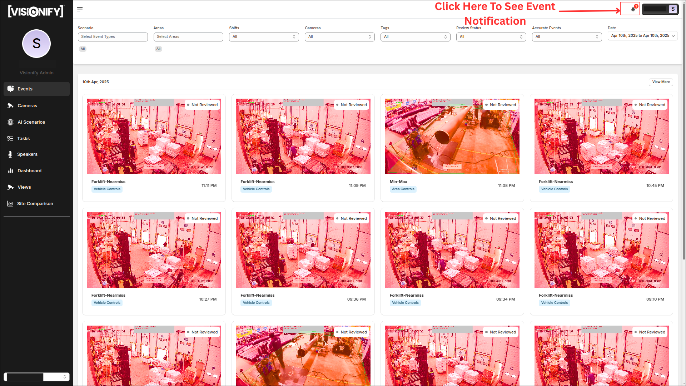
        

            <h4>2. Events Listing</h4>
            
The Notification Bell Icon is located at the top-right corner of the application.It provides real-time alerts for important event notifications. When a new event is triggered detection, a visual indicator appears on the bell icon, and a notification is displayed with an optional speaker sound alert to grab the user's attention. Clicking the bell icon opens a dropdown list of recent notifications with relevant timestamps and details.

        

    

        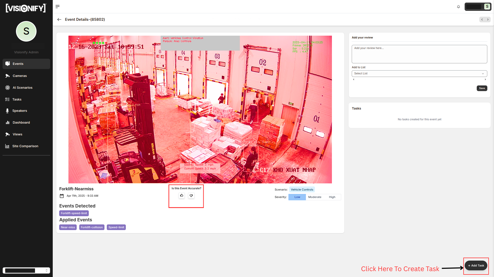
        

            <h4>3. Event Details</h4>
            
On the event details page, you can view a 12-second video clip of the event. You can click thumbs up/down to vote on the event. You can also add the event to add task to assigne to improved safety compliance.

        

    

!!! tip
    Use the dashboard's filtering capabilities to focus on specific areas or types of safety events. This helps in identifying patterns and addressing recurring safety concerns promptly.

---
## Step 6: Task Management {#step-6-Task-Management}

The VisionAI Task Management is essential to ensure work is organized, responsibilities are clear, and progress is tracked effectively within the application:

    

        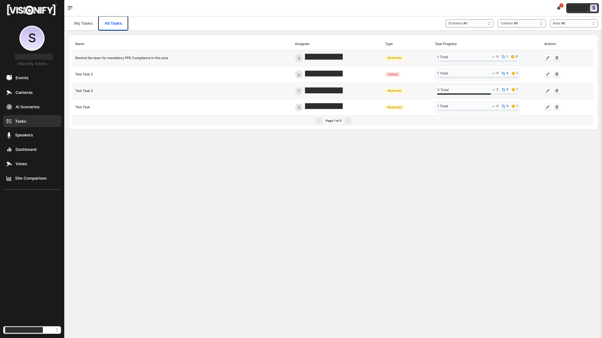
        

            <h4>Task Overview</h4>
            
Access the Dashboard from the left navigation menu to view key Task.Task Management helps users create, assign, track, and manage tasks within the application. It ensures that all work items are organized, progress is monitored, and responsibilities are clear.

        

    

    !!! tip
        Use clear titles and due dates when creating tasks to ensure easy tracking and accountability. Regularly update task statuses to keep your team informed and aligned.

 ---

## Step 7: Speaker Management {#step-7-Speakers-Management}

The VisionAI Speakers The purpose of the speaker feature is to broadcast real-time audio alerts for events, ensuring immediate awareness and response in monitored areas:

    

        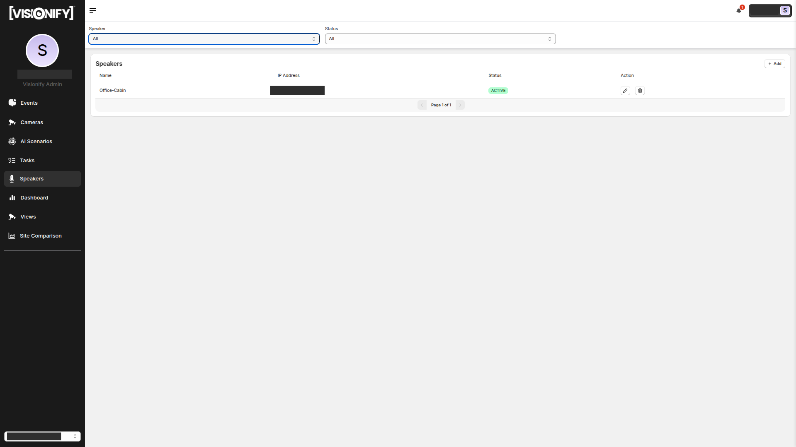
        

            <h4>Speakers Overview</h4>
            
Access the Dashboard from the left navigation menu to view key Speakers. The Speakers section allows users to add, edit, or delete speaker devices by providing their IP address, which is used to uniquely identify and communicate with each speaker over the network for delivering event-based audio alerts.

        

    

    !!! tip
        Ensure each speaker is assigned a valid and static IP address to maintain consistent connectivity and reliable delivery of real-time audio alerts during critical events.
        
 --- 
    

 ## Step 8: View Access {#step-8-View-Access}

The VisionAI Speakers The purpose of the speaker feature is to broadcast real-time audio alerts for events, ensuring immediate awareness and response in monitored areas:

    

        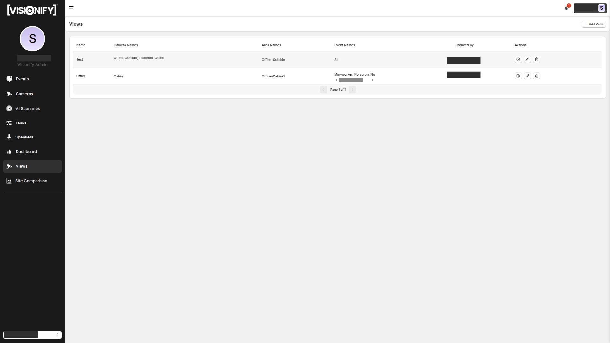
        

            <h4>Views Overview</h4>
            
Access the Dashboard from the left navigation menu to view key Views.The purpose of the Views page is to allow users to create and monitor customized event dashboards for specific cameras, areas, or events, enabling quick access to relevant incident data and performance metrics.

        

    

    !!! tip
         Create separate views for high-priority areas or event types to quickly monitor critical incidents without filtering through all data—this saves time and improves response efficiency.
    ---

## Step 9: Sites for Comparison {#step-9-Sites-Comparison}

The VisionAI The Sites for Comparison page is to enable users to analyze and evaluate safety performance across different locations, helping identify high-risk areas, improvement opportunities, and trends over time.

    

        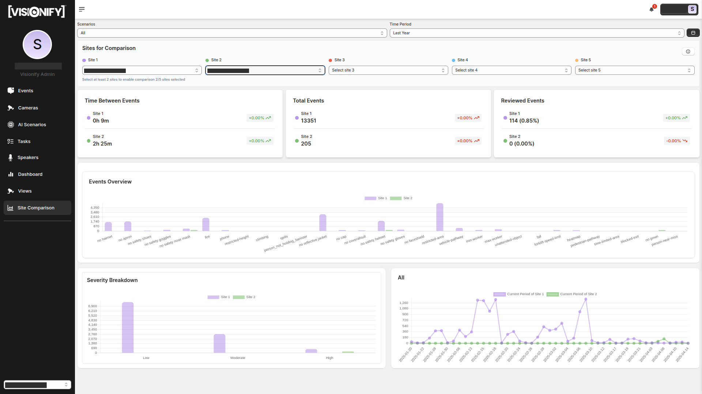
        

            <h4>Views Overview</h4>
            
Access the Dashboard from the left navigation menu to view key Sites Comparision.We can select and compare up to five sites to view key metrics such as Time Between Events, Total Events, and Reviewed Events, along with detailed charts like Events Overview and Severity Breakdown, enabling data-driven decision-making and proactive safety management..

        

    

    !!! tip
        Use the “Sites for Comparison” feature regularly to monitor underperforming locations—tracking metrics like time between incidents and reviewed event rates can help prioritize safety audits and training efforts effectively.
        
    ---

    
    

## AI Scenarios

- [PPE Compliance](../scenarios/ppe-detection.md)
- [Staircase Safety](../scenarios/staircase-safety.md)
- [Mobile Phone Compliance](../scenarios/mobile-phone-compliance.md)

## Learn More

- [Quick Start](../overview/quick-start.md)
- [Camera Placement Guide](../overview/camera-placement-guide.md)
- [Supported Scenarios](../overview/scenarios.md)
- [Camera Management](../overview/cameras.md)
- [FAQs](../overview/faqs.md)

---

## Contact Information

    

        <h3>contact_phone Sales Inquiries</h3>
        
Get in touch with our sales team for demos and pricing information.

        <ul class="contact-list">
            <li>Email: <a href="mailto:sales@visionify.ai">sales@visionify.ai</a></li>
            <li>Phone: +1 720-449-1124</li>
        </ul>
    

    

        <h3>support_agent Technical Support</h3>
        
Need help? Visit our support portal or contact our technical team.

        <ul class="contact-list">
            <li><a href="https://support.visionify.ai">https://support.visionify.ai</a></li>
            <li><a href="mailto:support@visionify.ai">support@visionify.ai</a></li>
        </ul>
    

    

        <h3>calendar_month Schedule a Demo</h3>
        
See VisionAI in action with a personalized demo from our team.

        

            <a href="https://cal.com/visionify/30min" class="cta-button">
                event
                Book Your Demo
            </a>
        

    

---