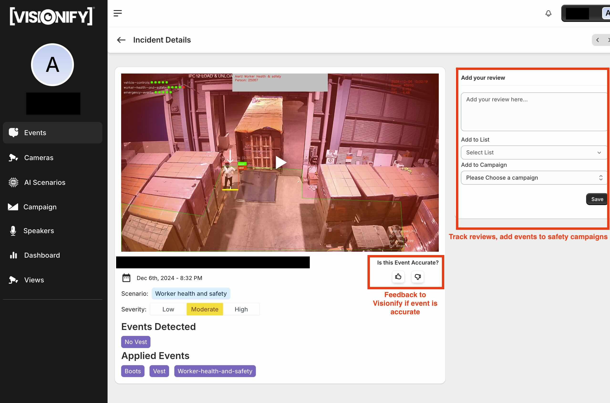

# Quick Start Guide

VisionAI is an enterprise-grade computer vision platform that transforms your existing camera infrastructure into an intelligent workplace safety system. This guide will walk you through the setup process and help you get started with your first safety monitoring deployment.

    <a href="#step-1-account-setup" class="flow-item">
        1
        login
        <h3>Sign In</h3>
        
Create your enterprise account and set up team access

    </a>
    <a href="#step-2-camera-integration" class="flow-item">
        2
        videocam
        <h3>Cameras</h3>
        
Connect your existing camera infrastructure

    </a>
    <a href="#step-3-scenario-configuration" class="flow-item">
        3
        memory
        <h3>AI Scenarios</h3>
        
Select and customize safety monitoring scenarios

    </a>
    <a href="#step-4-events-dashboard" class="flow-item">
        4  
        view_agenda
        <h3>Events</h3>
        
Select and customize safety monitoring scenarios

    </a>
     <a href="#step-5-task-Management" class="flow-item">
        5
        list_alt_check
        <h3>Tasks</h3>
        
Detailing the tasks assigned, their progress, and recommendations for improvement

    </a>

    <a href="#step-6-view-access" class="flow-item">
        6
        speed_camera
        <h3>Views</h3>
        
Create custom views to monitor surveillance data efficiently

    </a>
    <a href="#step-7-alert-configuration" class="flow-item">
        7
        notifications_active
        <h3>Alerts</h3>
        
Set up notifications and response workflows

    </a>
    <a href="#step-8-dashboard-access" class="flow-item">
        8
        dashboard
        <h3>Dashboard</h3>
        
Monitor safety metrics in real-time

    </a>
     <a href="#step-9-safety-intelligence" class="flow-item">
        9
        query_stats
        <h3>Safety Intelligence</h3>
        
Multi-site analytics with portfolio overview, predictive insights, and others.

    </a>
    <a href="#step-10-recordings" class="flow-item">
        10
        video_library
        <h3>Recordings</h3>
        
Start camera recordings to review or download clips

    </a>
    <a href="#step-11-reports" class="flow-item">
        11
        summarize
        <h3>Reports</h3>
        
Generate AI-powered safety reports or build custom reports.

    </a>

---

## Prerequisites
- Active enterprise subscription or trial account. [Contact Sales](https://visionify.ai/contact).
- Access to your organization's CCTV/camera infrastructure.
- RTSP URLs for your cameras. You can test RTSP URLs using [VLC Player](https://www.videolan.org/vlc/).

---

## Step 1: Sign In {#step-1-account-setup}

Getting started with VisionAI is simple. Here's how to activate your enterprise account:

    

        
        

            <h4>1. Activate Your Account</h4>
            
Once you've signed up for enterprise account, you will receive an activation email from Visionify team.

        

    

    

        
        

            <h4>2. Password Setup</h4>
            
Accept the invite from email & activate the account. Set your own password here.

        

    

    

        
        

            <h4>3. Sign In</h4>
            
After successfully setting up your password, you should be able to log in to the Visionify dashboard using your username and password.

        

    

---

## Step 2: Camera Onboarding {#step-2-camera-integration}

Connecting your cameras to VisionAI is straightforward. Follow these steps to integrate your existing camera infrastructure:

    

        
        

            <h4>1. Go to Cameras Page</h4>
            
Navigate to the Cameras page from the main dashboard. Click on the <b>"Add Camera"</b> button to begin the integration process. VisionAI supports IP cameras, CCTV systems, and NVR/DVR setups.

        

    

    

        
        

            <h4>2. Add New Camera Details</h4>
            
Enter your camera details including name, RTSP URL, and location. Test the connection to ensure proper setup before saving.

        

    

    

        
        

            <h4>3. Cameras List</h4>
            
Here you'll see all your connected cameras along with their current status. Use the available filters on the Cameras page to view cameras by area.

        

    

!!! note
    1. Test your Camera RTSP URL to make sure it is playing. You can test it using [VLC Player](https://www.videolan.org/vlc/index.html).
    2. Initially, you will see a blank screen for camera. The screenshot for the camera will update once the camera is connected.

---

## Step 3: Configuring AI Scenarios  {#step-3-scenario-configuration}

  

    
  

  

    

      
1

      

        <h4>Initiate Scenario Setup</h4>
        
Click "Add New Scenario" on camera details page to begin configuration.

      

    

    

      
2

      

        <h4>Select a Scenario</h4>
        
Choose from available safety scenarios by clicking "Get This" button.

      

    

    

      
3

      

        <h4>Set Up Monitoring Zones</h4>
        
Draw and adjust monitoring zones directly on camera feed.

      

    

    

      
4

      

        <h4>Configure Pause Times</h4>
        
Set break periods to pause detection during scheduled downtimes.

      

    

    

      
5

      

        <h4>Fine-tune Settings</h4>
        
Adjust confidence thresholds and duration, then click "Apply".

      

    

  

!!! tip
    Start with the default parameters and adjust them later based on the specific needs of your environment. These settings can always be modified at any time.

---

## Step 4: Events {#step-4-events-dashboard}
Setting up safety monitoring scenarios in VisionAI is straightforward. Follow these steps to configure your first scenario:

    

        
        

            <h4>1. Events Listing</h4>
            
Navigate to the Events page to review specific safety incidents. Filter events by time range, scenarios, event types, or specific cameras & Area Wise ,Shift Wise. Each event includes a 12-second video clip for detailed investigation and analysis.

        

    

    

        
        

            <h4>2. Event Details</h4>
            
On the Event Details page, you can view a 12-second video clip of the event. You can click thumbs up/down to vote on the event. Additionally, you can <b>leave a review, mark the event as accurate or inaccurate</b>, and view the severity level of the event—categorized as <b>Low, Moderate, or High</b>—to better understand its criticality.

        

    

!!! tip
    Start with the default parameters and adjust them later based on the specific needs of your environment. These settings can always be modified at any time.
---

## Step 5: Tasks {#step-5-task-Management}
The VisionAI Task Management is essential to ensure work is organized, responsibilities are clear, and progress is tracked effectively within the application:

    

        
        

            <h4>Task Overview</h4>
            
Access the Dashboard from the left navigation menu to view key Task.Task Management helps users create, assign, track, and manage tasks within the application. It ensures that all work items are organized, progress is monitored, and responsibilities are clear.

        

    

!!! tip
    Use clear titles and due dates when creating tasks to ensure easy tracking and accountability. Regularly update task statuses to keep your team informed and aligned.
---

## Step 6: Views {#step-6-view-access}

The Views feature provides customized dashboards for specific cameras, areas, or events, enabling quick access to incident insights and performance metrics. Views now include a **Share** feature that generates a shareable link for any view, and a **revamped Settings panel** with granular control over display preferences and camera groupings.

    

        
        <!-- PLACEHOLDER: Replace with screenshot of Views listing page -->
        

            <h4>1. Views Overview</h4>
            
Navigate to <b>Views</b> from the left sidebar to see all saved views. Each view card shows the cameras, areas, and events it monitors. Use <b>Play</b> to open the live view, <b>Edit</b> to modify it, or <b>Delete</b> to remove it.

        

    

    

        
        <!-- PLACEHOLDER: Replace with screenshot of the revamped Settings panel -->
        

            <h4>2. Configure Settings</h4>
            
Open the <b>Settings</b> panel inside any view to configure camera groupings, event filters, display layout, and refresh intervals. Settings are saved per view for a tailored monitoring experience.

        

    

    

        
        <!-- PLACEHOLDER: Replace with screenshot of Share button and generated shareable link -->
        

            <h4>3. Share a View</h4>
            
Click the <b>Share</b> button on any view to generate a unique, shareable link. Recipients can access the view without logging in, making it easy to share with other people.

        

    

## Step 7: Notifications {#step-7-alert-configuration}
Configure alerts and digests directly from the **Notifications** page in the sidebar—no separate observability platform needed. All alert types are configured through in-app modals, and each alert includes a **Test** button to verify delivery before going live.

    

        
        <!-- PLACEHOLDER: Replace with screenshot of the Notifications sidebar page -->
        

            <h4>1. Open Notifications</h4>
            
Click <b>Notifications</b> in the left sidebar to access all alert and digest settings in one place. The page lists all configured alerts with their status, schedule, and delivery channels.

        

    

    

        
        <!-- PLACEHOLDER: Replace with screenshot of the Daily Digest configuration modal -->
        

            <h4>2. Configure Digests</h4>
            
Click <b>Add Digest</b> to open the configuration modal. Set the frequency (daily, weekly), add recipient email addresses, and select which scenarios and areas to include. Digests deliver a safety summary with trend charts and key metrics to a broader audience.

        

    

    

        
        <!-- PLACEHOLDER: Replace with screenshot of the Alert configuration modal -->
        

            <h4>3. Configure Alerts</h4>
            
Click <b>Add Alert</b> to open the alert modal. Choose the alert type—<b>Email, WhatsApp, Microsoft Teams</b>—set priority level, select cameras or areas to monitor, and add recipient contacts. Multiple alert types can be active simultaneously.

        

    

    

        
        <!-- PLACEHOLDER: Replace with screenshot of the Test button sending a sample alert -->
        

            <h4>4. Test Your Alerts</h4>
            
Use the <b>Test</b> button next to any configured alert or digest to send a sample notification immediately. This confirms delivery to the right recipients and channels before any real safety event occurs.

        

    

!!! tip
    Always use the Test feature after configuring a new alert to confirm end-to-end delivery. Combine digest emails for management summaries with real-time alerts for on-call responders.
---

## Step 8: Dashboard {#step-8-dashboard-access}
The VisionAI Dashboard provides comprehensive insights into your safety metrics and events. Here's how to navigate and utilize the dashboard effectively:

    

        
        

            <h4>Safety Metrics Overview</h4>
            
View key metrics including <b>Total Events, Reviewed Events, Accurate Events, Time Since Last Event,</b> and <b>Time Between Events</b>. Select custom time ranges to analyze trends across weeks, months, or specific date ranges. Use filters for scenarios, cameras, shifts, and areas to focus on what matters most.

        

    

        

        
        <!-- PLACEHOLDER: Replace with screenshot of Dashboard showing the Safety Score chart -->
        

            <h4>Safety Score</h4>
            
The <b>Safety Score</b> chart shows your overall safety rating as a radial gauge, color-coded by performance: <b>green (&gt;90)</b>, <b>orange (50–89)</b>, and <b>red (&lt;50)</b>. A 7-day trend line tracks whether performance is improving or regressing over the week.

        

    

!!! tip
    Monitor the Safety Score trend daily to catch regressions early. Use the area and camera filters to drill into specific locations when the score dips—this helps surface recurring incidents faster.
---

## Step 9: Safety Intelligence {#step-9-safety-intelligence}
The **Safety Intelligence** page is a multi-site analytics hub for evaluating safety performance across your entire portfolio. It goes beyond simple site comparisons to provide predictive insights, compliance audits, and segment-level breakdowns—all organized into four dedicated tabs.

    

        
        <!-- PLACEHOLDER: Replace with screenshot of Safety Intelligence Portfolio tab -->
        

            <h4>1. Portfolio Overview</h4>
            
The <b>Portfolio</b> tab shows a KPI strip (Safety Score, MTTR, and more), a <b>Site Performance Leaderboard</b> ranking all locations by safety score, a <b>Top Risks</b> panel, a <b>World Map</b> of your sites, and a <b>Time Heatmap</b> showing when incidents peak across the day and week.

        

    

    

        
        <!-- PLACEHOLDER: Replace with screenshot of Safety Intelligence Segments tab -->
        

            <h4>2. Segments</h4>
            
The <b>Segments</b> tab breaks performance down by country, region, or custom site groupings. Compare safety metrics across segments to identify geographic patterns, high-performing regions, and areas that need targeted intervention.

        

    

    

        
        <!-- PLACEHOLDER: Replace with screenshot of Safety Intelligence Predictive tab -->
        

            <h4>3. Predictive Insights</h4>
            
The <b>Predictive</b> tab uses historical incident data to forecast risk trends and surface early warning signals before incidents escalate. Use these insights to allocate safety resources proactively.

        

    

    

        
        <!-- PLACEHOLDER: Replace with screenshot of Safety Intelligence Compliance tab -->
        

            <h4>4. Compliance Audit</h4>
            
The <b>Compliance</b> tab tracks adherence to safety policies across all sites. View compliance scores per scenario, identify chronically non-compliant areas, and generate audit-ready reports for leadership or regulators.

        

    

!!! tip
    Start with the Portfolio tab for a high-level view, then use the Leaderboard to find underperforming sites. Drill into Segments to identify regional patterns, and use Predictive Insights to plan safety interventions before incidents spike.
---

    
    
<!-- 
## AI Scenarios

- [PPE Compliance](../scenarios/ppe-detection.md)
- [Staircase Safety](../scenarios/staircase-safety.md)
- [Mobile Phone Compliance](../scenarios/mobile-phone-compliance.md)

## Learn More

- [Quick Start](../overview/quick-start.md)
- [Camera Placement Guide](../overview/camera-placement-guide.md)
- [Supported Scenarios](../overview/scenarios.md)
- [Camera Management](../overview/cameras.md)
- [FAQs](../overview/faqs.md)

--- -->

## Step 10: Recordings {#step-10-recordings}
Recordings let you capture full-length video from any camera on demand. Start and stop recordings directly from the **Camera Details** page; all clips are then available on the **Recordings** page for playback, review, and deletion.

    

        
        <!-- PLACEHOLDER: Replace with screenshot of the Recording toggle button on Camera Details page -->
        

            <h4>1. Start a Recording</h4>
            
Open any camera's <b>Camera Details</b> page and scroll to the <b>Recording</b> section below the applied scenarios. Click the red record button to start capturing. The button turns solid red while recording is active. Click it again to stop. A pulsing indicator confirms the recording is live.

        

    

    

        
        <!-- PLACEHOLDER: Replace with screenshot of the Recordings listing page -->
        

            <h4>2. Browse Recordings</h4>
            
Navigate to <b>Recordings</b> in the left sidebar to see all clips in a grid layout. Filter by camera, status (<b>Completed, In Progress, Started, Stopped</b>), and date range. Each card shows a thumbnail, start time, and duration. Clips are sorted newest first.

        

    

## Step 11: Reports {#step-11-reports}
The Reports page gives you on-demand safety reports in two modes: **AI-generated** narrative reports and fully customizable **standard reports**. AI reports are written by GPT and ready in seconds; standard reports let you build a tailored data export filtered by time, scenario, area, camera, and shift.

    

        
        <!-- PLACEHOLDER: Replace with screenshot of the Reports listing page -->
        

            <h4>1. Reports Overview</h4>
            
Navigate to <b>Reports</b> in the left sidebar. The page lists all saved reports with their title, type, time range, creator, and creation date. Use the search bar to find a report by name, or filter by type: <b>Standard, AI, Weekly Toolbox Talk, Monthly Executive Summary, Insurance Risk,</b> or <b>Incident Investigation</b>. In-progress reports appear pinned at the top with a live countdown.

        

    

    

        
        <!-- PLACEHOLDER: Replace with screenshot of the AI Report drawer (e.g. Weekly Toolbox Talk) -->
        

            <h4>2. Generate an AI Report</h4>
            
Click <b>Generate New Report</b> and select an AI report type from the catalog:

            <ul>
                <li><b>Weekly Toolbox Talk</b> — 5-minute crew safety talk with real events, screenshots, and discussion questions</li>
                <li><b>Monthly Executive Summary</b> — C-suite overview with risk posture, month-over-month deltas, and recommendations</li>
                <li><b>Quarterly Insurance Risk</b> — 90-day underwriter-facing risk profile</li>
                <li><b>Incident Investigation</b> — First-pass investigation for a single event with 5-Why analysis and root cause</li>
            </ul>
            
Enter the required date or event ID in the drawer, then click <b>Generate</b>. The report is ready in 10–45 seconds.

        

    

    

        
        <!-- PLACEHOLDER: Replace with screenshot of the Report preview page with download options -->
        

            <h4>4. Preview and Download</h4>
            
The preview page shows stat cards, safety score, bar charts, pie charts, and trend lines for your selected filters. When satisfied, download as <b>Excel</b> for raw data or <b>PDF</b> for a formatted report. Both formats are saved to the Reports list for future access.

        

    

## Contact Information

    

        <h3>contact_phone Sales Inquiries</h3>
        
Get in touch with our sales team for demos and pricing information.

        <ul class="contact-list">
            <li>Email: <a href="mailto:sales@visionify.ai">sales@visionify.ai</a></li>
            <li>Phone: +1 720-449-1124</li>
        </ul>
    

    

        <h3>support_agent Technical Support</h3>
        
Need help? Visit our support portal or contact our technical team.

        <ul class="contact-list">
            <li><a href="https://support.visionify.ai">https://support.visionify.ai</a></li>
            <li><a href="mailto:support@visionify.ai">support@visionify.ai</a></li>
        </ul>
    

    

        <h3>calendar_month Schedule a Demo</h3>
        
See VisionAI in action with a personalized demo from our team.

        

            <a href="https://cal.com/visionify/30min" class="cta-button">
                event
                Book Your Demo
            </a>
        

    

    <a href="#" class="back-to-top-button">
        arrow_upward
    </a>

---