# Quick Start Guide

VisionAI is an enterprise-grade computer vision platform that transforms your existing camera infrastructure into an intelligent workplace safety system. This guide will walk you through the setup process and help you get started with your first safety monitoring deployment.

<div class="quick-start-flow">
    <a href="#step-1-account-setup" class="flow-item">
        <span class="flow-number">1</span>
        <span class="material-symbols-outlined">login</span>
        <h3>Sign In</h3>
        <p>Create your enterprise account and set up team access</p>
    </a>
    <a href="#step-2-camera-integration" class="flow-item">
        <span class="flow-number">2</span>
        <span class="material-symbols-outlined">videocam</span>
        <h3>Cameras</h3>
        <p>Connect your existing camera infrastructure</p>
    </a>
    <a href="#step-3-scenario-configuration" class="flow-item">
        <span class="flow-number">3</span>
        <span class="material-symbols-outlined">memory</span>
        <h3>AI Scenarios</h3>
        <p>Select and customize safety monitoring scenarios</p>
    </a>
    <a href="#step-4-events-dashboard" class="flow-item">
        <span class="flow-number">4</span>  
        <span class="material-symbols-outlined">view_agenda</span>
        <h3>Events</h3>
        <p>Select and customize safety monitoring scenarios</p>
    </a>
</div>

<div class="quick-start-flow">
     <a href="#step-5-dashboard-access" class="flow-item">
        <span class="flow-number">5</span>
        <span class="material-symbols-outlined">dashboard</span>
        <h3>Dashboard</h3>
        <p>Monitor safety metrics and trends in real-time</p>
    </a>
    <a href="#step-6-view-access" class="flow-item">
        <span class="flow-number">6</span>
        <span class="material-symbols-outlined">speed_camera</span>
        <h3>Views</h3>
        <p>Create custom dashboards for specific monitoring needs</p>
    </a>
    <a href="#step-7-task-management" class="flow-item">
        <span class="flow-number">7</span>
        <span class="material-symbols-outlined">list_alt_check</span>
        <h3>Tasks</h3>
        <p>Create corrective actions and track their completion</p>
    </a>
    <a href="#step-8-tickets" class="flow-item">
        <span class="flow-number">8</span>
        <span class="material-symbols-outlined">confirmation_number</span>
        <h3>Tickets</h3>
        <p>Escalate issues into tracked support requests</p>
    </a>
</div>
<div class="quick-start-flow">
    <a href="#step-9-recordings" class="flow-item">
        <span class="flow-number">9</span>
        <span class="material-symbols-outlined">video_library</span>
        <h3>Recordings</h3>
        <p>Capture full-length video evidence from cameras</p>
    </a>
    <a href="#step-10-integrations" class="flow-item">
        <span class="flow-number">10</span>
        <span class="material-symbols-outlined">webhook</span>
        <h3>Integrations</h3>
        <p>Connect webhooks to push real-time events to external systems</p>
    </a>
    <a href="#step-11-speakers" class="flow-item">
        <span class="flow-number">11</span>
        <span class="material-symbols-outlined">speaker</span>
        <h3>Speakers</h3>
        <p>Configure on-site audio alerts for immediate response</p>
    </a>
    <a href="#step-12-notifications" class="flow-item">
        <span class="flow-number">12</span>
        <span class="material-symbols-outlined">notifications_active</span>
        <h3>Notifications</h3>
        <p>Set up alerts and digest emails for your team</p>
    </a>
</div>
<div class="quick-start-flow">
    <a href="#step-13-reports" class="flow-item">
        <span class="flow-number">13</span>
        <span class="material-symbols-outlined">summarize</span>
        <h3>Reports</h3>
        <p>Generate AI-powered and custom safety reports</p>
    </a>
    <a href="#step-14-safety-intelligence" class="flow-item">
        <span class="flow-number">14</span>
        <span class="material-symbols-outlined">query_stats</span>
        <h3>Safety Intelligence</h3>
        <p>Multi-site analytics and advanced insights</p>
    </a>
</div>

---

## Prerequisites
- Active enterprise subscription or trial account. [Contact Sales](https://visionify.ai/contact).
- Access to your organization's CCTV/camera infrastructure.
- RTSP URLs for your cameras. You can test RTSP URLs using [VLC Player](https://www.videolan.org/vlc/).

---

## Step 1: Sign In {#step-1-account-setup}

Getting started with VisionAI is simple. Here's how to activate your enterprise account:

<div class="setup-steps">
    <div class="setup-step">
        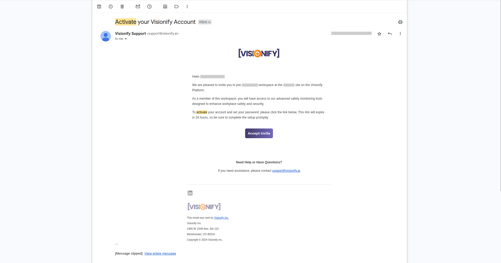
        <div class="step-content">
            <h4>1. Activate Your Account</h4>
            <p>Once you've signed up for enterprise account, you will receive an activation email from Visionify team.</p>
        </div>
    </div>
    <div class="setup-step">
        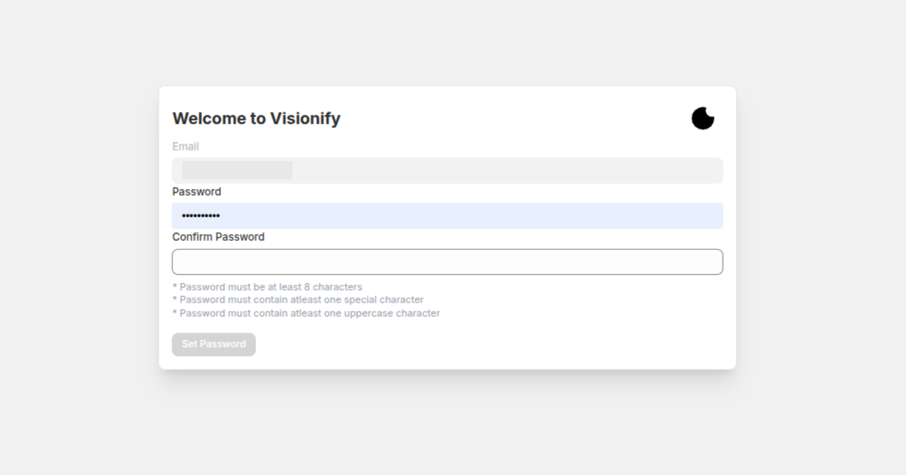
        <div class="step-content">
            <h4>2. Password Setup</h4>
            <p>Accept the invite from email & activate the account. Set your own password here.</p>
        </div>
    </div>
    <div class="setup-step">
        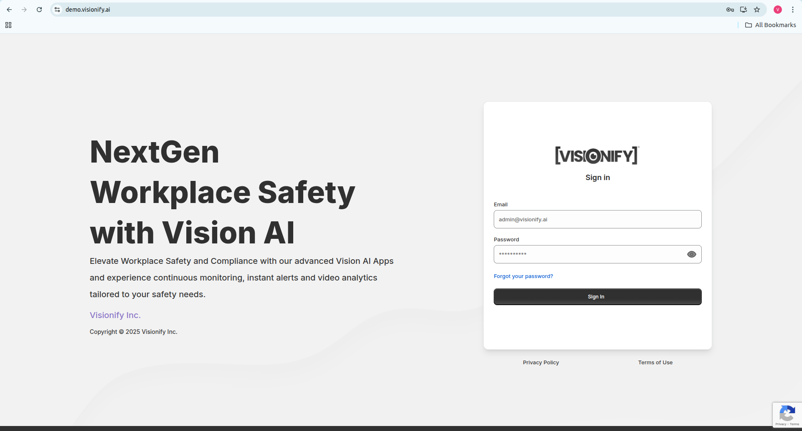
        <div class="step-content">
            <h4>3. Sign In</h4>
            <p>After successfully setting up your password, you should be able to log in to the Visionify dashboard using your username and password.</p>
        </div>
    </div>
</div>

---

## Step 2: Camera Onboarding {#step-2-camera-integration}

Connecting your cameras to VisionAI is straightforward. Follow these steps to integrate your existing camera infrastructure:

<div class="setup-steps">
    <div class="setup-step">
        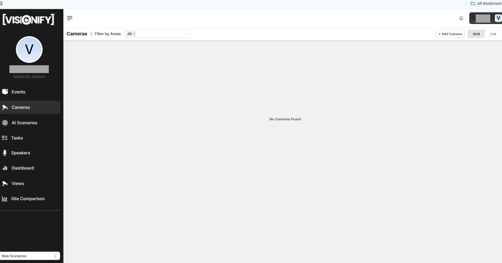
        <div class="step-content">
            <h4>1. Go to Cameras Page</h4>
            <p>Navigate to the Cameras page from the main dashboard. Click on the <b>"Add Camera"</b> button to begin the integration process. VisionAI supports IP cameras, CCTV systems, and NVR/DVR setups.</p>
        </div>
    </div>
    <div class="setup-step">
        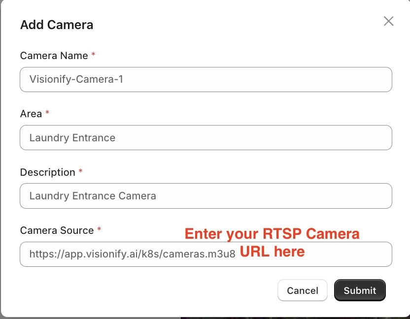
        <div class="step-content">
            <h4>2. Add New Camera Details</h4>
            <p>Enter your camera details including name, RTSP URL, and location. Test the connection to ensure proper setup before saving.</p>
        </div>
    </div>
    <div class="setup-step">
        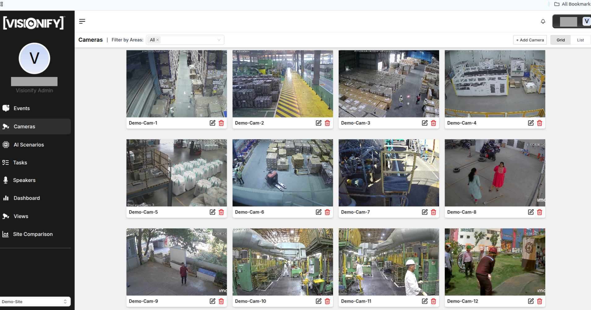
        <div class="step-content">
            <h4>3. Cameras List</h4>
            <p>Here you'll see all your connected cameras along with their current status. Use the available filters on the Cameras page to view cameras by area.</p>
        </div>
    </div>
</div>

!!! note
    1. Test your Camera RTSP URL to make sure it is playing. You can test it using [VLC Player](https://www.videolan.org/vlc/index.html).
    2. Initially, you will see a blank screen for camera. The screenshot for the camera will update once the camera is connected.

---

## Step 3: Configuring AI Scenarios  {#step-3-scenario-configuration}
<div class="step-with-media equal-split">
  <div class="media-container">
    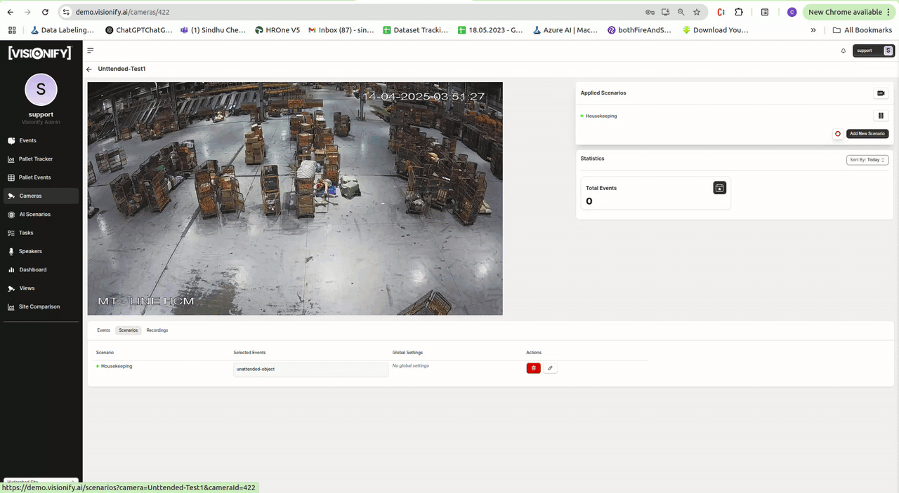
  </div>
  <div class="steps-container">
    <div class="setup-step">
      <div class="step-number">1</div>
      <div class="step-content">
        <h4>Initiate Scenario Setup</h4>
        <p>Click "Add New Scenario" on camera details page to begin configuration.</p>
      </div>
    </div>
    <div class="setup-step">
      <div class="step-number">2</div>
      <div class="step-content">
        <h4>Select a Scenario</h4>
        <p>Choose from available safety scenarios by clicking "Get This" button.</p>
      </div>
    </div>
    <div class="setup-step">
      <div class="step-number">3</div>
      <div class="step-content">
        <h4>Set Up Monitoring Zones</h4>
        <p>Draw and adjust monitoring zones directly on camera feed.</p>
      </div>
    </div>
    <div class="setup-step">
      <div class="step-number">4</div>
      <div class="step-content">
        <h4>Configure Pause Times</h4>
        <p>Set break periods to pause detection during scheduled downtimes.</p>
      </div>
    </div>
    <div class="setup-step">
      <div class="step-number">5</div>
      <div class="step-content">
        <h4>Fine-tune Settings</h4>
        <p>Adjust confidence thresholds and duration, then click "Apply".</p>
      </div>
    </div>
  </div>
</div>

!!! tip
    Start with the default parameters and adjust them later based on the specific needs of your environment. These settings can always be modified at any time.

---

## Step 4: Events {#step-4-events-dashboard}
The Events page is your primary feed of detected safety incidents. Each event includes a short video clip, metadata, and AI-generated analysis to help your team review and act quickly.

<div class="setup-steps">
    <div class="setup-step">
        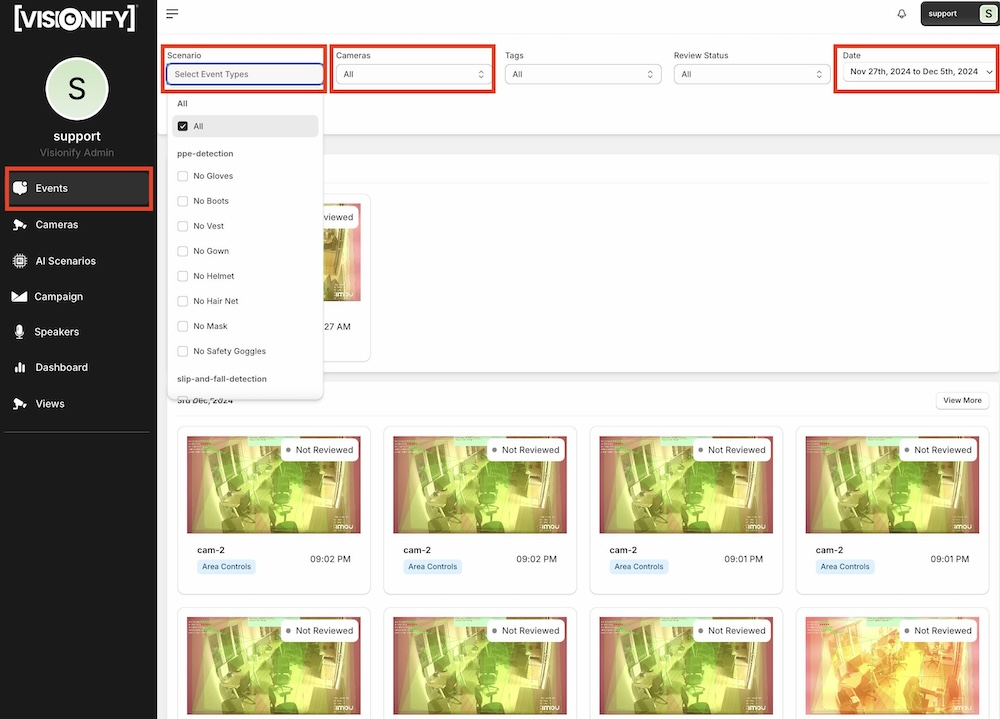
        <div class="step-content">
            <h4>1. Events Listing</h4>
            <p>Navigate to <b>Events</b> in the left sidebar to review safety incidents. Filter by time range, scenario, camera, area, or shift. Each event card shows the scenario type, camera name, timestamp, severity badge (<b>Low, Moderate, High</b>), and a thumbnail. Click any event to open the details view.</p>
        </div>
    </div>
    <div class="setup-step">
        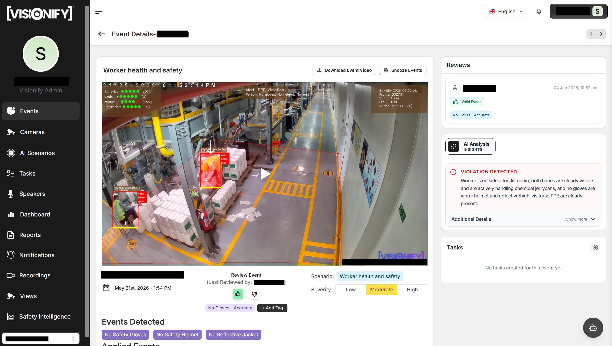
        <div class="step-content">
            <h4>2. Event Details</h4>
            <p>The Event Details page shows a 12-second video clip of the incident. Use the thumbs up/down buttons to vote, <b>mark it accurate or inaccurate</b>, and leave a written review. Severity level is shown alongside camera name, scenario, and timestamp. From here you can also create a Task or Ticket directly linked to this event.</p>
        </div>
    </div>
    <div class="setup-step">
        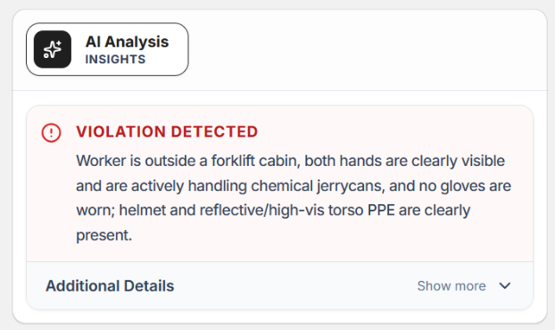
        <div class="step-content">
            <h4>3. AI Analysis Card</h4>
            <p>Next to the video player, the <b>AI Analysis</b> card shows an automated assessment of the event with observations and findings. Use this to quickly understand whether an event warrants follow-up action.</p>
        </div>
    </div>
</div>
!!! tip
    Use the AI Analysis card as a first triage layer—if the AI flags a violation with a clear reason, escalate immediately. For borderline events, review the observations before marking accurate or inaccurate.
---

## Step 5: Dashboard {#step-5-dashboard-access}
The VisionAI Dashboard provides comprehensive insights into your safety metrics and events. Here's how to navigate and utilize the dashboard effectively:

<div class="setup-steps">
    <div class="setup-step">
        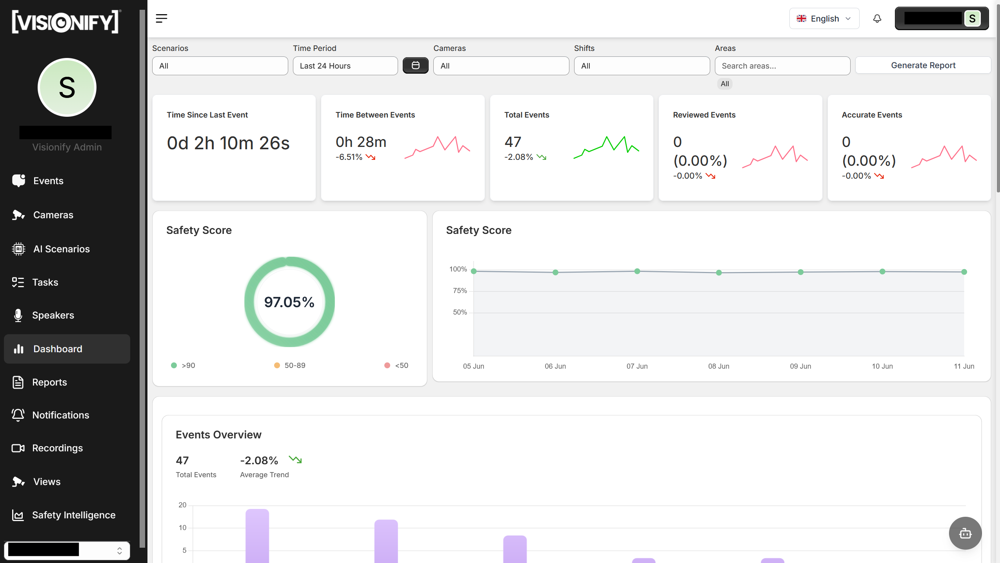
        <div class="step-content">
            <h4>Safety Metrics Overview</h4>
            <p>View key metrics including <b>Total Events, Reviewed Events, Accurate Events, Time Since Last Event,</b> and <b>Time Between Events</b>. Select custom time ranges to analyze trends across weeks, months, or specific date ranges. Use filters for scenarios, cameras, shifts, and areas to focus on what matters most.</p>
        </div>
    </div>
        <div class="setup-step">
        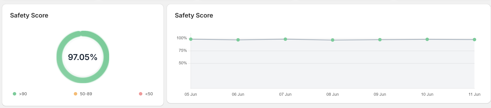
        <div class="step-content">
            <h4>Safety Score</h4>
            <p>The <b>Safety Score</b> chart shows your overall safety rating as a radial gauge, color-coded by performance: <b>green (&gt;90)</b>, <b>orange (50–89)</b>, and <b>red (&lt;50)</b>. A 7-day trend line tracks whether performance is improving or regressing over the week.</p>
        </div>
    </div>
</div>
!!! tip
    Monitor the Safety Score trend daily to catch regressions early. Use the area and camera filters to drill into specific locations when the score dips—this helps surface recurring incidents faster.
---

## Step 6: Views {#step-6-view-access}

The Views feature provides customized dashboards for specific cameras, areas, or events, enabling quick access to incident insights and performance metrics. Views now include a **Share** feature that generates a shareable link for any view, with granular control over display preferences and camera groupings.

<div class="setup-steps">
    <div class="setup-step">
        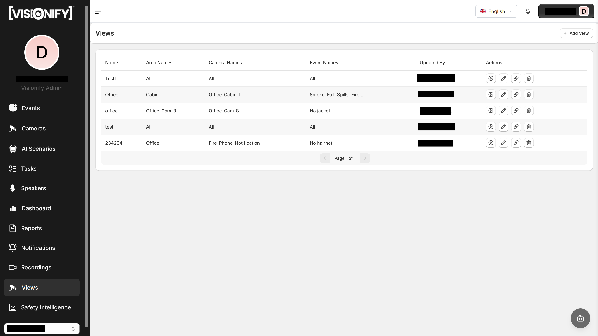
        <div class="step-content">
            <h4>1. Views Overview</h4>
            <p>Navigate to <b>Views</b> from the left sidebar to see all saved views. Each view card shows the cameras, areas, and events it monitors. Use <b>Play</b> to open the live view, <b>Edit</b> to modify it, or <b>Delete</b> to remove it.</p>
        </div>
    </div>
    <div class="setup-step">
        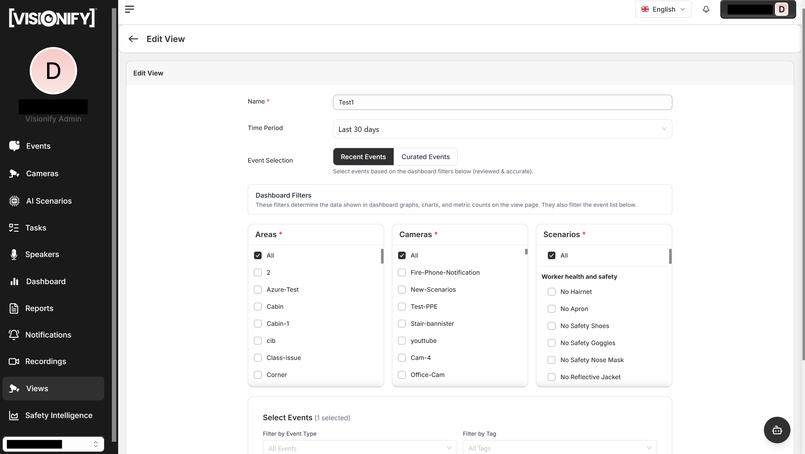
        <div class="step-content">
            <h4>2. Configure Settings</h4>
            <p>Open the <b>Settings</b> panel inside any view to configure camera groupings, event filters, display layout, and refresh intervals. Settings are saved per view for a tailored monitoring experience.</p>
        </div>
    </div>

    <div class="setup-step">
        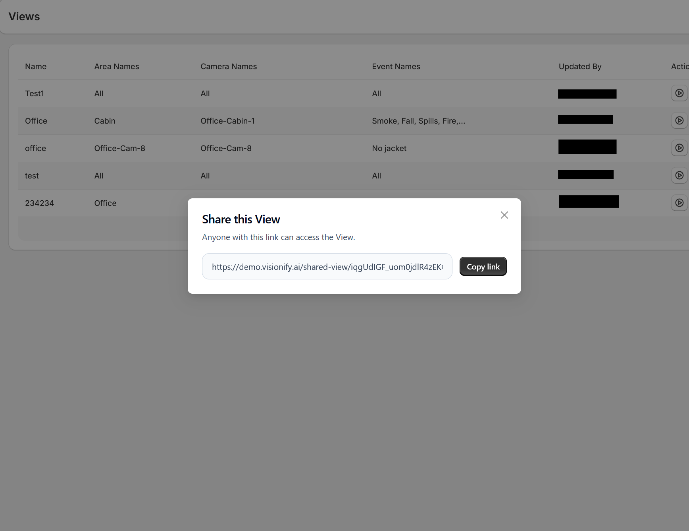
        <div class="step-content">
            <h4>3. Share a View</h4>
            <p>Click the <b>Share</b> button on any view to generate a unique, shareable link. Recipients can access the view without logging in, making it easy to share with other people.</p>
        </div>
    </div>
</div>

## Step 7: Tasks {#step-7-task-management}
Task Management in VisionAI lets you create corrective actions directly from safety events, assign them to team members, and track resolution through to closure with documented proof.

<div class="setup-steps">
    <div class="setup-step">
        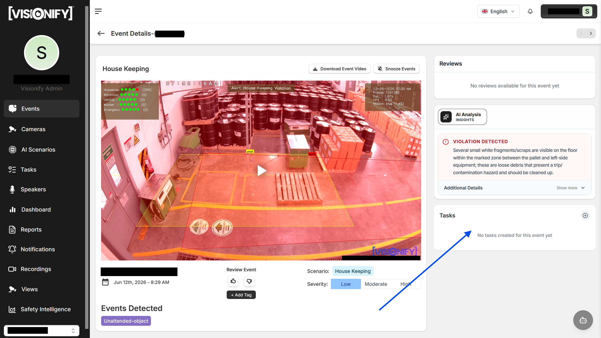
        <div class="step-content">
            <h4>1. Create a Task</h4>
            <p>From any <b>Event Details</b> page, click <b>Create Task</b> to open the task form. Fill in the task name, set the priority (<b>Critical, Moderate, Low</b>), and assign it to a team member. The task is automatically linked to the source event so the assignee has full context.</p>
        </div>
    </div>
    <div class="setup-step">
        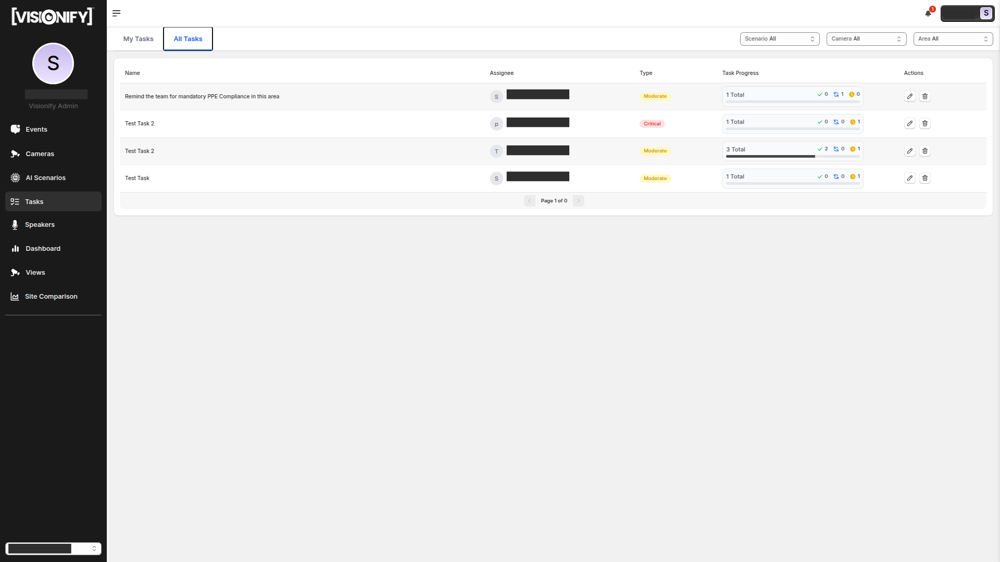
        <div class="step-content">
            <h4>2. Track Tasks</h4>
            <p>Navigate to <b>Tasks</b> in the left sidebar. Switch between <b>My Tasks</b> (your assignments) and <b>All Tasks</b> (team-wide view). Filter the list by scenario, camera, or area. Each row shows the task name, assignee, assigned-by, priority badge, and current status: TODO, IN PROGRESS, or DONE.</p>
        </div>
    </div>
    <div class="setup-step">
        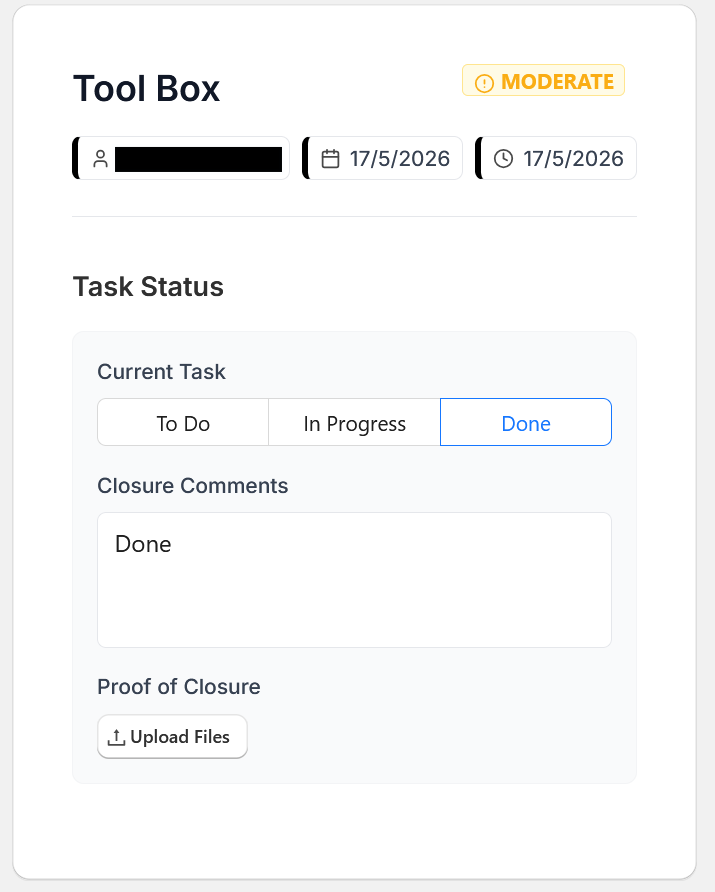
        <div class="step-content">
            <h4>3. Update and Close a Task</h4>
            <p>Click any task to open its details page. Use the status radio buttons to move it through the workflow. When closing a task, add <b>closure comments</b> explaining the corrective action taken and upload a <b>proof file</b> (photo, document, or video). The timeline at the bottom tracks every status change and finding update in chronological order.</p>
        </div>
    </div>
</div>
!!! tip
    Link tasks to specific events when creating them so the assignee can watch the video clip and understand the exact incident—this cuts resolution time significantly compared to describing the issue in text.
---

## Step 8: Tickets {#step-8-tickets}
Tickets let you escalate specific safety events or camera issues into tracked support items. They can be created from three places—the **Event Details** page, the **Camera Details** page, or directly from the **Tickets** page itself.

<div class="setup-steps">
    <div class="setup-step">
        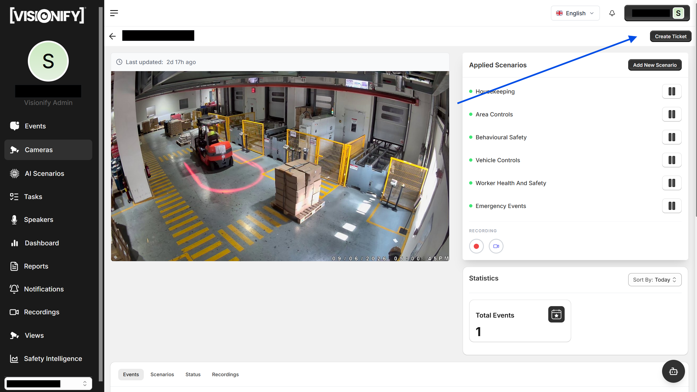
        <div class="step-content">
            <h4>1. Create a Ticket</h4>
            <p>On an <b>Event Details</b> or <b>Camera Details</b> page, click <b>Create Ticket</b> to open the ticket modal. You can also open the modal from the <b>Tickets</b> page itself via the <b>Create Ticket</b> button in the top-right corner. The ticket is automatically linked to the source event or camera so responders have full context.</p>
        </div>
    </div>
    <div class="setup-step">
        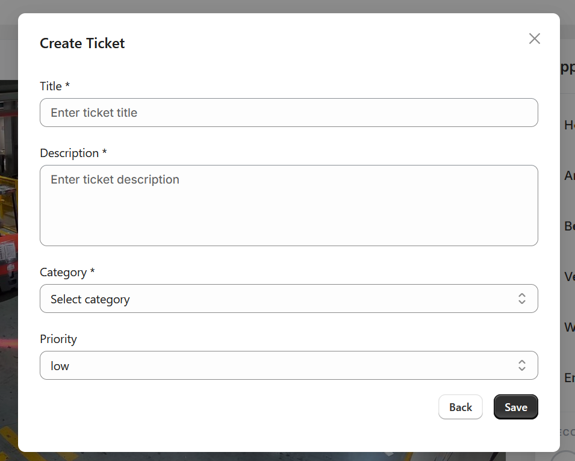
        <div class="step-content">
            <h4>2. Fill in Ticket Details</h4>
            <p>In the modal, fill in the required fields:</p>
            <ul>
                <li><b>Title</b> — a short, descriptive name for the issue</li>
                <li><b>Description</b> — a detailed explanation of what happened and why it needs attention</li>
                <li><b>Category</b> — the type of issue (options depend on your role)</li>
                <li><b>Priority</b> — Low, Medium, or High</li>
            </ul>
            <p>Click <b>Submit</b> to create the ticket. The creator and timestamp are captured automatically.</p>
        </div>
    </div>
    <div class="setup-step">
        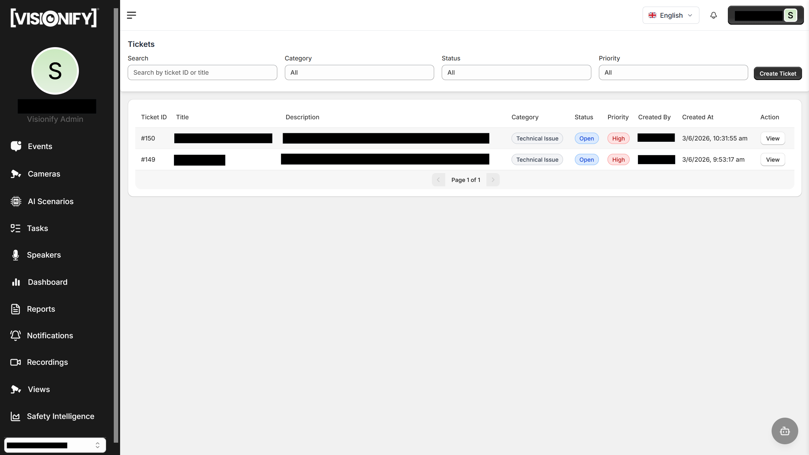
        <div class="step-content">
            <h4>3. Track Ticket Status</h4>
            <p>Navigate to <b>Tickets</b> under the profiles tab to see all tickets. Filter by <b>category, status,</b> or <b>priority</b>, or search by title. Each row shows the ticket ID, title, category, status, priority, creator, and creation date. Tickets move through four statuses: <b>Open → In Progress → Closed</b> (or <b>Rejected</b>). Click <b>View</b> to open a ticket and see the full timeline of status changes, assignee history, and resolution comments.</p>
        </div>
    </div>
</div>
!!! tip
    Use High-priority tickets for safety violations that need same-day resolution. Link them to the specific event so the responder can watch the video clip directly from the ticket detail page.
---

## Step 9: Recordings {#step-9-recordings}
Recordings let you capture full-length video from any camera on demand. Start and stop recordings directly from the **Camera Details** page; all clips are then available on the **Recordings** page for playback, review, and deletion.

<div class="setup-steps">
    <div class="setup-step">
        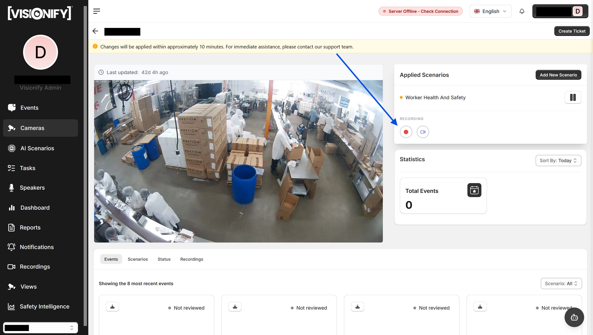
        <div class="step-content">
            <h4>1. Start a Recording</h4>
            <p>Open any camera's <b>Camera Details</b> page and scroll to the <b>Recording</b> section below the applied scenarios. Click the red record button to start capturing. The button turns solid red while recording is active. Click it again to stop. A pulsing indicator confirms the recording is live.</p>
        </div>
    </div>
    <div class="setup-step">
        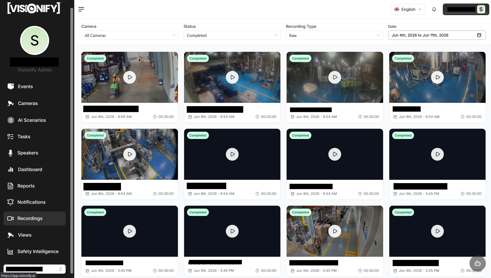
        <div class="step-content">
            <h4>2. Browse Recordings</h4>
            <p>Navigate to <b>Recordings</b> in the left sidebar to see all clips in a grid layout. Filter by camera, status (<b>Completed, In Progress, Started, Stopped</b>), and date range. Each card shows a thumbnail, start time, and duration. Clips are sorted newest first.</p>
        </div>
    </div>
</div>

## Step 10: Integrations {#step-10-integrations}
Integrations let VisionAI push real-time event notifications to external systems the moment a safety event is detected. Once an integration is saved, it becomes selectable when creating an instant alert under Notifications. Currently, three webhook subtypes are supported. For requirements beyond these, please reach out to the VisionAI team for assistance.

| Subtype | Format |
|---------|--------|
| Generic Webhook | `application/json` |
| MS Teams Webhook | `application/json` |
| Synology Webhook | `application/x-www-form-urlencoded` |

<div class="setup-steps">
    <div class="setup-step">
        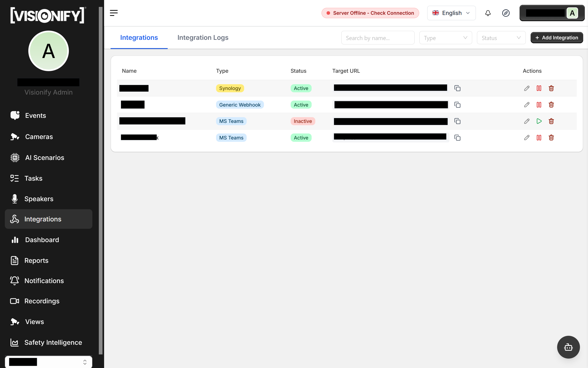
        <div class="step-content">
            <h4>1. Open the Integrations Page</h4>
            <p>Navigate to <b>Settings → Integrations</b> in the left sidebar. The page lists all configured integrations with their name, type, status, and target URL. Click <b>Add Integration</b> in the top-right corner to begin.</p>
        </div>
    </div>
    <div class="setup-step">
        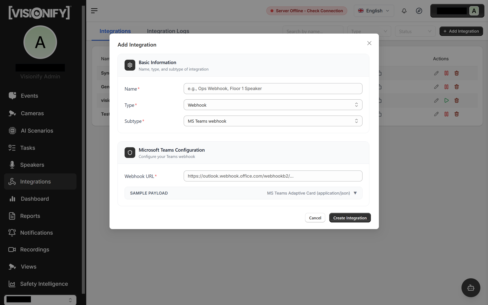
        <div class="step-content">
            <h4>2. Set Name, Type, and Subtype</h4>
            <p>Fill in a <b>Name</b>, set <b>Type</b> to <b>Webhook</b>, then choose a <b>Subtype</b>: <b>Generic Webhook</b>, <b>MS Teams Webhook</b>, or <b>Synology Webhook</b>.</p>
        </div>
    </div>
    <div class="setup-step">
        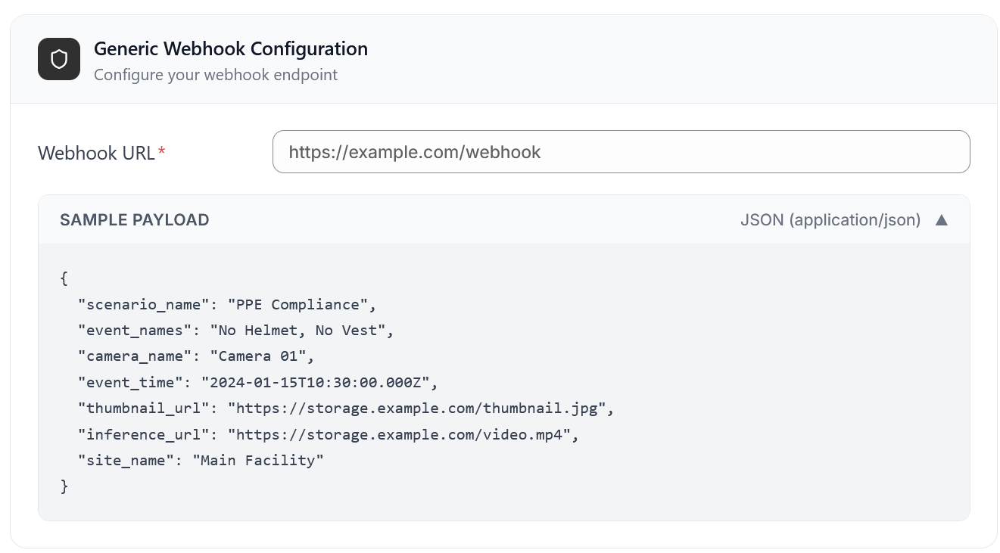
        <div class="step-content">
            <h4>3. Enter the Webhook URL and Save</h4>
            <p>Paste your destination URL into the <b>Webhook URL</b> field. A <b>Sample Payload</b> toggle below shows the exact body that will be posted so you can verify your endpoint is ready. Click <b>Save</b> to activate the integration.</p>
        </div>
    </div>
</div>

!!! tip "Getting a Teams Incoming Webhook URL"
    In Microsoft Teams, open the target channel → **⋯ More options → Connectors → Incoming Webhook → Configure**. Copy the generated URL and paste it into the Webhook URL field.

### Webhook Payload Reference

VisionAI sends an HTTP POST to your webhook URL each time a matching event fires. The request body format depends on the subtype chosen.

=== "Generic Webhook"

    **Content-Type:** `application/json`

    ```json
    {
      "scenario_name": "PPE Compliance",
      "event_names": "No Helmet, No Vest",
      "camera_name": "Camera 01",
      "event_time": "2024-01-15T10:30:00.000Z",
      "thumbnail_url": "https://storage.example.com/thumbnail.jpg",
      "inference_url": "https://storage.example.com/video.mp4",
      "site_name": "Main Facility"
    }
    ```

    | Field | Type | Description |
    |-------|------|-------------|
    | `scenario_name` | string | AI scenario that fired |
    | `event_names` | string | Comma-separated detected events |
    | `camera_name` | string | Camera that captured the event |
    | `event_time` | ISO 8601 | UTC timestamp |
    | `thumbnail_url` | string | Snapshot image URL |
    | `inference_url` | string | Annotated video clip URL |
    | `site_name` | string | Site where the event occurred |

=== "MS Teams Webhook"

    **Content-Type:** `application/json`

    VisionAI sends a Microsoft Adaptive Card wrapped in the Teams message envelope. The card includes scenario details, camera name, timestamp, a snapshot image, and action buttons linking back to the dashboard.

    ```json
    {
      "type": "message",
      "attachments": [
        {
          "contentType": "application/vnd.microsoft.card.adaptive",
          "content": {
            "type": "AdaptiveCard",
            "version": "1.4",
            "body": [
              {
                "type": "Container",
                "style": "emphasis",
                "items": [{ "type": "TextBlock", "text": "Visionify Detected an Event!", "weight": "Bolder", "size": "Large" }]
              },
              {
                "type": "ColumnSet",
                "columns": [
                  { "type": "Column", "width": "stretch", "items": [
                    { "type": "TextBlock", "text": "**Scenario**", "weight": "Bolder" },
                    { "type": "TextBlock", "text": "PPE Compliance" },
                    { "type": "TextBlock", "text": "**Events Detected**", "weight": "Bolder" },
                    { "type": "TextBlock", "text": "No Helmet, No Vest" }
                  ]},
                  { "type": "Column", "width": "stretch", "items": [
                    { "type": "TextBlock", "text": "**Camera**", "weight": "Bolder" },
                    { "type": "TextBlock", "text": "Camera 01" },
                    { "type": "TextBlock", "text": "**Time**", "weight": "Bolder" },
                    { "type": "TextBlock", "text": "2024-01-15 10:30 AM" }
                  ]}
                ]
              },
              { "type": "Image", "url": "https://storage.example.com/thumbnail.jpg", "size": "Stretch" }
            ],
            "actions": [
              { "type": "Action.OpenUrl", "title": "View Event Details", "url": "https://app.visionify.ai/..." },
              { "type": "Action.OpenUrl", "title": "Snooze All Events", "url": "https://app.visionify.ai/..." }
            ]
          }
        }
      ]
    }
    ```

=== "Synology Webhook"

    **Content-Type:** `application/x-www-form-urlencoded`

    ```
    token=<camera_token>&text1=<scenario_name>&text2=<event_names>&time=<unix_timestamp>
    ```

    **Example:**
    ```
    token=abc123xyz&text1=PPE+Compliance&text2=No+Helmet%2C+No+Vest&time=1705312200
    ```

    | Field | Description |
    |-------|-------------|
    | `token` | Camera-specific token configured on the camera record |
    | `text1` | Scenario name |
    | `text2` | URL-encoded, comma-separated event names |
    | `time` | Unix timestamp in seconds |

!!! info "Using your integration in an alert"
    Once an integration is saved and active, go to [**Notifications → Step 12**](#step-12-notifications) to create an alert that routes safety events through it. In the **Add Alert** modal, choose the matching webhook type (Generic, MS Teams, or Synology) and select the named integration from the dropdown that appears. The integration must exist here before it can be selected in Notifications.

### Integration Logs

<div class="setup-steps">   
    <div class="setup-step">
        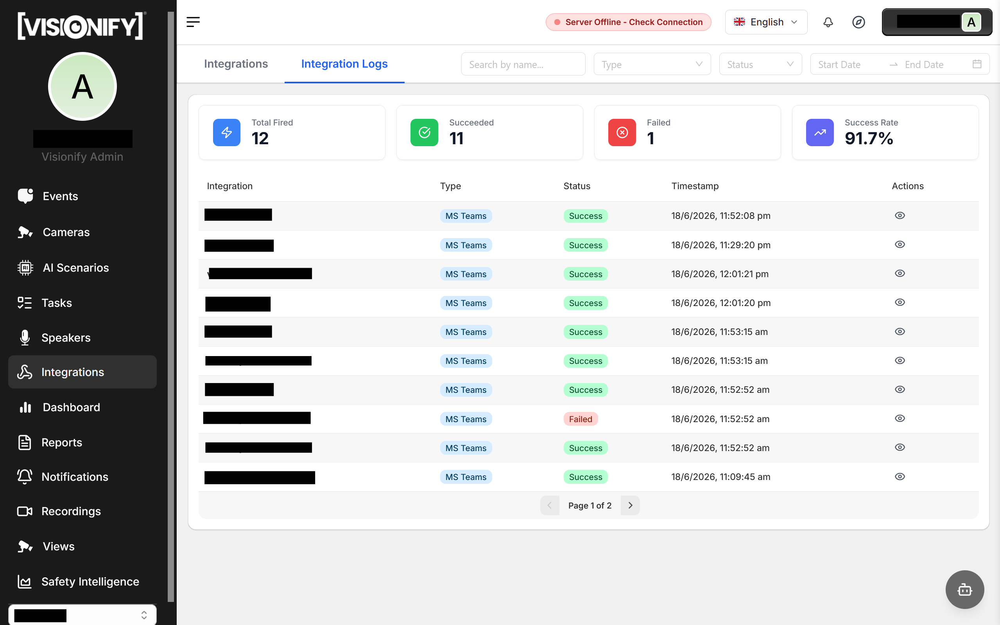
        <div class="step-content">
            <p>Switch to the <b>Integration Logs</b> tab to inspect every delivery attempt. Each row shows the integration name, subtype, timestamp, HTTP status returned by your endpoint, and whether the delivery succeeded or failed. Use the filters to narrow by type, status, or date range.
        </div>
    </div>
</div>
---

## Step 11: Speakers {#step-11-speakers}
The Speakers page manages your IP-based audio speakers for on-site safety announcements. Configure which cameras and scenarios trigger each speaker and what message to play.

<div class="setup-steps">
    <div class="setup-step">
        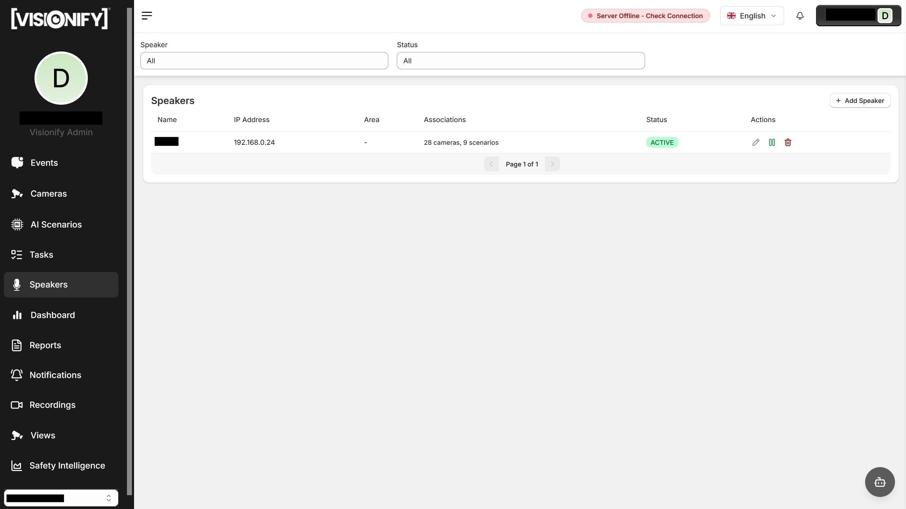
        <div class="step-content">
            <h4>1. Speakers Overview</h4>
            <p>Navigate to <b>Speakers</b> in the left sidebar to see all configured speakers. Each row shows the speaker name, IP address, area, the number of associated cameras and scenarios, and its status (<b>Active / Inactive</b>). Use the toggle buttons to activate or deactivate a speaker, or click <b>Edit</b> to modify its configuration.</p>
        </div>
    </div>
    <div class="setup-step">
        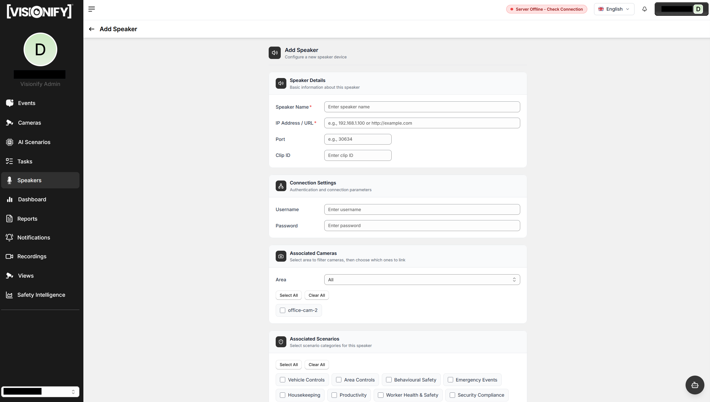
        <div class="step-content">
            <h4>2. Add a Speaker</h4>
            <p>Click <b>Add Speaker</b> and fill in the speaker details:</p>
            <ul>
                <li><b>Speaker Name</b> — display label used throughout the app</li>
                <li><b>IP Address / URL</b> — the speaker's network address (IPv4 or URL format)</li>
                <li><b>Port</b> — optional, for non-standard ports</li>
                <li><b>Clip ID</b> — optional, for pre-loaded audio clip selection</li>
                <li><b>Username / Password</b> — optional, for authenticated speaker endpoints</li>
            </ul>
            <p>In the <b>Associated Cameras</b> section, filter by area and check the cameras this speaker should cover. In the <b>Associated Scenarios</b> section, check the scenario types (e.g., PPE violation, area restriction) that should trigger an announcement from this speaker.</p>
        </div>
    </div>
    <div class="setup-step">
        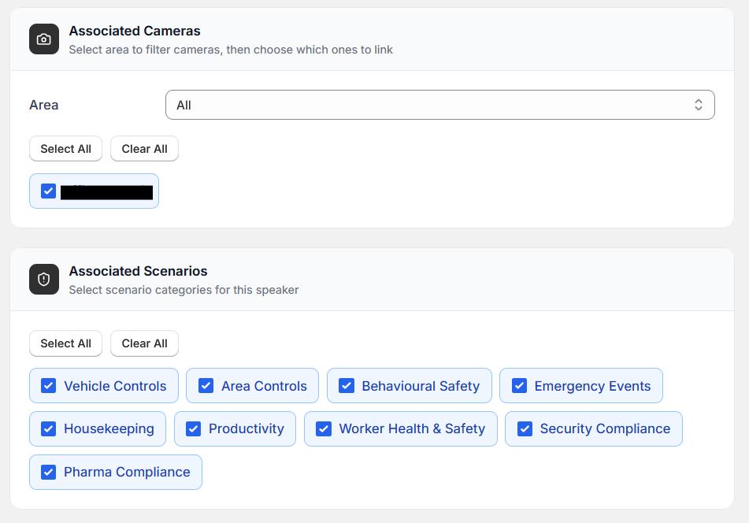
        <div class="step-content">
            <h4>3. Configure Event-Triggered Alerts</h4>
            <p>After saving the speaker, the system automatically plays an announcement whenever a detection event matches one of the speaker's associated cameras and scenario types. To adjust which events fire the speaker, edit the speaker and update the camera or scenario selections.</p>
        </div>
    </div>
</div>
!!! tip
    Assign speakers to specific areas rather than all cameras—this ensures the announcement plays only near the incident location and avoids unnecessary disruption in unaffected zones.
---

## Step 12: Notifications {#step-12-notifications}
Configure alerts and digests directly from the **Notifications** page in the sidebar. All alert types are configured through in-app modals, and each alert includes a **Test** button to verify delivery before going live.

<div class="setup-steps">
    <div class="setup-step">
        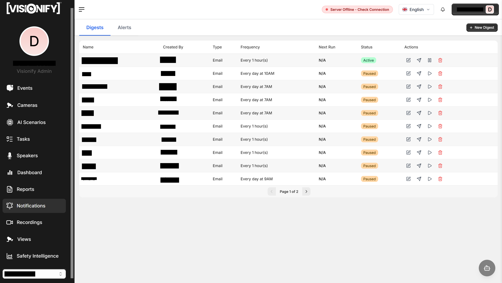
        <div class="step-content">
            <h4>1. Open Notifications</h4>
            <p>Click <b>Notifications</b> in the left sidebar to access all alert and digest settings in one place. The page lists all configured alerts with their status, schedule, and delivery channels.</p>
        </div>
    </div>
    <div class="setup-step">
        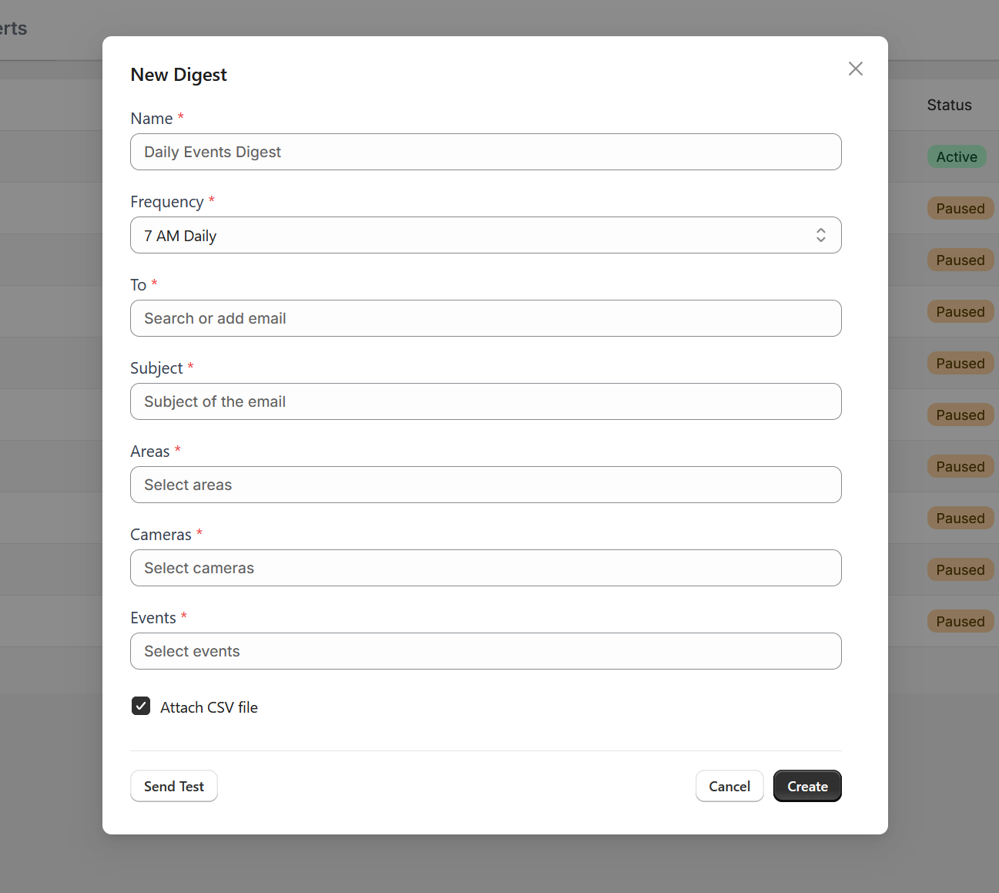
        <div class="step-content">
            <h4>2. Configure Digests</h4>
            <p>Click <b>Add Digest</b> to open the configuration modal. Set the frequency (daily, weekly), add recipient email addresses, and select which scenarios and areas to include. Digests deliver a safety summary with trend charts and key metrics to a broader audience.</p>
        </div>
    </div>
    <div class="setup-step">
        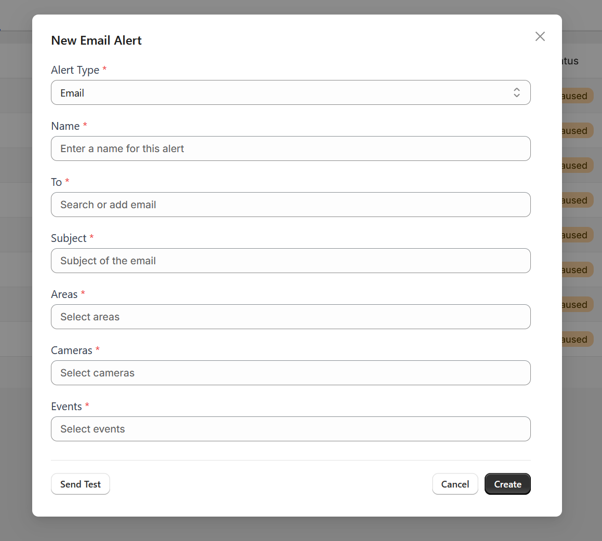
        <div class="step-content">
            <h4>3. Configure Alerts</h4>
            <p>Click <b>Add Alert</b> to open the alert modal. Choose the alert type—<b>Email, WhatsApp, MS Teams, Generic Webhook,</b> or <b>Synology Webhook</b>.</p>
            <ul>
                <li><b>Email / WhatsApp</b> — add recipient contacts directly in the modal; no prior integration setup required.</li>
                <li><b>Webhook types (MS Teams, Generic Webhook, Synology Webhook)</b> — a second dropdown appears listing all active integrations of the matching subtype. You must first create the integration under <a href="#step-10-integrations"><b>Settings → Integrations</b></a> before it appears here. Select the named integration to route this alert to.</li>
            </ul>
            <p>Set the event, area, and camera scope for the alert, then click <b>Save</b>. Multiple alert types can be active simultaneously, so you can combine real-time webhook alerts for on-call responders with digest emails for management.</p>
        </div>
    </div>
    <div class="setup-step">
        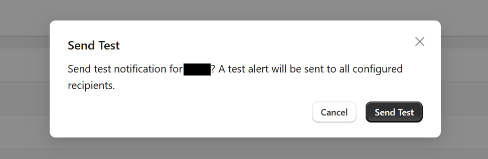
        <div class="step-content">
            <h4>4. Test Your Alerts</h4>
            <p>Use the <b>Test</b> button next to any configured alert or digest to send a sample notification immediately. This confirms delivery to the right recipients and channels before any real safety event occurs.</p>
        </div>
    </div>
    <div class="setup-step">
        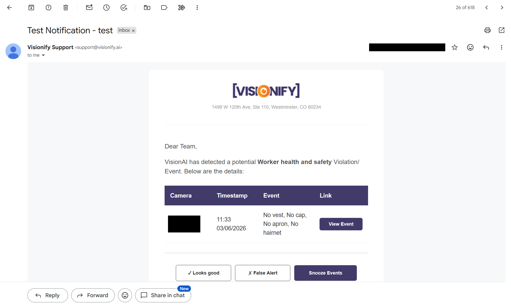
        <div class="step-content">
            <h4>5. Verify Email Delivery</h4>
            <p>Check the inbox of each recipient email address after the first scheduled digest or after clicking <b>Test</b>. The email shows the VisionAI safety summary with key metrics, event thumbnails, and trend charts. Confirm that formatting renders correctly and that links back to the app are working before the alert goes into production use.</p>
        </div>
    </div>
    <div class="setup-step">
        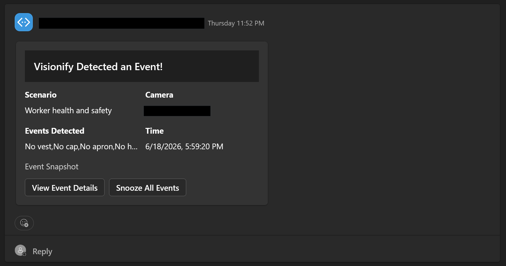
        <div class="step-content">
            <h4>6. Verify Webhook Delivery</h4>
            <p>After clicking <b>Test</b> on a webhook-type alert, navigate to <b>Settings → Integrations</b> and open the <a href="#integration-logs"><b>Integration Logs</b></a> tab. Locate the delivery attempt that matches your test—each row shows the integration name, subtype, timestamp, and the HTTP status code returned by your endpoint.</p>
            <ul>
                <li><b>2xx OK</b> — payload was accepted successfully. No further action needed.</li>
                <li><b>4xx status</b> — the endpoint rejected the request. Check that the URL is correct and that your receiving service accepts <code>POST</code> requests with the expected content type.</li>
                <li><b>5xx status or connection error</b> — your endpoint is unreachable or returned a server error. Verify the service is running and the URL is accessible.</li>
            </ul>
            <p>Re-test after fixing any issues and confirm the log shows a successful delivery before relying on the alert in production.</p>
        </div>
    </div>
</div>
!!! tip
    Always use the Test feature after configuring a new alert to confirm end-to-end delivery. For webhook alerts, cross-check the <a href="#integration-logs"><b>Integration Logs</b></a> tab to see the exact HTTP response your endpoint returned—this is the fastest way to debug a missed delivery. Combine digest emails for management summaries with real-time webhook or WhatsApp alerts for on-call responders.
---

## Step 13: Reports {#step-13-reports}
The Reports page gives you on-demand safety reports in two modes: **AI-generated** narrative reports and fully customizable **standard reports**. AI reports are written by GPT and ready in seconds; standard reports let you build a tailored data export filtered by time, scenario, area, camera, and shift.

<div class="setup-steps">
    <div class="setup-step">
        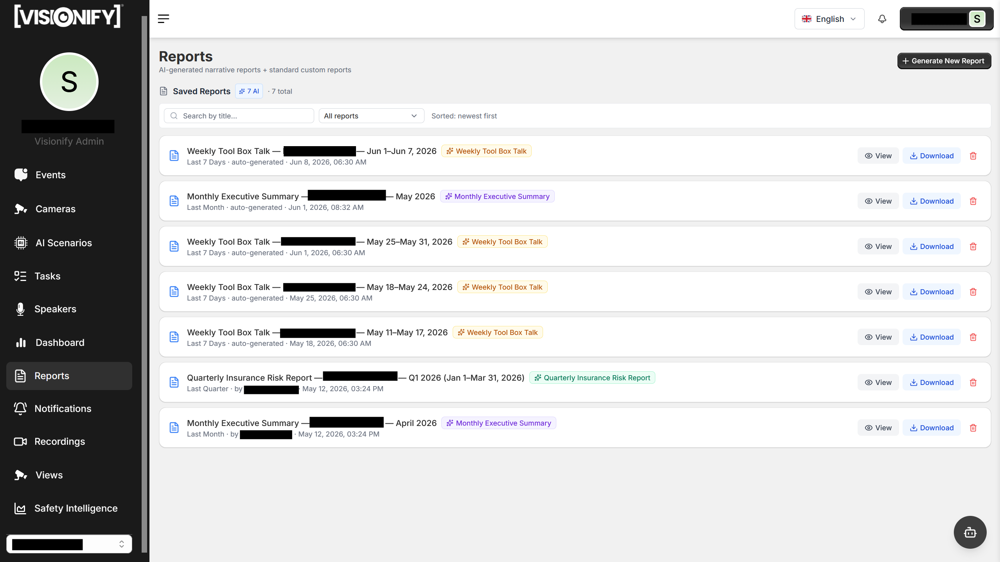
        <div class="step-content">
            <h4>1. Reports Overview</h4>
            <p>Navigate to <b>Reports</b> in the left sidebar. The page lists all saved reports with their title, type, time range, creator, and creation date. Use the search bar to find a report by name, or filter by type: <b>Standard, AI, Weekly Toolbox Talk, Monthly Executive Summary, Insurance Risk,</b> or <b>Incident Investigation</b>. In-progress reports appear pinned at the top with a live countdown.</p>
        </div>
    </div>
    <div class="setup-step">
    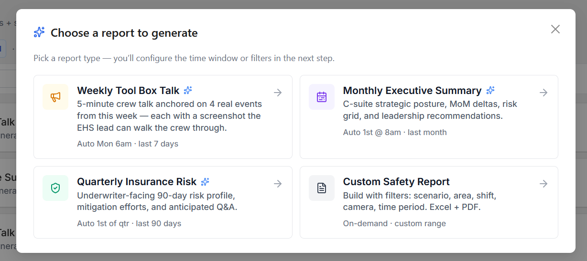
    <div class="step-content">
        <h4>2. Select an AI Report Type</h4>
        <p>Click <b>Generate New Report</b> from the Reports page. A dialog opens showing all available report types.</p>
    </div>
</div>
    <div class="setup-step">
    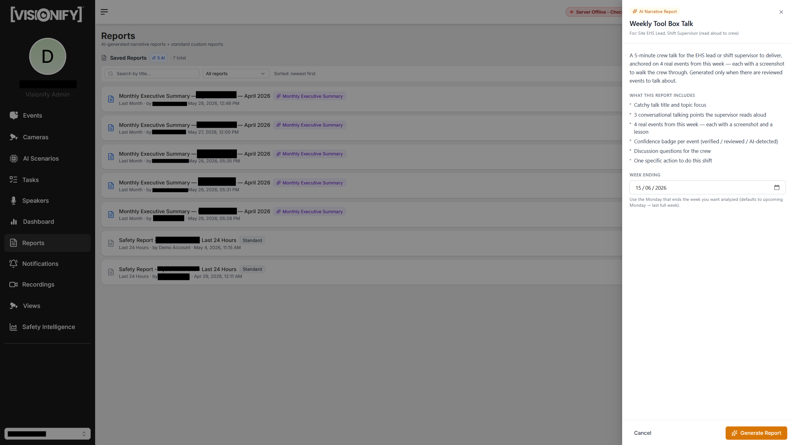
    <div class="step-content">
        <h4>3. Select an AI Report Type</h4>
        <ul>
            <li><b>Weekly Toolbox Talk</b> — 5-minute crew safety talk with real events, screenshots, and discussion questions</li>
            <li><b>Monthly Executive Summary</b> — C-suite overview with risk posture, month-over-month deltas, and recommendations</li>
            <li><b>Quarterly Insurance Risk</b> — 90-day underwriter-facing risk profile</li>
            <li><b>Incident Investigation</b> — First-pass investigation for a single event with 5-Why analysis and root cause</li>
        </ul>
        <p>Enter the required date range or event ID, then click <b>Generate</b>. Reports are typically ready in 10–45 seconds.</p>
    </div>
</div>

<div class="setup-step">
    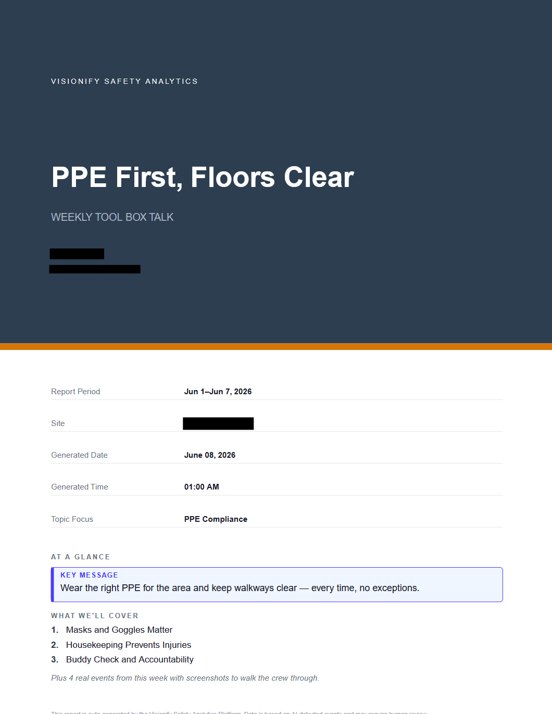
    <div class="step-content">
        <h4>4. Download your Report</h4>
        <p>Once the report is ready, it can be downloaded as <b>Excel</b> for raw data or <b>PDF</b> for a formatted report. Both formats are saved to the Reports list for future access.</p>
    </div>
</div>
</div>
!!! tip
    Use **Incident Investigation** reports immediately after a high-severity event—enter the event ID and the AI produces a structured first-pass investigation with root cause analysis in under a minute.
---

## Step 14: Safety Intelligence {#step-14-safety-intelligence}
The **Safety Intelligence** page is a multi-site analytics hub organized into four tabs. Use the filter bar at the top to choose your site scope—**All Sites, Country, Region,** or a **Custom** multi-site selection—and all tabs update together.

<div class="setup-steps">
    <div class="setup-step">
        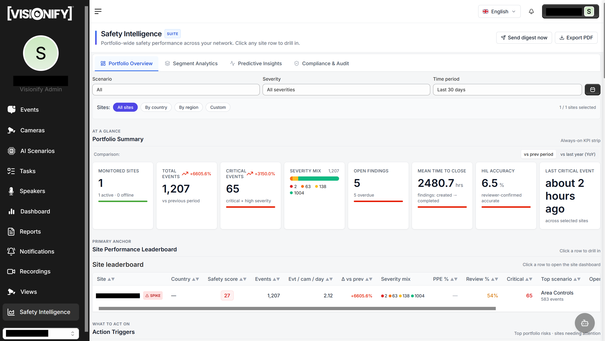
        <div class="step-content">
            <h4>1. Portfolio</h4>
            <p>The <b>Portfolio</b> tab gives a portfolio-wide view across five panels:</p>
            <ul>
                <li><b>KPI Strip</b> — headline metrics: portfolio Safety Score, Mean Time To Resolve (MTTR), total events, and reviewed event rate</li>
                <li><b>Site Performance Leaderboard</b> — all sites ranked by safety score; flagged sites show an "At Risk" badge</li>
                <li><b>Top Risks</b> — the most-violated scenario types across your portfolio, ranked by event count</li>
                <li><b>World Map</b> — geographic distribution of sites with color-coded safety status</li>
                <li><b>Time Heatmap</b> — day × hour grid showing when incidents peak across the week; use this to schedule audits or shift supervisor coverage</li>
            </ul>
        </div>
    </div>
    <div class="setup-step">
        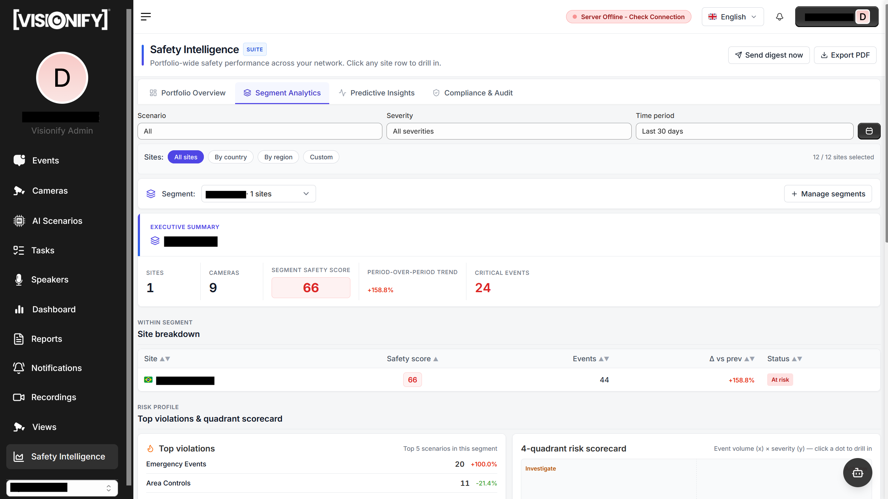
        <div class="step-content">
            <h4>2. Segments</h4>
            <p>The <b>Segments</b> tab breaks your portfolio down by <b>country, region,</b> or <b>custom grouping</b>. Each segment row shows aggregated safety score, total events, MTTR, and a mini trend sparkline. Use this to compare performance across geographies, business units, or franchisee groups. Clicking a segment row filters the other tabs to that segment's sites.</p>
        </div>
    </div>
    <div class="setup-step">
        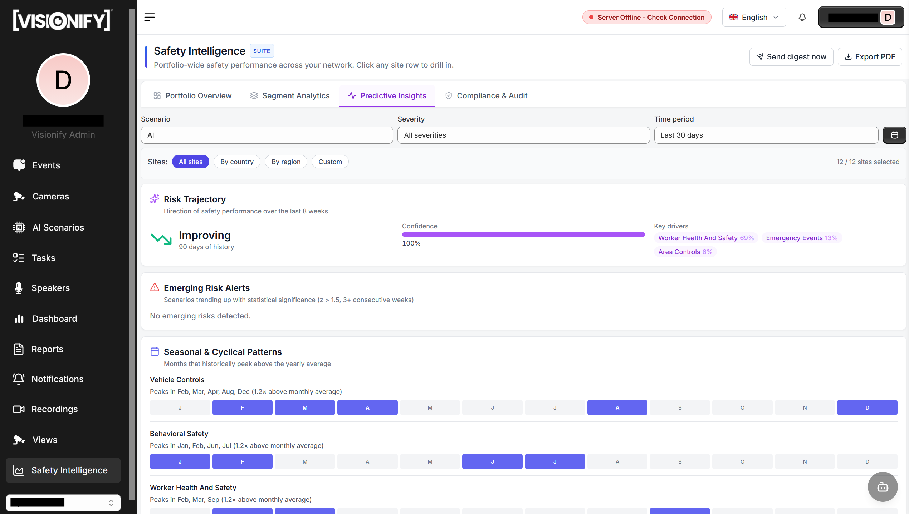
        <div class="step-content">
            <h4>3. Predictive Insights</h4>
            <p>The <b>Predictive</b> tab uses historical incident patterns to forecast where risk is trending upward. Charts show event-count forecasts per site and scenario for the next 7–30 days. Sites projected to cross a risk threshold are surfaced as early-warning alerts, so safety managers can intervene before an incident spike occurs.</p>
        </div>
    </div>
    <div class="setup-step">
        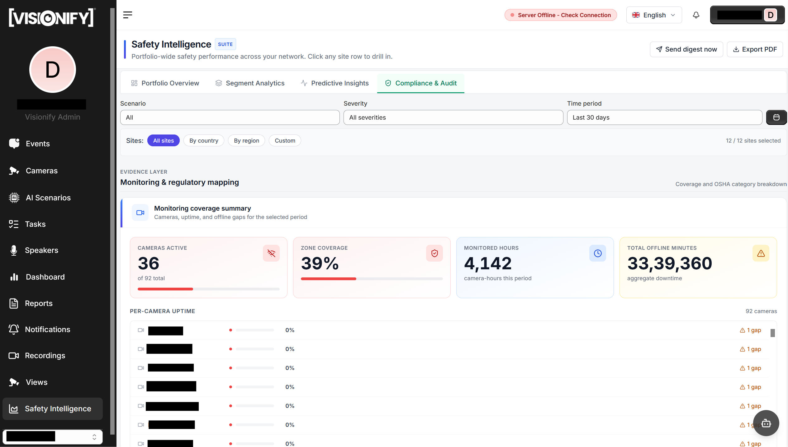
        <div class="step-content">
            <h4>4. Compliance Audit</h4>
            <p>The <b>Compliance</b> tab scores each site's adherence to safety policies, broken down by scenario (e.g., PPE compliance rate, restricted-area adherence). A <b>Scenario × Site matrix</b> lets you spot which specific combinations are chronically non-compliant. Export the audit table as a report for regulators, insurers, or leadership reviews.</p>
        </div>
    </div>
</div>
!!! tip
    Start with the Portfolio tab and its Leaderboard to find the lowest-scoring sites. Switch to Segments to check if underperformance is geographic or isolated. Then use Predictive Insights to decide where to deploy additional resources before the next audit cycle.
---

## Contact Information

<div class="grid-cards">
    <div class="grid-card">
        <h3><span class="material-symbols-outlined">contact_phone</span> Sales Inquiries</h3>
        <p>Get in touch with our sales team for demos and pricing information.</p>
        <ul class="contact-list">
            <li>Email: <a href="mailto:sales@visionify.ai">sales@visionify.ai</a></li>
            <li>Phone: +1 720-449-1124</li>
        </ul>
    </div>
    <div class="grid-card">
        <h3><span class="material-symbols-outlined">support_agent</span> Technical Support</h3>
        <p>Need help? Visit our support portal or contact our technical team.</p>
        <ul class="contact-list">
            <li><a href="https://support.visionify.ai">https://support.visionify.ai</a></li>
            <li><a href="mailto:support@visionify.ai">support@visionify.ai</a></li>
        </ul>
    </div>
    <div class="grid-card">
        <h3><span class="material-symbols-outlined">calendar_month</span> Schedule a Demo</h3>
        <p>See VisionAI in action with a personalized demo from our team.</p>
        <div class="demo-button">
            <a href="https://cal.com/visionify/30min" class="cta-button">
                <span class="material-symbols-outlined">event</span>
                Book Your Demo
            </a>
        </div>
    </div>
</div>

<div class="back-to-top">
    <a href="#" class="back-to-top-button">
        <span class="material-symbols-outlined">arrow_upward</span>
    </a>
</div>
---