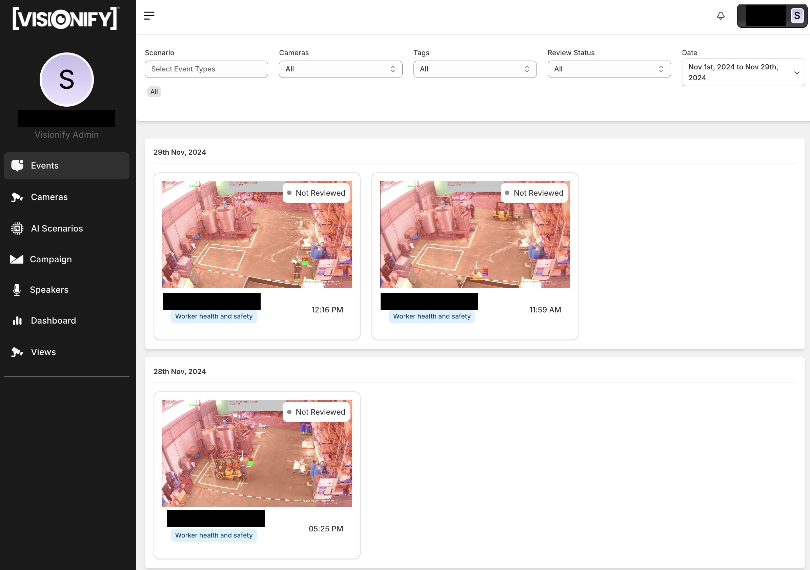
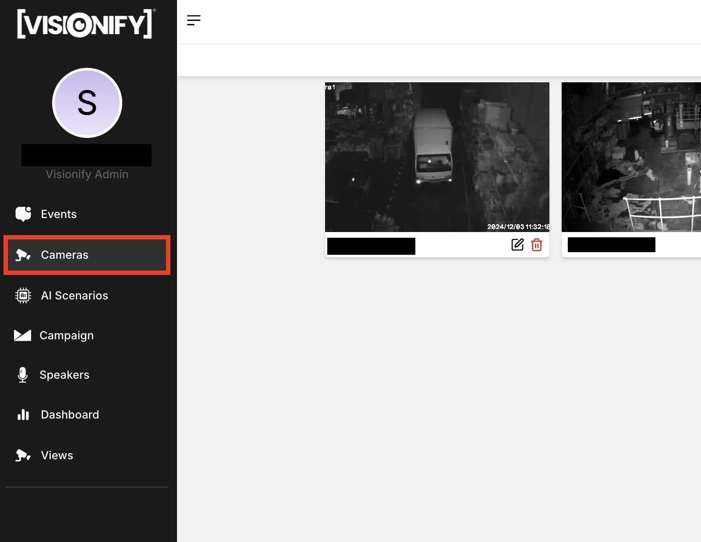
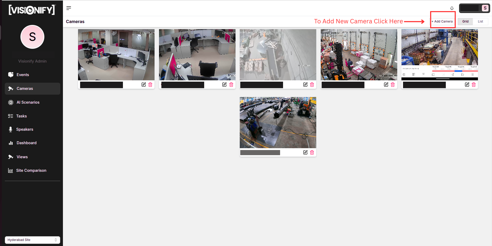
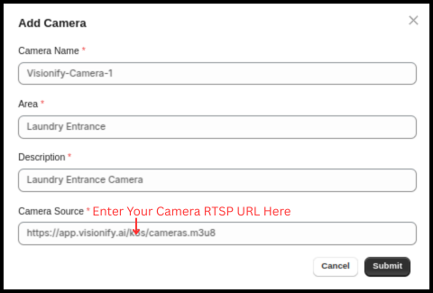

# Quick Start Guide

VisionAI is an enterprise-grade computer vision platform that transforms your existing camera infrastructure into an intelligent workplace safety system. This guide will walk you through the setup process and help you get started with your first safety monitoring deployment.

    <a href="#step-1-account-setup" class="flow-item">
        1
        login
        <h3>Sign In</h3>
        
Create your enterprise account and set up team access

    </a>
    <a href="#step-2-camera-integration" class="flow-item">
        2
        videocam
        <h3>Cameras</h3>
        
Connect your existing camera infrastructure

    </a>
    <a href="#step-3-scenario-configuration" class="flow-item">
        3
        settings_suggest
        <h3>Scenarios</h3>
        
Select and customize safety monitoring scenarios

    </a>
    <a href="#step-4-alert-configuration" class="flow-item">
        4
        notifications_active
        <h3>Alerts</h3>
        
Set up notifications and response workflows

    </a>
    <a href="#step-5-dashboard-access" class="flow-item">
        5
        dashboard
        <h3>Dashboard</h3>
        
Monitor safety metrics in real-time

    </a>

---

## Prerequisites
- Active enterprise subscription or trial account. [Contact Sales](https://visionify.ai/contact).
- Access to your organization's CCTV/camera infrastructure.
- RTSP URLs for your cameras. You can test RTSP URLs using [VLC Player](https://www.videolan.org/vlc/).

---

## Step 1: Sign In {#step-1-account-setup}

Getting started with VisionAI is simple. Here's how to activate your enterprise account:

    

        
        

            <h4>1. Activate Your Account</h4>
            
Once you've signed up for enterprise account, you will receive an activation email from Visionify team. Accept the invite from email & activate the account. Set your own password here.

        

    

    

        
        

            <h4>2. Sign In</h4>
            
Login with your username & password.

        

    

    

        
        

            <h4>3. Access Dashboard</h4>
            
You will be directed to events dashboard page.

        

    

---

## Step 2: Camera Onboarding {#step-2-camera-integration}

Connecting your cameras to VisionAI is straightforward. Follow these steps to integrate your existing camera infrastructure:

    

        
        

            <h4>1. Go to Cameras Page</h4>
            
Navigate to the Cameras page from the main dashboard. Here you'll see all your connected cameras and their status.

        

    

    

        
        

            <h4>2. Add New Camera</h4>
            
Click on the "Add Camera" button to begin the integration process. VisionAI supports IP cameras, CCTV systems, and NVR/DVR setups.

        

    

    

        
        

            <h4>3. Provide Camera Details</h4>
            
Enter your camera details including name, RTSP URL, and location. Test the connection to ensure proper setup before saving.

        

    

!!! note
    1. Test your Camera RTSP URL to make sure it is playing. You can test it using [VLC Player](https://www.videolan.org/vlc/index.html).
    2. Initially, you will see a blank screen for camera. The screenshot for the camera will update once the camera is connected.

---

## Step 3: Scenario Configuration {#step-3-scenario-configuration}

Setting up safety monitoring scenarios is easy with VisionAI. Follow these steps to configure your first scenario:

    

        
        

            <h4>1. Start Scenario Setup</h4>
            
From the camera details page, click on the "Add New Scenario" button to begin configuring safety monitoring for your camera.

        

    

    

        
        

            <h4>2. Choose Scenario</h4>
            
Browse through available safety scenarios and click "Get This" on your desired scenario. Each scenario is designed for specific safety monitoring needs.

        

    

    

        
        

            <h4>3. Define Monitoring Zones</h4>
            
Configure specific zones where you want to monitor safety events. Draw and adjust zones directly on your camera feed for precise monitoring.

        

    

    

        
        

            <h4>4. Fine-tune Parameters</h4>
            
Adjust model confidence thresholds and event duration parameters to match your safety requirements. Click "Apply" to activate the scenario.

        

    

!!! tip
    Start with default parameters and adjust based on your environment's specific needs. You can always modify these settings later.

---

## Step 4: Alert Configuration {#step-4-alert-configuration}

Configure comprehensive notification settings through your dedicated observability platform at `customername.visionify.ai/observability`. VisionAI offers multiple alert types to ensure your team stays informed of safety events:

    

        
        

            <h4>1. Daily Digest Emails</h4>
            
Set up automated daily summaries of safety events, incidents, and compliance metrics. Perfect for management oversight and trend analysis.

        

    

    

        
        

            <h4>2. Periodic Reports</h4>
            
Schedule detailed reports with CSV attachments, delivered via email or Microsoft Teams. Customize reports by area, camera, or specific event types for targeted insights.

        

    

    

        
        

            <h4>3. Text Message Alerts</h4>
            
Enable real-time SMS notifications for immediate awareness of critical safety events. Ideal for urgent situations requiring immediate attention.

        

    

    

        
        

            <h4>4. Speaker Based Alerts</h4>
            
Configure automated audio announcements for real-time safety notifications in your facility. Perfect for immediate on-site response to safety events.

        

    

!!! tip
    Combine multiple alert types for comprehensive coverage. For example, use speaker alerts for immediate on-site response, while keeping management informed through daily digests and periodic reports.

---

## Step 5: Dashboard Access {#step-5-dashboard-access}

The VisionAI dashboard provides comprehensive insights into your safety metrics and events. Here's how to navigate and utilize the dashboard effectively:

    

        
        

            <h4>1. Safety Metrics Overview</h4>
            
Access the Dashboard from the left navigation menu to view key safety metrics. Select custom time ranges to analyze trends across weeks, months, or specific date ranges. Track compliance rates, incident counts, and safety improvements over time.

        

    

    

        
        

            <h4>2. Events Listing</h4>
            
Navigate to the Events page to review specific safety incidents. Filter events by time range, scenarios, event types, or specific cameras. Each event includes a 12-second video clip for detailed investigation and analysis.

        

    

    

        
        

            <h4>3. Event Details</h4>
            
On the event details page, you can view a 12-second video clip of the event. You can click thumbs up/down to vote on the event. You can also add the event to your watchlist or safety campaign.

        

    

!!! tip
    Use the dashboard's filtering capabilities to focus on specific areas or types of safety events. This helps in identifying patterns and addressing recurring safety concerns promptly.

---

## AI Scenarios

- [PPE Compliance](../scenarios/ppe-detection.md)
- [Staircase Safety](../scenarios/staircase-safety.md)
- [Mobile Phone Compliance](../scenarios/mobile-phone-compliance.md)

## Learn More

- [Quick Start](../overview/quick-start.md)
- [Camera Placement Guide](../overview/camera-placement-guide.md)
- [Supported Scenarios](../overview/scenarios.md)
- [Camera Management](../overview/cameras.md)
- [FAQs](../overview/faqs.md)

---

## Contact Information

    

        <h3>contact_phone Sales Inquiries</h3>
        
Get in touch with our sales team for demos and pricing information.

        <ul class="contact-list">
            <li>Email: <a href="mailto:sales@visionify.ai">sales@visionify.ai</a></li>
            <li>Phone: +1 720-449-1124</li>
        </ul>
    

    

        <h3>support_agent Technical Support</h3>
        
Need help? Visit our support portal or contact our technical team.

        <ul class="contact-list">
            <li><a href="https://support.visionify.ai">https://support.visionify.ai</a></li>
            <li><a href="mailto:support@visionify.ai">support@visionify.ai</a></li>
        </ul>
    

    

        <h3>calendar_month Schedule a Demo</h3>
        
See VisionAI in action with a personalized demo from our team.

        

            <a href="https://cal.com/visionify/30min" class="cta-button">
                event
                Book Your Demo
            </a>
        

    

---