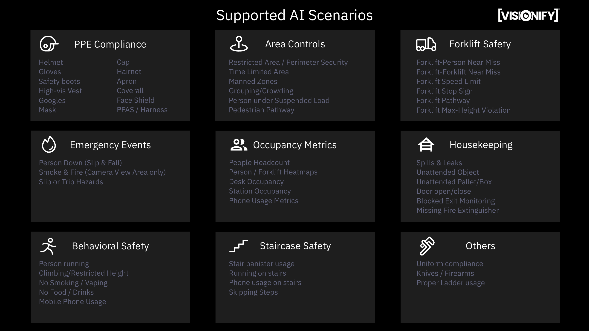

# Scenarios

Scenarios (also referred to as `use cases`) form the building blocks of VisionAI platform. These scenarios are organized into `Suites`. Below we talk about different suites and the scenarios that are part of them.

- All scenarios are available as pick-n-choose scenarios. You can pick the scenarios you want based on your business needs. Each scenario is independently tested.
- Some scenarios require zones to be defined - you can define zones through the VisionAI web-application.
- Events provided by these scenarios are given below. Events are sent to Redis, MQTT & WebSocket endpoints for custom integrations.
- Currently supported scenarios are highlighted by a ✅. Roadmap scenarios are highlighted by a 📅.

Below image also provides a summary of all the scenarios that are supported by VisionAI.



!!! note "New scenario request"
    This chapter lists down all the scenarios that are supported by the VisionAI platform. We are always looking to expand our suite - please [send a request](https://support.visionify.ai) to us about any additional scenarios you need.

---

## PPE Compliance

PPE Compliance is our core application. We support most of the common types of PPEs used in manufacturing & construction industry. This suite is sometimes also referred to by `Worker Health and Safety`.

PPE compliance is the first step towards a comprehensive safety program. Workers sometimes forget to wear PPEs like helmets, gloves, safety boots, high-vis vests, goggles, masks, coveralls etc., due to lack of awareness or complacency. PPE Compliance helps you ensure that workers are wearing the required PPEs.

Ensuring PPE Compliance can yield significant benefits. It can help reduce the number of accidents and injuries in the workplace, improve productivity, and enhance the overall safety culture of the organization.

| Status | Scenario name | Supported Events | Additional considerations |
| :----: | :------------ | :--------------- | :------------------------ |
| ✅ | `PPE Compliance` | `No Helmet` <br>  `No Gloves` <br> `No Safety Boots` <br> `No High-Vis Vest` <br> `No Goggles` <br> `No Mask` <br> `No Cap` <br> `No Apron` <br> `No Hairnet` <br> `No Face Shield (Welding)` <br> `No Coveralls` <br> `No PFAS (Harness)` <br>  `No Earmuffs` <br> | [More details](../scenarios/ppe-detection.md){:target="_blank"}

---

## Emergency Events

Emergency events detection is critical for workplace safety. This suite focuses on detecting various emergency situations that require immediate attention, such as falls, fires, and hazardous conditions. Early detection of these events can help prevent accidents and enable quick response times.

| Status | Scenario name | Supported Events | Additional considerations |
| :----: | :------------ | :--------------- | :------------------------ |
| ✅ | `person-down` | `Person Down Event (slip & fall)` <br> `Slip Hazard Detected` <br> `Trip Hazard Detected` | [More details](../scenarios/slip-and-fall-detection.md){:target="_blank"} |
| ✅ | `smoke-and-fire` | `Smoke Event Detected` <br> `Fire Event Detected` <br> `Sparks Detected` | [More details](../scenarios/smoke-and-fire-detection.md){:target="_blank"} |

---


## Privacy Suite

For a majority of organizations - employee privacy is a top concern. Along with employee privacy, the organization needs to make sure that any data does not leave the premises. Any faces detected through Vision AI system need to be blurred, along with text, signage, computer screens and other sensitive information.

Before any other scenarios are run, or before we store or process the images - the images are pre-processed through this privacy suite. As such, privacy suite is treated differently from other scenarios. Below examples provide a high-level overview of the privacy suite.

---

| Status | Scenario name | Details | Additional considerations |
| :----: | :------------ | :--------------- | :------------------------ |
| ✅ | `face-blurring` | Blur any faces detected | [More details](../privacy/blur-faces.md){:target="_blank"} |
| ✅ | `text-blurring` | Blue any text detected (paper, computer screens etc) | [More details](../privacy/blur-signs.md){:target="_blank"} |
| ✅ | `license-plate-blurring` | Blur any license plates detected | [More details](../privacy/blur-license-plates.md){:target="_blank"} |
| 📅 | `signs-blurring` | Blur any signs detected | [More details](../privacy/blur-signs.md){:target="_blank"} |
| 📅 | `obstructed-camera` | If camera feed is obstructed, send an alert | [More details](../privacy/obstructed-camera-view.md){:target="_blank"} |

---


## Hazard Warnings Suite

Following scenarios provide hazard warning examples supported by VisionAI suite. Currently supported scenarios are highlighted by a ✅. 


| Status | Scenario name | Supported Events | Additional considerations |
| :----: | :------------ | :--------------- | :------------------------ |
| ✅ | `smoke-and-fire-detection`       | `Smoke event detected` <br> `Fire event detected` <br> `Sparks detected` <br> `Open flames detection` | [More details](../scenarios/smoke-and-fire-detection.md){:target="_blank"} |
| ✅ | `no-smoking-zone`                | `Smoking event detected` <br> `Vaping event detected` | [More details](../scenarios/no-smoking-hazard.md){:target="_blank"} |
| 📅 | `spills-and-leak-detection`      | `Water puddle detected` <br> `Water leak from equipment detected` <br> `Spill event detected` <br> `Slippery sign detected` |
| 📅 | `missing-fire-extinguisher`      | `Fire extinguisher missing` |
| 📅 | `blocked-exit-monitoring`        | `Blocked exit detected` |
| ✅ | `rust-and-corrosion-detection`   | `Rust or corrosion event detected` | [More details](../scenarios/rust-and-corrosion-hazard.md){:target="_blank"} |


---

## Occupancy Policies

Occupancy Policies relate to counting and tracking employees and/or other personnel in the room. These could include people-counting and enforcing max-occupancy policies, or tracking people's dwell time in a confined space.

Currently supported scenarios are highlighted by a ✅. 

!!! note "Occupancy Metrics"
    - Occupancy metrics is similar in structure to max-occupancy, or restricted areas scenarios.
    - However it sends out a summary event is structured like this. This will give a granular summary event at the end of the day.
    - Users can start with occupancy-metrics and then move to max-occupancy or restricted areas if they need to enforce policies.
    ``` json
    {
      "date": "2023-02-23",
      "stations": [{
        "id": "station_1",
        "hours": [
            {
              "start_time": "2023-02-23T14:00:01",
              "end_time": "2023-02-23T15:00:00",
              "occupancy_cnt": 14
            }
            ...
        ]
      }...]
    }
    ```

Also need to specify that the camera needs to be configured to have a good view of the stations where occupancy metrics need to be checked.

| Status | Scenario name | Supported Events | Additional considerations |
| :----: | :------------ | :--------------- | :------------------------ |
| ✅ | `max-occupancy`              | `Person count exceeds max limit` | [More details](../scenarios/max-occupancy-count.md) |
| ✅ | `restricted-areas`           | `Person detected in restricted area` <br> `Movement detected in restricted area` <br> `Person detected after hours` <br> `Movement detected after hours` | [More details](../scenarios/exclusion-zones.md){:target="_blank"} |
| ✅ | `dwell-time`                 | `Person detected` <br> `Person left` <br> `Person dwell time exceeds limit` <br> `Person detected without motion` <br> `Person fall detected` | [More details](../scenarios/confined-spaces-monitoring.md){:target="_blank"} |
| ✅ | `station-occupancy`          | `Daily summary event` | [More details](../scenarios/station-occupancy.md){:target="_blank"} |
| 📅 | `occupancy-metrics`          | `Daily summary event` |
| 📅 | `authorized-personnel-only`  | `Unauthorized person detected` |


[^1]: This works by detecting a person's uniform and comparing it to a list of authorized personnel. This is a more advanced scenario and requires a custom model to be trained for your specific use-case.

---

## Company Policies

Company policies include specific scenarios that are relevant to your company. These could include scenarios like no-smoking/no-vaping zones, no food or drinks in certain areas, or no cell phones/pictures in certain areas. Some of these scenarios overlap with [occupancy policies](#occupancy-policies), but they are still useful to have here as separate scenarios.

| Status | Scenario name | Supported Events | Additional considerations |
| :----: | :------------ | :--------------- | :------------------------ |
| 📅 | `no-food-or-drinks-allowed`  | `Person with food detected` <br> `Person with drinks detected` <br> `Spill event detected` | [More details](../scenarios/no-food-or-drinks.md){:target="_blank"} |
| ✅ | `no-phone-text-pictures`     | `Cellphone usage detected` <br> `Person detected taking pictures` | [More details](../scenarios/no-phone-usage.md){:target="_blank"} |
| ✅ | `no-smoking-or-vaping`       | `Smoking event detected` <br> `Vaping event detected` | [More details](../scenarios/no-smoking.md){:target="_blank"} |
| ✅ | `no-children-pets-visitors`  | `Children detected` <br> `Pets detected` <br> `Visitors detected` | [More details](../scenarios/authorized-personnel.md){:target="_blank"} |

---
## Suspicious Activity detection

Suspicious activity detection suite relies on a combination of activity detection models and object detection models. These models are trained to detect suspicious activity in a variety of scenarios.


| Status | Scenario name | Supported Events | Additional considerations |
| :----: | :------------ | :--------------- | :------------------------ |
| 📅  | `vandalism-graffiti-company-property-destruction` | `Motion detected in area (gross event)` <br> `People detected in area (more granular event)` <br> `Non-uniformed personnel detected in area` <br> `Non badged personnel detected in area` <br> `Vandalism detected in area (before & after)` <br> `Paint/graffiti detected in area (before & after changes)` <br> `Behavior analysis event showing company property destruction.` | [More details](../scenarios/vandalism.md){:target="_blank"} |
| ✅ | `firearms-knives-detection` | `Person brandishing firearm` <br> `Person brandishing knives` | [More details](../scenarios/firearms-and-knives.md){:target="_blank"} |


---

## Behavioral Safety Suite

Behavioral safety focuses on identifying and correcting unsafe behaviors before they lead to accidents. This suite monitors various behavioral patterns that could potentially cause injuries or accidents in the workplace. By detecting these behaviors early, organizations can provide timely interventions and training to promote safer work practices.

| Status | Scenario name | Supported Events | Additional considerations |
| :----: | :------------ | :--------------- | :------------------------ |
| ✅ | `unsafe-behavior` | `Person running detected` <br> `Climbing on equipment detected` <br> `Working at unsafe height detected` | [More details](../scenarios/unsafe-behavior.md){:target="_blank"} |
| ✅ | `prohibited-activities` | `Smoking detected` <br> `Vaping detected` <br> `Food/drinks in restricted area` | [More details](../scenarios/prohibited-activities.md){:target="_blank"} |
| ✅ | `phone-usage` | `Mobile phone usage detected` <br> `Texting while walking detected` <br> `Taking pictures in restricted area` | [More details](../scenarios/phone-usage.md){:target="_blank"} |

---

## Next Steps

Now that you have a better understanding of the scenarios that are available, you can start to think about how you can organize these scenarios into a solution that meets your needs. You can also go to the individual scenario page to learn more about it. We can customize each of these models for your use-cases and provide you with a solution that is tailored to your needs. You can contact us through [this page](https://visionify.ai/contact-us/-us/).