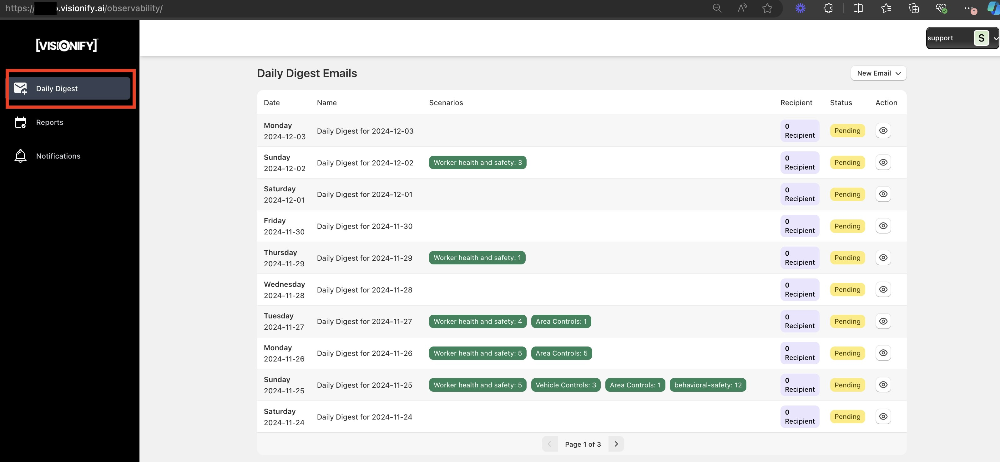
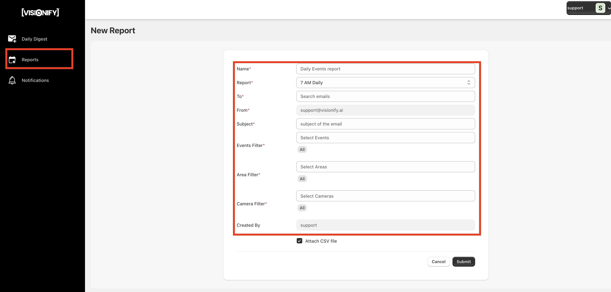
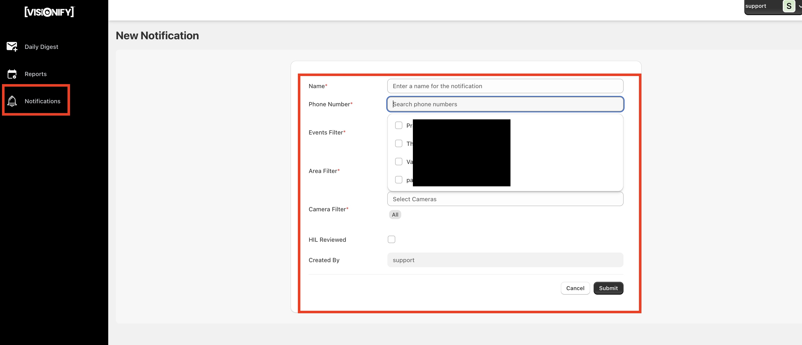
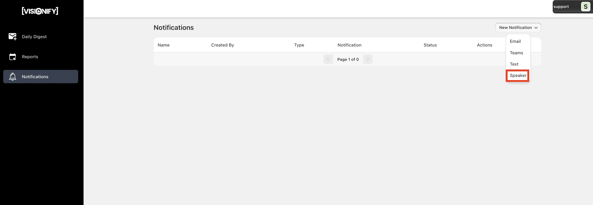

# Alerts & Notifications

VisionAI provides comprehensive notification capabilities to ensure your team stays informed of safety events in real-time. This guide covers the various alert types and configuration options available through your Visionify App.

## Alert Types

    

        <h3>Daily Digest</h3>
        
Daily safety summary email.

        

            

                <h4>Features:</h4>
                <ul>
                    <li>Last Day summary</li>
                    <li>Summary metrics</li>
                    <li>Watch Trends</li>
                    <li>Larger audience</li>
                </ul>
            

            <h4>Best For:</h4>
            

                <ul>
                    <li>Safety managers</li>
                    <li>Facility supervisors</li>
                    <li>Management teams</li>
                </ul>
            

        

    

    

        <h3>Periodic Reports</h3>
        
Hourly, daily Email/Teams report.

        

            <h4>Features:</h4>
            <ul>
                <li>CSV exports</li>
                <li>Custom schedules</li>
                <li>Area filtering</li>
                <li>Teams integration</li>
            </ul>
            <h4>Report Types:</h4>
            <ul>
                <li>Compliance data</li>
                <li>Incident reports</li>
                <li>Area analysis</li>
            </ul>
        

    

    

        <h3>Text Message</h3>
        
Instant SMS Alert for critical events.

        

            <h4>Features:</h4>
            <ul>
                <li>Instant delivery</li>
                <li>Priority levels</li>
                <li>Team escalation</li>
                <li>Response tracking</li>
            </ul>
            <h4>Use Cases:</h4>
            <ul>
                <li>Emergency events</li>
                <li>Critical violations</li>
                <li>Urgent responses</li>
            </ul>
        

    

    

        <h3>Speaker</h3>
        
On-site audio alerts for immediate action.

        

            <h4>Features:</h4>
            <ul>
                <li>Custom messages</li>
                <li>Multiple languages</li>
                <li>Zone-specific</li>
                <li>Volume control</li>
            </ul>
            <h4>Applications:</h4>
            <ul>
                <li>PPE violations</li>
                <li>Area restrictions</li>
                <li>Safety reminders</li>
            </ul>
        

    

## Alert Configuration

Configure comprehensive notification settings through your dedicated observability platform at `customername.visionify.ai/observability`. VisionAI offers multiple alert types to ensure your team stays informed of safety events:

    

        
        

            <h4>1. Daily Digest Emails</h4>
            
Set up automated daily summaries of safety events, incidents, and compliance metrics. Perfect for management oversight and trend analysis.

        

    

    

        
        

            <h4>2. Periodic Reports</h4>
            
Schedule detailed reports with CSV attachments, delivered via email or Microsoft Teams. Customize reports by area, camera, or specific event types for targeted insights.

        

    

    

        
        

            <h4>3. Text Message Alerts</h4>
            
Enable real-time SMS notifications for immediate awareness of critical safety events. Ideal for urgent situations requiring immediate attention.

        

    

    

        
        

            <h4>4. Speaker Based Alerts</h4>
            
Configure automated audio announcements for real-time safety notifications in your facility. Perfect for immediate on-site response to safety events.

        

    

!!! tip
    Combine multiple alert types for comprehensive coverage. For example, use speaker alerts for immediate on-site response, while keeping management informed through daily digests and periodic reports.

## Next Steps

- [Quick Start](../overview/quick-start.md)
- [Camera Placement Guide](../overview/camera-placement-guide.md)
- [Supported Scenarios](../overview/scenarios.md)
- [Camera Management](../overview/cameras.md)
- [FAQs](../overview/faqs.md)

---

## Contact Information

    

        <h3>Sales Inquiries</h3>
        
Get in touch with our sales team for demos and pricing information.

        <ul class="contact-list">
            <li>Email: <a href="mailto:sales@visionify.ai">sales@visionify.ai</a></li>
            <li>Phone: +1 720-449-1124</li>
        </ul>
    

    

        <h3>Technical Support</h3>
        
Need help? Visit our support portal or contact our technical team.

        <ul class="contact-list">
            <li><a href="https://support.visionify.ai">https://support.visionify.ai</a></li>
            <li><a href="mailto:support@visionify.ai">support@visionify.ai</a></li>
        </ul>
    

    

        <h3>Schedule a Demo</h3>
        
See VisionAI in action with a personalized demo from our team.

        

            <a href="https://cal.com/visionify/30min" class="cta-button">Book Your Demo</a>
        

    

---