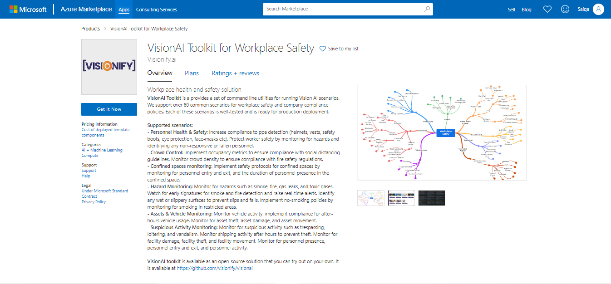

# Azure Managed App

> VisionAI Azure Managed Application is a  pre-built cloud solution that is deployed through Azure Marketplace to an Azure environment for end customers. 

## Overview

VisionAI Azure Managed application is designed to provide a fast and secure way to deliver applications and services to customers while ensuring consistency and control.

Basically, Managed Applications is a packaged solution that include all the necessary resources and components, such as virtual machines, storage accounts, networking resources, and security configurations. 

## Access VisionAI App

VisionAI Azure App is accessible by logging into Azure Market Place.

It shows its Overview, different plans and ratings.
Once we click, **Get it Now**. Following screen appears.

Enter all your information and click on **Continue**. It takes you to your dashboard as:

In Basics tab, Enter your project details in the following screen.

 If you have empty resource group, please select that otherwise create **new** by clicking on **Create new**.

Verify Virtual Machine Settings. Click on **Review+create**. It takes some time to perform validation.

The Managed Applications can be customized with branding, pricing, and support offerings, allowing MSPs to differentiate their offerings and provide added value to their customers.

In summary, Azure Managed Applications offer a simplified and streamlined way to deploy and manage pre-built cloud solutions, enabling customers to focus on their core business functions while leaving the management and maintenance of the underlying infrastructure to Microsoft.