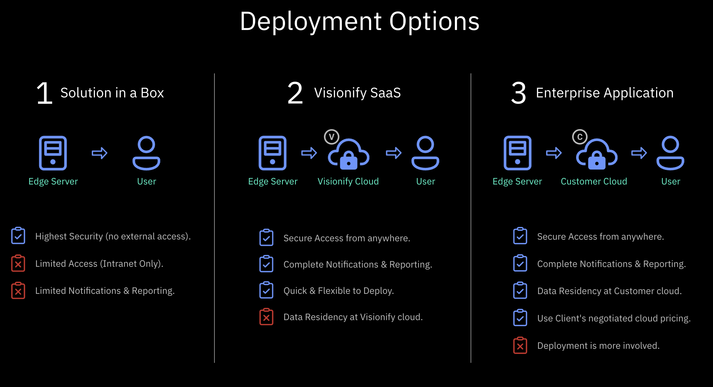

# Deployment Options

VisionAI offers flexible deployment options to meet your organization's specific requirements for security, privacy, and infrastructure. Choose from our three deployment models based on your needs for data residency, connectivity, and system integration.

---

## Available Deployment Models

    

        

            <h3>Solution in a Box</h3>
            Highest Security
        

        

            
Complete on-premise solution with maximum security and privacy.

            <h4>Key Features:</h4>
            <ul>
                <li>Edge server contains entire solution</li>
                <li>Highest security and privacy</li>
                <li>Operates within intranet only</li>
                <li>Zero cloud costs</li>
                <li>Limited connectivity</li>
                <li>Limited notifications & reporting</li>
            </ul>
            

                <!-- <a href="../solution-in-box" class="learn-more">Learn More →</a> -->
            

        

    

    

        

            <h3>Visionify SaaS</h3>
            Most Flexible
        

        

            
Quick deployment with full features and cloud-based management.

            <h4>Key Features:</h4>
            <ul>
                <li>Edge server for inference</li>
                <li>Cloud-based webapp & database</li>
                <li>Quick & flexible deployment</li>
                <li>Complete notifications & reporting</li>
                <li>Managed video storage</li>
                <li>Data resides in Visionify Cloud</li>
            </ul>
            

                <!-- <a href="../saas-deployment" class="learn-more">Learn More →</a> -->
            

        

    

    

        

            <h3>Enterprise App</h3>
            Full Control
        

        

            
Deploy in your cloud infrastructure with complete control.

            <h4>Key Features:</h4>
            <ul>
                <li>Edge server for inference</li>
                <li>Your cloud infrastructure</li>
                <li>Single tenant deployment</li>
                <li>Complete notifications & reporting</li>
                <li>Use existing cloud pricing</li>
                <li>Full data residency control</li>
            </ul>
            

                <!-- <a href="../enterprise-deployment" class="learn-more">Learn More →</a> -->
            

        

    

---

## Deployment Comparison

<table>
    <thead>
        <tr>
            <th>Feature</th>
            <th>Solution in a Box</th>
            <th>Visionify SaaS</th>
            <th>Enterprise Application</th>
        </tr>
    </thead>
    <tbody>
        <tr>
            <td>Deployment Time</td>
            <td>1-2 Week</td>
            <td>1-2 Week</td>
            <td>3-4 Weeks</td>
        </tr>
        <tr>
            <td>Data Residency</td>
            <td>On-premise only</td>
            <td>Visionify Cloud</td>
            <td>Customer Cloud</td>
        </tr>
        <tr>
            <td>Security Level</td>
            <td>Highest</td>
            <td>High</td>
            <td>High</td>
        </tr>
        <tr>
            <td>Connectivity Required</td>
            <td>Intranet only</td>
            <td>Internet</td>
            <td>Internet</td>
        </tr>
        <tr>
            <td>Notifications</td>
            <td>Basic</td>
            <td>Full</td>
            <td>Full</td>
        </tr>
        <tr>
            <td>Reporting</td>
            <td>Basic</td>
            <td>Advanced</td>
            <td>Advanced</td>
        </tr>
        <tr>
            <td>Infrastructure Costs</td>
            <td>Lowest</td>
            <td>Medium</td>
            <td>Custom</td>
        </tr>
    </tbody>
</table>

---

## Next Steps
- [Quick Start](../../overview/quick-start)
- [Camera Placement Guide](../../overview/camera-placement-guide)
- [Supported Scenarios](../../scenarios)
- [Camera Management](../../overview/cameras)
- [FAQs](../../overview/faqs)

---

## Contact Information

    

        <h3>Sales Inquiries</h3>
        
Get in touch with our sales team for demos and pricing information.

        <ul class="contact-list">
            <li>Email: <a href="mailto:sales@visionify.ai">sales@visionify.ai</a></li>
            <li>Phone: +1 720-449-1124</li>
        </ul>
    

    

        <h3>Technical Support</h3>
        
Need help? Visit our support portal or contact our technical team.

        <ul class="contact-list">
            <li><a href="https://support.visionify.ai">https://support.visionify.ai</a></li>
            <li><a href="mailto:support@visionify.ai">support@visionify.ai</a></li>
        </ul>
    

    

        <h3>Schedule a Demo</h3>
        
See VisionAI in action with a personalized demo from our team.

        

            <a href="https://cal.com/visionify/30min" class="cta-button">Book Your Demo</a>
        

    

---