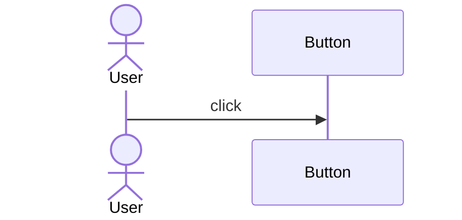
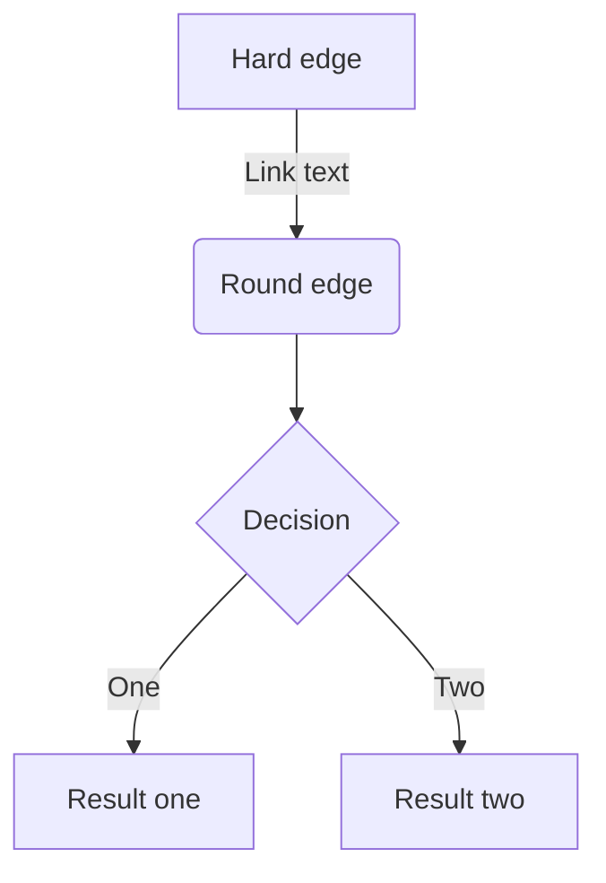
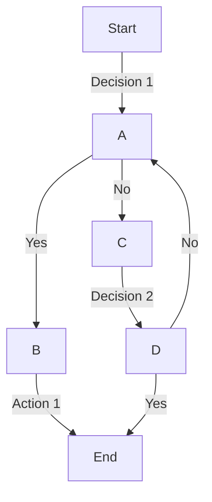
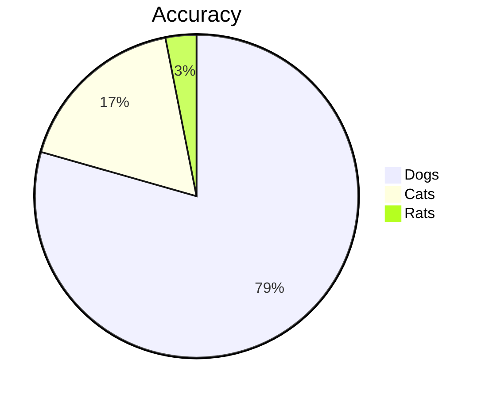
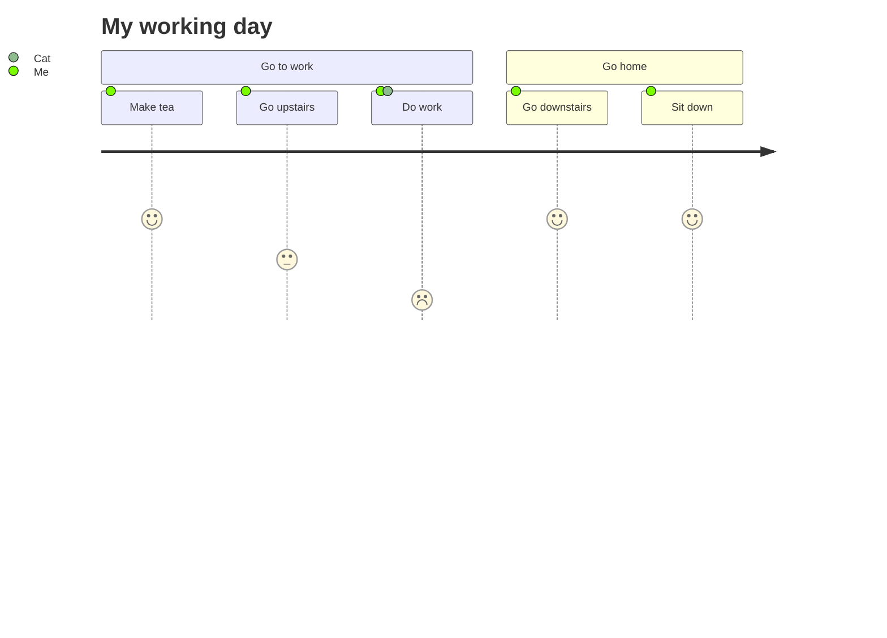
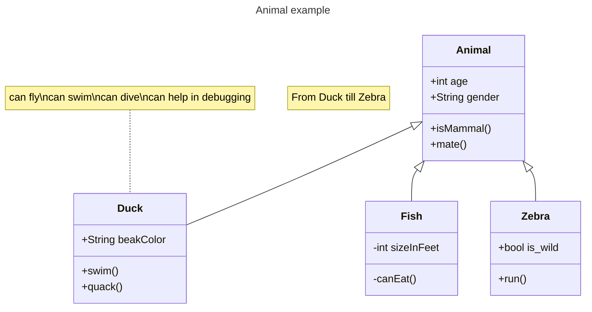
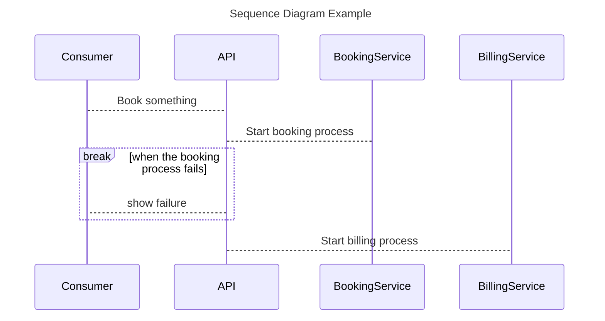

# Notes

## Definition List

`Lorem ipsum dolor sit amet`

:   Sed sagittis eleifend rutrum. Donec vitae suscipit est. Nullam tempus
    tellus non sem sollicitudin, quis rutrum leo facilisis.

`Cras arcu libero`

:   Aliquam metus eros, pretium sed nulla venenatis, faucibus auctor ex. Proin
    ut eros sed sapien ullamcorper consequat. Nunc ligula ante.

    Duis mollis est eget nibh volutpat, fermentum aliquet dui mollis.
    Nam vulputate tincidunt fringilla.
    Nullam dignissim ultrices urna non auctor.


## Partially completed list

- [x] Lorem ipsum dolor sit amet, consectetur adipiscing elit
- [ ] Vestibulum convallis sit amet nisi a tincidunt
    * [x] In hac habitasse platea dictumst
    * [x] In scelerisque nibh non dolor mollis congue sed et metus
    * [ ] Praesent sed risus massa
- [ ] Aenean pretium efficitur erat, donec pharetra, ligula non scelerisque


## Tables
Suite	Scenarios	Supported events
Hazard Warnings	Smoke and Fire Detection	"Smoke event detected
Fire event detected
Sparks detected
Open flames detection"
	No smoking/no-vaping zones	"Smoking event detected
Vaping event detected"
	Spills & Leaks detection (Liquids)	"Water puddle detected
Water leak from equipment detected
Spill event detected
Slippery sign detected"
	Gas leak detection	Gas leak detected
	Missing fire-extinguisher	Missing fire extinguisher
	Blocked exit monitoring	Blocked exit detected
	Equipment temperature	"Temperature exceeds limit
Temperature subceeds limit"
	Slip/trip and fall detection	Blocker on pathway detected.
	Equipment rust-and-corrosion	Rust or corrosion event detected


---
**Hazard Warnings**
---
| Scenario name  | Supported Events |
| :------------- | :-------------   |
| `smoke-and-fire-detection` ✅  | Fire event detected <br> Smoke Event Detected <br> Sparks Detected <br> Open Flames Detected  |
| `no-smoking-no-vaping-zones` ✅  | Smoking event detected <br> Vaping event detected |
| `smoke-and-fire-detection` ✅   | Fire event detected <br> Smoke Event Detected <br> Sparks Detected <br> Open Flames Detected  |

  Smoke and Fire Detection
  No smoking/no-vaping zones
  Spills & Leaks detection (Liquids)
  Gas leak detection
  Missing fire-extinguisher
  Blocked exit monitoring
  Equipment temperature
  Slip/trip and fall detection
  Equipment rust-and-corrosion


## Callout

!!! note

    Lorem ipsum dolor sit amet, consectetur adipiscing elit. Nulla et euismod
    nulla. Curabitur feugiat, tortor non consequat finibus, justo purus auctor
    massa, nec semper lorem quam in massa.


!!! abstract
    Lorem ipsum dolor sit amet, consectetur adipiscing elit. Nulla et euismod nulla. Curabitur feugiat, tortor non consequat finibus, justo purus auctor massa, nec semper lorem quam in massa.

!!! warning
    Lorem ipsum dolor sit amet, consectetur adipiscing elit. Nulla et euismod nulla. Curabitur feugiat, tortor non consequat finibus, justo purus auctor massa, nec semper lorem quam in massa.

!!! danger
    Lorem ipsum dolor sit amet, consectetur adipiscing elit. Nulla et euismod nulla. Curabitur feugiat, tortor non consequat finibus, justo purus auctor massa, nec semper lorem quam in massa.

!!! success
    Lorem ipsum dolor sit amet, consectetur adipiscing elit. Nulla et euismod nulla. Curabitur feugiat, tortor non consequat finibus, justo purus auctor massa, nec semper lorem quam in massa.

!!! question
    Lorem ipsum dolor sit amet, consectetur adipiscing elit. Nulla et euismod nulla. Curabitur feugiat, tortor non consequat finibus, justo purus auctor massa, nec semper lorem quam in massa.

!!! tip
    Lorem ipsum dolor sit amet, consectetur adipiscing elit. Nulla et euismod nulla. Curabitur feugiat, tortor non consequat finibus, justo purus auctor massa, nec semper lorem quam in massa.

!!! quote
    Lorem ipsum dolor sit amet, consectetur adipiscing elit. Nulla et euismod nulla. Curabitur feugiat, tortor non consequat finibus, justo purus auctor massa, nec semper lorem quam in massa.

!!! note "VisionAI Comment"

    Lorem ipsum dolor sit amet, consectetur adipiscing elit. Nulla et
    euismod nulla. Curabitur feugiat, tortor non consequat finibus, justo
    purus auctor massa, nec semper lorem quam in massa.


## Images

<figure markdown>
  { width="300" }
  <figcaption>Image caption</figcaption>
</figure>


<figure markdown>
  { loading=lazy }
  <figcaption>Image caption</figcaption>
</figure>


## Side-by-side code-blocks

=== "Material for MkDocs"

    ``` yaml
    name: ci # (1)!
    on:
      push:
        branches:
          - master # (2)!
          - main
    permissions:
      contents: write
    jobs:
      deploy:
        runs-on: ubuntu-latest
        steps:
          - uses: actions/checkout@v3
          - uses: actions/setup-python@v4
            with:
              python-version: 3.x
          - uses: actions/cache@v2
            with:
              key: ${{ github.ref }}
              path: .cache
          - run: pip install mkdocs-material # (3)!
          - run: mkdocs gh-deploy --force
    ```

    1.  You can change the name to your liking.

    2.  At some point, GitHub renamed `master` to `main`. If your default branch
        is named `master`, you can safely remove `main`, vice versa.

    3.  This is the place to install further [MkDocs plugins] or Markdown
        extensions with `pip` to be used during the build:

        ``` sh
        pip install \
          mkdocs-material \
          mkdocs-awesome-pages-plugin \
          ...
        ```

=== "Insiders"

    ``` yaml
    name: ci
    on:
      push:
        branches:
          - master
          - main
    permissions:
      contents: write
    jobs:
      deploy:
        runs-on: ubuntu-latest
        if: github.event.repository.fork == false
        steps:
          - uses: actions/checkout@v3
          - uses: actions/setup-python@v4
            with:
              python-version: 3.x
          - uses: actions/cache@v2
            with:
              key: ${{ github.ref }}
              path: .cache
          - run: apt-get install pngquant # (1)!
          - run: pip install git+https://${GH_TOKEN}@github.com/squidfunk/mkdocs-material-insiders.git
          - run: mkdocs gh-deploy --force
    env:
      GH_TOKEN: ${{ secrets.GH_TOKEN }} # (2)!
    ```

## Code blocks annotations

Material for MkDocs is published as a [Python package] and can be installed with
`pip`, ideally by using a [virtual environment]. Open up a terminal and install
Material for MkDocs with:

``` yaml
theme:
  features:
    - content.code.annotate # (1)
```

1.  👷 I'm a code annotation! I can contain `code`, __formatted
    text__, images, ... basically anything that can be written in Markdown.


## Version/tags flags


[:octicons-tag-24: 9.0.0][Code copy button support] ·
:octicons-unlock-24: Feature flag


## Adding a title to a code-block

``` python title="bubble_sort.py"
def bubble_sort(items):
    for i in range(len(items)):
        for j in range(len(items) - 1 - i):
            if items[j] > items[j + 1]:
                items[j], items[j + 1] = items[j + 1], items[j]
```


## Hover, Important information

TODO:

``` markdown title="Icon with tooltip"
 {title="Important information" }
```


:handshake:{title="Important information" }

hello this is important.

:material-information-outline:{title="Important information" }


## Adding footnotes

[^1]: This is a footnote.

This is how you add footnotes.

[^2]: This is another footnote.


## Add buttons

[Subscribe to our newsletter](#){ .md-button }


another button

[Subscribe to our newsletter](#){ .md-button .md-button--primary }


## Data tables

``` markdown title="This is table 1"
| Method      | Description                          |
| ----------- | ------------------------------------ |
| `GET`       | :material-check:     Fetch resource  |
| `PUT`       | :material-check-all: Update resource |
| `DELETE`    | :material-close:     Delete resource |
```


| Method      | Description                          |
| ----------- | ------------------------------------ |
| `GET`       | :material-check:     Fetch resource  |
| `PUT`       | :material-check-all: Update resource |
| `DELETE`    | :material-close:     Delete resource |


## Text highlighting


- ==This was marked==
- ^^This was inserted^^
- ~~This was deleted~~


## Text block with title
``` title="Emoji"
Here you can add anything..
```
:smile:


## Mermaid


#### Sequence Diagram



#### Flowchart


### Another chart



#### Pi chart


#### User Journey




#### Class Diagram




#### Sequence Diagram




