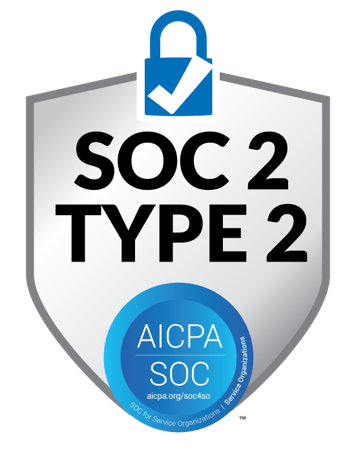
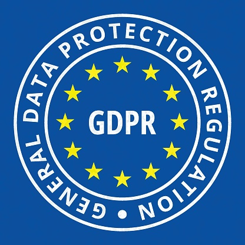

# Security

> Visionify's commitment to security and privacy goes beyond compliance - it's built into our DNA. Our platform meets the highest enterprise security standards while protecting individual privacy.

    <figure style="margin: 0; text-align: center; height: 250px; display: flex; flex-direction: column;">
        
        <figcaption>SOC 2 Type II Certified</figcaption>
    </figure>
    <figure style="margin: 0; text-align: center; height: 250px; display: flex; flex-direction: column;">
        
        <figcaption>GDPR Compliant</figcaption>
    </figure>

## Enterprise-Grade Security

### Infrastructure Security
- **Azure Cloud Infrastructure**: Leveraging Microsoft Azure's enterprise-grade security
- **End-to-End Encryption**: AES-256 encryption for data at rest and in transit
- **Network Isolation**: Private VNet support with dedicated instances
- **Access Controls**: Role-based access control (RBAC)

### Data Protection
- **Data Residency**: Options for US, EU, and custom data centers
- **Data Retention**: Configurable retention policies
- **Backup & Recovery**: Automated backups with point-in-time recovery
- **Audit Trails**: Comprehensive logging of all system access

## Privacy by Design

### Video Privacy
- **Automated Face Blurring**: Real-time face anonymization
- **License Plate Masking**: Automatic vehicle identification masking
- **Text Redaction**: Intelligent text and signage blurring
- **Minimal Data Storage**: Only relevant event metadata stored

### Compliance Features
- **Data Minimization**: Only essential data collected and processed
- **Right to be Forgotten**: Built-in data deletion capabilities
- **Privacy Controls**: Granular privacy settings configuration
- **Consent Management**: Built-in consent tracking system

## Security Certifications

### SOC 2 Type II Certified
Our SOC 2 Type II certification demonstrates our commitment to:

- Security
- Availability
- Processing Integrity
- Confidentiality
- Privacy

### GDPR Compliance
Full compliance with EU data protection regulations including:

- Data Protection Impact Assessments
- Privacy Impact Assessments
- Data Processing Agreements
- Subject Access Request Management

## Enterprise Controls

### Authentication & Access
- **Multi-Factor Authentication**: Required for all admin access
- **IP Whitelisting**: Restrict access to approved networks
- **Session Management**: Automatic timeout and session controls

### Monitoring & Alerts
- **24/7 Security Monitoring**: Real-time threat detection
- **Automated Alerts**: Immediate notification of security events
- **Activity Logging**: Comprehensive audit trails
- **Performance Monitoring**: Continuous system health checks

### Data Governance
- **Data Classification**: Automated data categorization
- **Access Controls**: Granular permissions management
- **Retention Policies**: Configurable data lifecycle management
- **Audit Capabilities**: Complete data access tracking

### Security Operations
- **Incident Response**: 24/7 security team
- **Vulnerability Management**: Regular security assessments
- **Patch Management**: Automated security updates
- **Penetration Testing**: Annual third-party testing

## Learn More

- [Get Started](../overview/quick-start.md)
- [Workplace Safety Best Practices Guide](../overview/best-practices.md)
- [Compliance & Reporting Features](../overview/compliance.md)
- [Integration with Existing Systems](../overview/integration.md)
- [Alerts & Notifications](../overview/alerts-and-notifications.md)

---

## Contact Information

    

        <h3>contact_phone Sales Inquiries</h3>
        
Get in touch with our sales team for demos and pricing information.

        <ul class="contact-list">
            <li>Email: <a href="mailto:sales@visionify.ai">sales@visionify.ai</a></li>
            <li>Phone: +1 720-449-1124</li>
        </ul>
    

    

        <h3>support_agent Technical Support</h3>
        
Need help? Visit our support portal or contact our technical team.

        <ul class="contact-list">
            <li><a href="https://support.visionify.ai">https://support.visionify.ai</a></li>
            <li><a href="mailto:support@visionify.ai">support@visionify.ai</a></li>
        </ul>
    

    

        <h3>calendar_month Schedule a Demo</h3>
        
See VisionAI in action with a personalized demo from our team.

        

            <a href="https://cal.com/visionify/30min" class="cta-button">
                event
                Book Your Demo
            </a>
        

    

---