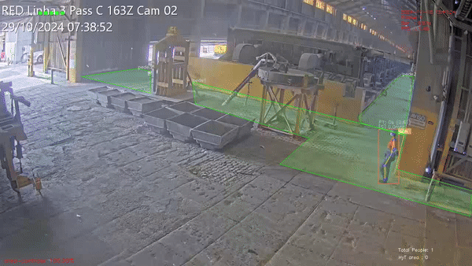

# Area Control

> Transform your workplace safety program with AI-powered area monitoring that helps prevent accidents, maintains occupancy compliance, and ensures worker safety in restricted zones.

<figure markdown>
  { width="600" }
  <figcaption>Real-time detection of safety zone violations</figcaption>
</figure>

Our enterprise solution helps you:

- Prevent unauthorized access to dangerous areas
- Ensure worker safety in high-risk zones
- Monitor pedestrian and vehicle pathways
- Track occupancy limits in restricted areas
- Generate compliance documentation automatically

## Why Area Control Matters for Workplace Safety

In today's complex industrial environments, maintaining worker safety in different areas of your facility is a critical challenge for EHS managers. Whether it's:

- Protecting workers from dangerous equipment zones
- Managing occupancy in high-risk areas
- Ensuring compliance with safety regulations
- Preventing unauthorized access to restricted areas
- Maintaining clear emergency exit paths

Traditional safety methods like physical barriers, warning signs, or periodic safety walks have significant gaps:

- No real-time monitoring capability
- Heavy reliance on worker compliance
- Limited coverage of large facilities
- Difficulty in proving compliance
- No data for safety improvements
- High cost of dedicated safety personnel

## Real-World Applications

<figure markdown>
  { width="600" }
  <figcaption>Real-time detection of restricted zone violations</figcaption>
</figure>

<figure markdown>
  { width="600" }
  <figcaption>Automated monitoring of pedestrian pathway compliance</figcaption>
</figure>

## The Smart Solution: AI-Powered Safety Monitoring

Visionify's Area Control solution transforms how you manage workplace safety zones:

1. **24/7 Automated Monitoring**: Continuous protection of all safety zones
2. **Instant Safety Alerts**: Real-time notifications when violations occur
3. **Easy Zone Management**: Define and adjust safety zones through simple interface
4. **Compliance Documentation**: Automated reporting for safety audits
5. **Data-Driven Safety**: Analytics to improve safety programs

## Key Safety Scenarios Covered

Our system helps you manage these critical workplace safety scenarios:

| Safety Scenario | How It Helps |
|----------------|---------------|
| Restricted Areas | Prevents unauthorized entry into dangerous zones |
| Maximum Occupancy | Maintains safe occupancy limits in work areas |
| Time-Limited Access | Controls access during specific shift times |
| Confined Spaces | Monitors worker safety in confined spaces |
| Minimum Personnel | Ensures required staff presence in critical areas |
| Crowd Management | Prevents unsafe crowding in work areas |
| Suspended Load Areas | Keeps workers safe from overhead operations |
| Safe Pathways | Maintains separation of pedestrian and vehicle traffic |

## Benefits for EHS Managers

- **Improved Safety Performance**: Prevent accidents before they happen
- **Enhanced Compliance**: Automated monitoring and documentation
- **Reduced Costs**: Lower insurance premiums and fewer incidents
- **Better Resource Allocation**: Data-driven safety improvements
- **Simplified Audits**: Complete safety violation records
- **Scalable Solution**: Works with existing security cameras

## Easy Implementation

1. **Quick Setup**: Uses your existing camera infrastructure
2. **Flexible Configuration**: Define safety zones based on your needs
3. **Multiple Alert Options**: Email, SMS, or integration with existing systems
4. **Privacy Focused**: Built-in face blurring for worker privacy
5. **Enterprise Ready**: Secure, scalable, and reliable

## Success Stories

"Visionify's area control system has transformed how we manage safety zones in our facility. We've seen a 60% reduction in safety violations and significantly improved our audit compliance." - *Safety Manager, Fortune 500 Manufacturing Company*

## Learn More

- [Quick Start](../overview/quick-start.md)
- [Camera Placement Guide](../overview/camera-placement-guide.md)
- [Supported Scenarios](../overview/scenarios.md)
- [Camera Management](../overview/cameras.md)
- [FAQs](../overview/faqs.md)

---

## Contact Information

    

        <h3>contact_phone Sales Inquiries</h3>
        
Get in touch with our sales team for demos and pricing information.

        <ul class="contact-list">
            <li>Email: <a href="mailto:sales@visionify.ai">sales@visionify.ai</a></li>
            <li>Phone: +1 720-449-1124</li>
        </ul>
    

    

        <h3>support_agent Technical Support</h3>
        
Need help? Visit our support portal or contact our technical team.

        <ul class="contact-list">
            <li><a href="https://support.visionify.ai">https://support.visionify.ai</a></li>
            <li><a href="mailto:support@visionify.ai">support@visionify.ai</a></li>
        </ul>
    

    

        <h3>calendar_month Schedule a Demo</h3>
        
See VisionAI in action with a personalized demo from our team.

        

            <a href="https://cal.com/visionify/30min" class="cta-button">
                event
                Book Your Demo
            </a>
        

    

---