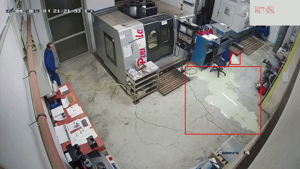

# Workplace Hazard Detection & Housekeeping Analytics

> Transform your facility safety program with AI-powered hazard detection that helps prevent accidents, maintains workplace standards, and ensures OSHA compliance through automated monitoring.

<figure markdown>
  { width="500" }
  <figcaption>Real-time detection of workplace hazards and spills</figcaption>
</figure>

## The Cost of Poor Housekeeping

Workplace hazards and poor housekeeping lead to:

- **95,000** workplace injuries annually due to poor housekeeping
- **$450M** yearly costs from slip and fall accidents
- **30%** of workplace accidents linked to poor housekeeping
- **40%** increase in insurance premiums due to poor safety records

## Comprehensive Hazard Monitoring

  

    <figure markdown>
      { width="300" }
      <figcaption>Oil leak detection</figcaption>
    </figure>
  

  

    <figure markdown>
      { width="300" }
      <figcaption>Water leak monitoring</figcaption>
    </figure>
  

### 1. Spills & Leaks Detection
- Immediate spill identification
- Liquid leak monitoring
- Slippery surface detection
- Quick response activation

### 2. Pathway Monitoring
- Exit blockage detection
- Clean pathway verification
- Unattended object detection
- Traffic flow optimization

### 3. Safety Equipment Monitoring
- Fire extinguisher presence
- Emergency exit accessibility
- Safety signage verification
- Door status monitoring

### 4. Workplace Organization
- Pallet placement monitoring
- Box and container tracking
- Equipment positioning
- Storage area compliance

## Business Benefits

✓ **Accident Prevention**
- Early hazard detection
- Proactive maintenance alerts
- Slip and fall prevention
- Emergency exit compliance

✓ **Cost Reduction**
- Lower insurance premiums
- Reduced cleanup costs
- Minimized downtime
- Decreased liability exposure

✓ **Compliance Management**
- OSHA standard adherence
- Automated documentation
- Audit trail maintenance
- Regular compliance reports

✓ **Operational Efficiency**
- Streamlined inspections
- Automated monitoring
- Quick incident response
- Resource optimization

## Success Story

> "VisionAI's hazard detection system helped us reduce workplace incidents by 45% and improve our safety audit scores by 60%. The automated monitoring has transformed our housekeeping program." 
> 
> *- EHS Director, Global Manufacturing Facility*

## Key Features

| Feature | Detection Capability | Business Impact |
|---------|---------------------|-----------------|
| Spills & Leaks | Real-time liquid detection | Prevent slip and fall accidents |
| Blocked Exits | Exit pathway monitoring | Ensure emergency preparedness |
| Unattended Objects | Object detection in pathways | Maintain workplace organization |
| Missing Safety Equipment | Fire extinguisher monitoring | Ensure safety compliance |
| Door Monitoring | Open/close status tracking | Improve security and climate control |
| Clean Pathway | Obstruction detection | Maintain efficient operations |

## Implementation Process

1. **Facility Assessment**
   - Risk area identification
   - Camera placement planning
   - Custom alert configuration
   - Integration planning

2. **Quick Deployment**
   - Non-disruptive installation
   - System configuration
   - Team training
   - Alert setup

3. **Ongoing Support**
   - 24/7 monitoring capability
   - Regular performance reviews
   - System optimization
   - Compliance reporting

## Learn More

- [Quick Start](../overview/quick-start.md)
- [Camera Placement Guide](../overview/camera-placement-guide.md)
- [Supported Scenarios](../overview/scenarios.md)
- [Camera Management](../overview/cameras.md)
- [FAQs](../overview/faqs.md)

---

## Contact Information

    

        <h3>contact_phone Sales Inquiries</h3>
        
Get in touch with our sales team for demos and pricing information.

        <ul class="contact-list">
            <li>Email: <a href="mailto:sales@visionify.ai">sales@visionify.ai</a></li>
            <li>Phone: +1 720-449-1124</li>
        </ul>
    

    

        <h3>support_agent Technical Support</h3>
        
Need help? Visit our support portal or contact our technical team.

        <ul class="contact-list">
            <li><a href="https://support.visionify.ai">https://support.visionify.ai</a></li>
            <li><a href="mailto:support@visionify.ai">support@visionify.ai</a></li>
        </ul>
    

    

        <h3>calendar_month Schedule a Demo</h3>
        
See VisionAI in action with a personalized demo from our team.

        

            <a href="https://cal.com/visionify/30min" class="cta-button">
                event
                Book Your Demo
            </a>
        

    

---