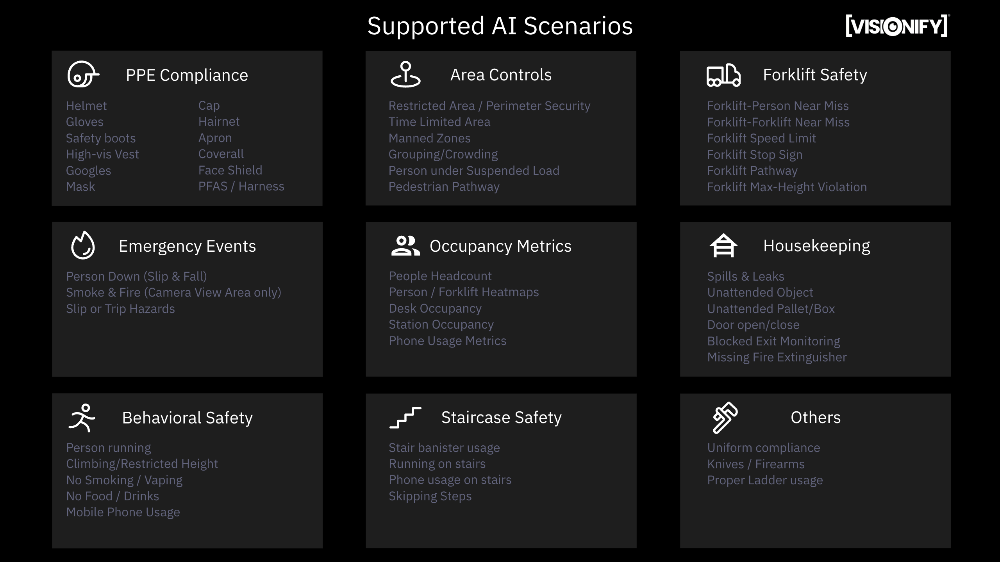
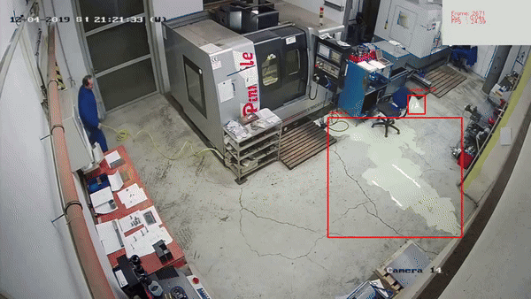
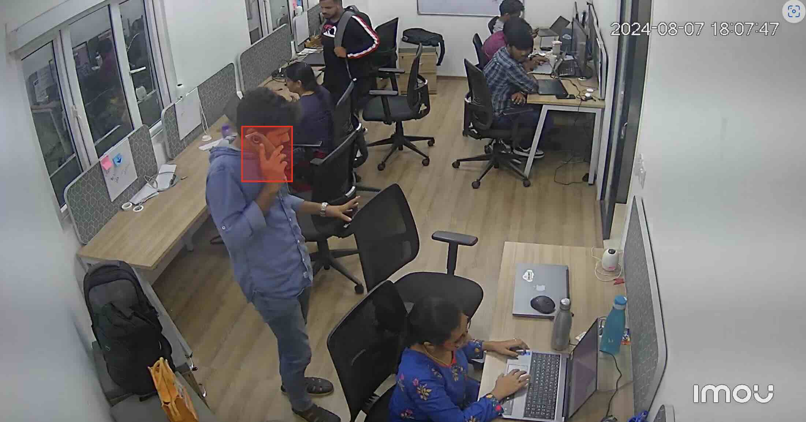

# Scenarios

Scenarios (also referred to as `use cases`) form the building blocks of VisionAI platform. These scenarios are organized into `Suites`. Below we talk about different suites and the scenarios that are part of them.

- All scenarios are available as pick-n-choose scenarios. You can pick the scenarios you want based on your business needs. Each scenario is independently tested.
- Some scenarios require zones to be defined - you can define zones through the VisionAI web-application.
- Events provided by these scenarios are given below. Events are sent to Redis, MQTT & WebSocket endpoints for custom integrations.
- Currently supported scenarios are highlighted by a ✅. Roadmap scenarios are highlighted by a 📅.

Below image also provides a summary of all the scenarios that are supported by VisionAI.

!!! note "New scenario request"
    This chapter lists down all the scenarios that are supported by the VisionAI platform. We are always looking to expand our suite - please [send a request](https://support.visionify.ai) to us about any additional scenarios you need.

---

## PPE Compliance

PPE Compliance is our core application. We support most of the common types of PPEs used in manufacturing & construction industry. This suite is sometimes also referred to by `Worker Health and Safety`.

PPE compliance is the first step towards a comprehensive safety program. Workers sometimes forget to wear PPEs like helmets, gloves, safety boots, high-vis vests, goggles, masks, coveralls etc., due to lack of awareness or complacency. PPE Compliance helps you ensure that workers are wearing the required PPEs.

Ensuring PPE Compliance can yield significant benefits. It can help reduce the number of accidents and injuries in the workplace, improve productivity, and enhance the overall safety culture of the organization.

**Table: PPE Compliance Events and Detection Details**

| Status | Scenario name | Supported Events | Event Details | More Info |
| :----: | :------------ | :--------------- | :------------------------ | :------------------------ |
| ✅ | PPE Compliance | `No Helmet` | Person detected without helmet  | [PPE Compliance](../scenarios/ppe-detection.md){:target="blank"} |
|    |                | `No Gloves` | Person detected without gloves  |  |
|    |                | `No Safety Boots` | Person detected without safety boots  |  |
|    |                | `No High-Vis Vest` | Person detected without high-vis vest  |  |
|    |                | `No Goggles` | Person detected without goggles  |  |
|    |                | `No Mask` | Person detected without mask  |  |
|    |                | `No Cap` | Person detected without cap  |  |
|    |                | `No Apron` | Person detected without apron  |  |
|    |                | `No Hairnet` | Person detected without hairnet  |  |
|    |                | `No Face Shield` | Person detected without face shield (Welding)  |  |
|    |                | `No Coveralls` | Person detected without coveralls  |  |
|    |                | `No Safety Harness` | Personal Fall Arrest System (PFAS) |  |
|    |                | `No Earmuffs` | Person detected without earmuffs  |  |

---

## Area Controls

Area controls is a core scenario of the VisionAI application. With this scenario - we can enable different area and time related use-cases. Area control scenarios require a zone to be configured for each of the different events.

For example, if we want to setup a Pedestrian Pathway, or create a Man-Machine area that is restricted during certain hours - we can do that with area control scenarios.

Deploying Area Control scenarios requires understanding of the camera area and the type of work performed there. We recommend that you look at the video clips from the camera, and tune the scenario accordingly.

**Table: Area Control Events and Detection Details**

| Scenario name | Supported? | Event |Event Details | More Info |
| :-------------: | -- | :--------------- | :------------------------ | :------------------------ |
| Area Controls | ✅ | `Restricted Area`               | Person in Restricted Area | [More details](../scenarios/area-controls.md){:target="_blank"} |
|                 | ✅ | `Perimeter Control`             | Person in Secure Perimeter |  |
|                 | ✅ | `Time Limited Areas`            | Person in zone for more than X mins |  |
|                 | ✅ | `Confined Space Monitoring`     | Person in confined space for more than X mins |  |
|                 | ✅ | `Min Worker Zone`          | No Person in Mandatory Personnel Zone |  |
|                 | ✅ | `Max Worker Zone`               | Grouping/Crowding detected |  |
|                 | 📅 | `Person under Suspended Load`   | Person under suspended load |  |
|                 | ✅ | `Pedestrian Pathway`            | Person outside of pedestrian pathway |  |
|                 | ✅ | `Person in Vehicle Pathway`     | Person detected in vehicle pathway |  |

---

## Forklift Safety

Visionify's Forklift Safety suite detects near-misses between forklifts & people, forklift-speed limit, and dedicated pathways for forklifts & people. This scenario is useful for areas where forklifts are operated.

Forklift Safety also implements other best practices like Wearning Seatbelts, Stop sign compliance etc.

Our forklift safety suite can be considered as a passive safety system. It does not actively prevent any accidents, but it does help you identify areas that need attention. The goal of the Forklift Safety Suite is to make your team aware of the risks, so you can data driven changes to make your workplace safer.

**Table: Forklift Safety Events and Detection Details**

| Scenario name | Supported? | Event |Event Details | More Info |
| :-------------: | -- | :--------------- | :------------------------ | :------------------------ |
| Forklift Safety | ✅ | `Forklift Person interaction`                | Forklift Person Near-Miss | [More details](../scenarios/forklift-safety.md){:target="_blank"} |
|                 | ✅ | `Forklift Forklift interaction`              | Forklift Forklift Near-Miss |  |
|                 | ✅ | `Forklift Speed Limit`                       | Forklift Speed Limit Violation |  |
|                 | ✅ | `Forklift Stop Sign Compliance`              | Forklift Stop Sign Compliance Violation |  |
|                 | ✅ | `Dedicated Forklift Pathway`                 | Forklift outside of dedicated pathway |  |
|                 | ✅ | `Person in Forklift Pathway`                 | Person in Forklift Pathway |  |
|                 | 📅 | `Forklift Max-height Violation`              | Forklift Max-height Violation |  |
|                 | 📅 | `Forklift with Pins Up`                      | Forklift with Pins Up |  |
|                 | ✅ | `Forklift and People Heatmap`                | Forklift and People Heatmap |  |

---

## Emergency Events

Emergency events detection is critical for workplace safety. This suite focuses on detecting various emergency situations that require immediate attention, such as smoke, fire, slip, trip and falls, any person-down events resulting from exhaustion and heat-stroke. Early detection of these events can help prevent accidents and enable quick response times.

!!! note "Alert Notifications"
    Visionify's system can be configured to send out an alert when any of these emergency events are detected. This alert can be sent as a Text Message, Email or a notification through Microsoft Teams.

**Table: Emergency Events and Detection Details**

| Scenario name | Supported? | Event |Event Details | More Info |
| :-------------: | -- | :--------------- | :------------------------ | :------------------------ |
| Emergency Events | ✅ | `Smoke Event Detected`                | Smoke Event Detected | [More details](../scenarios/smoke-and-fire-detection.md){:target="_blank"} |
|                 | ✅ | `Fire Event Detected`              | Fire Event Detected |  [More details](../scenarios/smoke-and-fire-detection.md){:target="_blank"} |
|                 | ✅ | `Person Down`                       | Slip, trip, fall, or other Person Down Events | [More details](../scenarios/slip-and-fall-detection.md){:target="_blank"} |

---

## Heatmaps and Occupancy Metrics

Occupancy metrics suite provides use-cases for person counting, heatmaps (density maps) of people & forklifts, desk occupancy, station occupancy and mobile phone usage metrics. 

Visionify's occupancy metrics suite can be used with the rest of our suite to enable different compliance policies or collect general planning data for your organization.

**Table: Occupancy Metrics Events and Detection Details**

| Scenario name | Supported? | Event |Event Details | More Info |
| :-------------: | -- | :--------------- | :------------------------ | :------------------------ |
| Occupancy Metrics | ✅ | `People Headcount`          | People Headcount | [More details](../scenarios/occupancy-metrics.md){:target="_blank"} |
|                   | ✅ | `People & Forklift Heatmap` | Periodic Heatmap Event |  |
|                   | ✅ | `Desk Occupancy`            | Desk Occupancy |  |
|                   | ✅ | `Station Occupancy`         | Station Occupancy |  |
|                   | ✅ | `Phone Usage Metrics`       | Station Occupancy |  |

---

## Housekeeping

Visionify's Housekeeping Suite provides various hazard identifications on the work floor. These metrics include identifying spills and leaks on the floor, unattended objects, boxes or pallets on the floor, identifying door open/close events, blocked exits monitoring, missing fire-extinguishers etc. 

Housekeeping suite provides organization a second set of eyes for their regular audits. By identifying hazards early, this suite tends to avoid accidents and injuries.

**Table: Housekeeping Events and Detection Details**

| Scenario name | Supported? | Event |Event Details | More Info |
| :-------------: | -- | :--------------- | :------------------------ | :------------------------ |
| Housekeeping      | ✅ | `Spills & Leaks`              | Spills and Leaks | [More details](../scenarios/housekeeping.md){:target="_blank"} |
|                   | ✅ | `Unattended Objects`          | Unattended Objects |  |
|                   | ✅ | `Unattended Pallet/Box`       | Unattended Pallet/Box |  |
|                   | ✅ | `Clean Pathway`               | Clean Pathway |  |
|                   | ✅ | `Blocked Exits`               | Blocked Exits |  |
|                   | ✅ | `Missing Fire Extinguisher`   | Missing Fire Extinguisher Event |  |
|                   | ✅ | `Door Open/Close`             | Door Open/Close Event |  |

---

## Behavioral Safety Suite

Visionify's Behavioral Safety Suite focuses on identifying and correcting unsafe behaviors before they lead to accidents. This suite monitors various behavioral patterns including running in work areas, climbing on equipment or railings, smoking/vaping in prohibited areas, consuming food/drinks in restricted zones, and mobile phone usage in unsafe conditions. 

By detecting these unsafe behaviors early, organizations can provide timely interventions and training to promote safer work practices. The Behavioral Safety suite serves as a proactive tool for safety managers to reinforce safety protocols and maintain workplace discipline.

**Table: Behavioral Safety Events and Detection Details**

| Scenario name | Supported? | Event |Event Details | More Info |
| :-------------: | -- | :--------------- | :------------------------ | :------------------------ |
| Behavioral Safety | ✅ | `Running Detection`              | Person running in work area | [More details](../scenarios/mobile-phone-compliance.md){:target="_blank"} |
|                   | ✅ | `Climbing Detection`            | Person climbing on equipment/railings |  |
|                   | ✅ | `Smoking/Vaping Detection`      | Person smoking or vaping in prohibited area |  |
|                   | ✅ | `Food/Drinks Detection`         | Person with food/drinks in restricted area |  |
|                   | ✅ | `Mobile Phone Usage`            | Person using phone in unsafe conditions |  |

---

## Staircase Safety

Visionify's Staircase Safety Suite focuses on preventing accidents and injuries in one of the most common yet hazardous areas of any facility - staircases. This suite monitors various unsafe behaviors including failure to use handrails, running on stairs, using mobile phones while climbing/descending, and skipping steps. These behaviors are leading causes of workplace accidents, often resulting in serious injuries.

By identifying these risky behaviors in real-time, organizations can take proactive measures to prevent staircase-related incidents. The suite helps safety managers enforce proper staircase usage protocols and create awareness about safe staircase practices among employees.

<!--  -->

**Table: Staircase Safety Events and Detection Details**

| Scenario name | Supported? | Event |Event Details | More Info |
| :-------------: | -- | :--------------- | :------------------------ | :------------------------ |
| Staircase Safety | ✅ | `No Bannister Usage`              | Person not holding handrail while using stairs | [More details](../scenarios/staircase-safety.md){:target="_blank"} |
|                   | ✅ | `Running on Stairs`              | Person running on staircase |  |
|                   | ✅ | `Phone Usage on Stairs`          | Person using mobile phone while on stairs |  |
|                   | ✅ | `Skipping Steps`                 | Person skipping steps while using stairs |  |

---

## Employee Privacy (Face Blurring)

For a majority of organizations - employee privacy is a top concern. Along with employee privacy, the organization needs to make sure that any data does not leave the premises. Any faces detected through Vision AI system need to be blurred, along with text, signage, computer screens and other sensitive information.

Before any other scenarios are run, or before we store or process the images - the images are pre-processed through this privacy suite. As such, privacy suite is treated differently from other scenarios. Below examples provide a high-level overview of the privacy suite.

**Table: Privacy Suite Events and Detection Details**

| Status | Scenario name | Details | Details |
| :----: | :------------ | :--------------- | :------------------------ |
| ✅ | `face-blurring` | Blur any faces detected | [More details](../reference/privacy.md){:target="_blank"} |
| ✅ | `text-blurring` | Blue any text detected (paper, computer screens etc) | |
| ✅ | `license-plate-blurring` | Blur any license plates detected | |
| 📅 | `signs-blurring` | Blur any signs detected | |
| 📅 | `obstructed-camera` | If camera feed is obstructed, send an alert |  |

---

## Company Policies

Company policies include specific scenarios that are relevant to your company. These could include scenarios like no-smoking/no-vaping zones, no food or drinks in certain areas, or no cell phones/pictures in certain areas. Some of these scenarios overlap with [occupancy metrics](#heatmaps-and-occupancy-metrics), but they are still useful to have here as separate scenarios.

**Table: Company Policies Events and Detection Details**

| Status | Scenario name | Supported Events | Details |
| :----: | :------------ | :--------------- | :------------------------ |
| 📅 | `no-food-or-drinks-allowed`  | `Person with food detected`   `Person with drinks detected`   `Spill event detected` | [More details](../scenarios/no-food-or-drinks.md){:target="_blank"} |
| 📅 | `no-phone-text-pictures`     | `Cellphone usage detected`   `Person detected taking pictures` | [More details](../scenarios/mobile-phone-compliance.md){:target="_blank"} |
| ✅ | `no-smoking-or-vaping`       | `Smoking event detected`   `Vaping event detected` | [More details](../scenarios/no-smoking.md){:target="_blank"} |
| 📅 | `no-children-pets-visitors`  | `Children detected`   `Pets detected`   `Visitors detected` | [More details](../scenarios/authorized-personnel.md){:target="_blank"} |

---
## Suspicious Activity detection

Suspicious activity detection suite includes knives & firearms detection, graffitti & vandalism detection etc.

**Table: Suspicious Activity Events and Detection Details**

| Status | Scenario name | Supported Events | Details |
| :----: | :------------ | :--------------- | :------------------------ |
| 📅  | `vandalism-graffiti`  | Vandalism or Graffiti detected |[More details](../scenarios/vandalism.md){:target="_blank"} |
| ✅  | `firearms-knives`     | Firearm or Knife detected` | [More details](../scenarios/firearms-and-knives.md){:target="_blank"} |

---

## Next Steps

- [Quick Start](../overview/quick-start.md)
- [Camera Placement Guide](../overview/camera-placement-guide.md)
- [Supported Scenarios](../overview/scenarios.md)
- [Camera Management](../overview/cameras.md)
- [FAQs](../overview/faqs.md)

---

## Contact Information

    

        <h3>contact_phone Sales Inquiries</h3>
        
Get in touch with our sales team for demos and pricing information.

        <ul class="contact-list">
            <li>Email: <a href="mailto:sales@visionify.ai">sales@visionify.ai</a></li>
            <li>Phone: +1 720-449-1124</li>
        </ul>
    

    

        <h3>support_agent Technical Support</h3>
        
Need help? Visit our support portal or contact our technical team.

        <ul class="contact-list">
            <li><a href="https://support.visionify.ai">https://support.visionify.ai</a></li>
            <li><a href="mailto:support@visionify.ai">support@visionify.ai</a></li>
        </ul>
    

    

        <h3>calendar_month Schedule a Demo</h3>
        
See VisionAI in action with a personalized demo from our team.

        

            <a href="https://cal.com/visionify/30min" class="cta-button">
                event
                Book Your Demo
            </a>
        

    

---