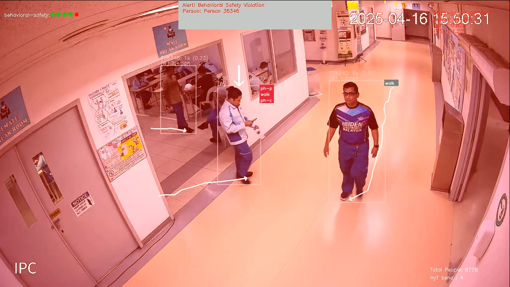

# Mobile Phone Compliance 

> Enabling businesses to overcome digital distractions and misuse of mobile phones at workplaces.

<figure markdown>
  { width="600" }
  <figcaption>Visionify Mobile Phone Usage Detection</figcaption>
</figure>

## Business Challenge

In today's digital workplace, unauthorized mobile phone usage presents significant risks to enterprise security and productivity. From industrial espionage to data breaches, organizations need robust solutions to enforce mobile phone policies and protect sensitive areas.

## The Visionify Solution

Visionify's enterprise-grade computer vision platform delivers automated, real-time detection of unauthorized mobile phone usage across your facilities. By leveraging advanced AI and deep learning technologies, our solution provides:

- **Superior Detection Accuracy**: Up to 92% accurate detection of mobile phone usage, significantly outperforming traditional surveillance methods
- **Immediate ROI**: Seamless integration with existing security camera infrastructure, eliminating the need for additional hardware investment
- **Enterprise-Scale Deployment**: Proven deployment across multiple facilities and thousands of cameras
- **Real-Time Alerts**: Instant notification system for security teams when violations occur
- **Compliance Support**: Comprehensive audit trails and reporting to support regulatory requirements

## Enterprise Benefits

    

        <h3>Enhanced Security</h3>
        <ul>
            <li>Prevent unauthorized documentation of sensitive information</li>
            <li>Protect intellectual property and trade secrets</li>
            <li>Reduce risks of industrial espionage</li>
        </ul>
    

    

        <h3>Operational Excellence</h3>
        <ul>
            <li>Automate compliance monitoring across facilities</li>
            <li>Reduce manual security oversight costs</li>
            <li>Improve workplace productivity</li>
        </ul>
    

    

        <h3>Risk Management</h3>
        <ul>
            <li>Support regulatory compliance requirements</li>
            <li>Maintain audit trails for investigations</li>
            <li>Reduce liability exposure</li>
        </ul>
    

    

        <h3>Enterprise-Ready Architecture</h3>
        <ul>
            <li>Edge-based processing for minimal network impact</li>
            <li>Flexible deployment options (cloud, on-premise, hybrid)</li>
            <li>Enterprise-grade security and encryption</li>
            <li>High availability and failover support</li>
        </ul>
    

## Implementation Process

1. **Assessment**: Review of existing camera infrastructure and compliance requirements
2. **Deployment**: Rapid integration with existing security systems
3. **Configuration**: Customization of detection parameters and alert protocols
4. **Training**: Security team orientation and system management training
5. **Support**: Ongoing technical support and system optimization

## Privacy and Compliance

Our solution is designed with enterprise privacy requirements in mind:
- Data processing compliant with GDPR and other privacy regulations
- No personal data storage
- Configurable privacy zones
- Role-based access control

## Enterprise Support

- 24/7 technical support
- Dedicated account management
- Regular system updates and improvements
- Custom integration services available

## Custom Enterprise Solutions

For organizations requiring customized solutions, Visionify offers:

- Custom model training for specific use cases
- Integration with existing enterprise systems
- Custom reporting and analytics
- Extended support packages

## Next Steps

- [Quick Start](../overview/quick-start.md)
- [Camera Placement Guide](../overview/camera-placement-guide.md)
- [Supported Scenarios](../overview/scenarios.md)
- [Camera Management](../overview/cameras.md)
- [FAQs](../overview/faqs.md)

---

## Contact Information

    

        <h3>contact_phone Sales Inquiries</h3>
        
Get in touch with our sales team for demos and pricing information.

        <ul class="contact-list">
            <li>Email: <a href="mailto:sales@visionify.ai">sales@visionify.ai</a></li>
            <li>Phone: +1 720-449-1124</li>
        </ul>
    

    

        <h3>support_agent Technical Support</h3>
        
Need help? Visit our support portal or contact our technical team.

        <ul class="contact-list">
            <li><a href="https://support.visionify.ai">https://support.visionify.ai</a></li>
            <li><a href="mailto:support@visionify.ai">support@visionify.ai</a></li>
        </ul>
    

    

        <h3>calendar_month Schedule a Demo</h3>
        
See VisionAI in action with a personalized demo from our team.

        

            <a href="https://cal.com/visionify/30min" class="cta-button">
                event
                Book Your Demo
            </a>
        

    

---