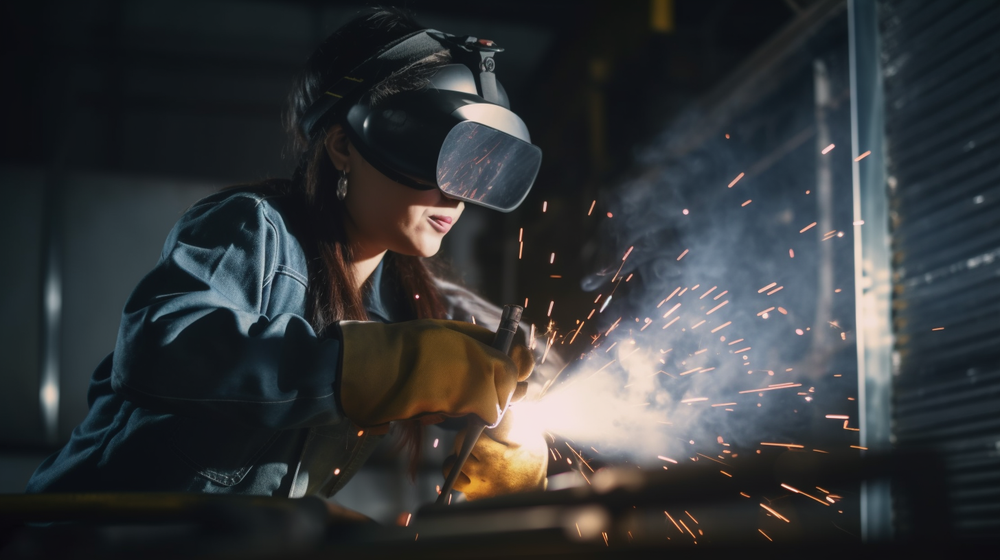
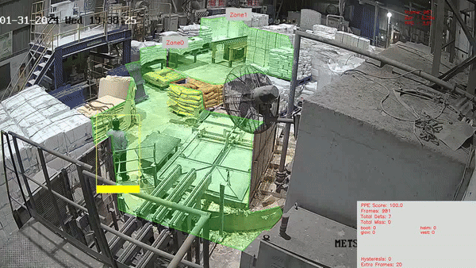

# **PPE Detection**

> Transform Workplace Safety with Intelligent Vision AI Solutions from Visionify

<figure markdown>
  { width="600" }
  <figcaption>Visionify PPE Compliance Solution</figcaption>
</figure>

## Business Impact

In 2021, workplace injuries resulted in over $167 billion in costs to businesses, with a significant portion attributed to PPE non-compliance. Our Vision AI solution helps organizations:

- **Reduce Liability**: Protect your organization from legal damages and worker compensation claims
- **Maintain Productivity**: Prevent accidents that lead to downtime and reduced output
- **Ensure Compliance**: Achieve 24/7 automated monitoring of PPE requirements
- **Protect Workforce**: Safeguard your most valuable asset - your employees

## Solution Overview

Visionify's PPE Compliance Solution leverages advanced AI to monitor and enforce safety equipment requirements in real-time. Our system integrates with your existing camera infrastructure to provide:

<figure markdown>
  { width="600" }
  <figcaption>PPE Compliance Sample Event</figcaption>
</figure>

### Comprehensive Detection

- ✓ Helmets & Hard Hats
- ✓ Safety Gloves
- ✓ Protective Eyewear
- ✓ High-Visibility Vests
- ✓ Safety Footwear
- ✓ Face Masks & Shields
- ✓ Fall Protection Equipment

<figure markdown>
  { width="600" }
  <figcaption>Configure PPE compliance with Zones</figcaption>
</figure>

### Enterprise-Grade Features

- **Real-Time Monitoring**: Continuous surveillance across all shifts and locations
- **Instant Alerts**: Immediate notifications when violations are detected
- **Compliance Reporting**: Detailed analytics and trends for safety management
- **Multi-Site Support**: Centralized monitoring across facilities
- **Custom Integration**: APIs and webhooks for your existing safety systems

## Implementation Benefits

1. **Rapid Deployment**
      - Uses existing security cameras
      - Edge-based processing for minimal IT overhead
      - Quick setup and configuration

2. **Proven Reliability**
      - Trained on 100,000+ real-world images
      - Optimized for various environments and lighting conditions
      - Industry-leading accuracy rates

3. **Cost-Effective**
      - Reduces manual monitoring needs
      - Prevents costly accidents and violations
      - Scalable pricing based on deployment size

## Industry Applications

- Manufacturing & Industrial
- Construction Sites
- Warehousing & Logistics
- Oil & Gas Facilities
- Mining Operations
- Food Processing Plants

## Success Metrics

- Up to 85% reduction in PPE-related incidents
- 90% decrease in manual safety monitoring costs
- Average ROI within 6-8 months of deployment

## Events Supported

**Table: PPE Compliance Events and Detection Details**

| Status | Scenario name | Supported Events | Event Details | More Info |
| :----: | :------------ | :--------------- | :------------------------ | :------------------------ |
| ✅ | PPE Compliance | `No Helmet` | Person detected without helmet  |  |
|    |                | `No Gloves` | Person detected without gloves  |  |
|    |                | `No Safety Boots` | Person detected without safety boots  |  |
|    |                | `No High-Vis Vest` | Person detected without high-vis vest  |  |
|    |                | `No Goggles` | Person detected without goggles  |  |
|    |                | `No Mask` | Person detected without mask  |  |
|    |                | `No Cap` | Person detected without cap  |  |
|    |                | `No Apron` | Person detected without apron  |  |
|    |                | `No Hairnet` | Person detected without hairnet  |  |
|    |                | `No Face Shield` | Person detected without face shield (Welding)  |  |
|    |                | `No Coveralls` | Person detected without coveralls  |  |
|    |                | `No Safety Harness` | Personal Fall Arrest System (PFAS) |  |
|    |                | `No Earmuffs` | Person detected without earmuffs  |  |

## Getting Started

1. [Schedule a Demo](https://cal.com/visionify/30min)
2. Review our [Implementation Guide](../overview/quick-start.md)
3. Deploy with our expert support team

---

## Next Steps

- [Quick Start](../overview/quick-start.md)
- [Camera Placement Guide](../overview/camera-placement-guide.md)
- [Supported Scenarios](../overview/scenarios.md)
- [Camera Management](../overview/cameras.md)
- [FAQs](../overview/faqs.md)

---

## Contact Information

    

        <h3>contact_phone Sales Inquiries</h3>
        
Get in touch with our sales team for demos and pricing information.

        <ul class="contact-list">
            <li>Email: <a href="mailto:sales@visionify.ai">sales@visionify.ai</a></li>
            <li>Phone: +1 720-449-1124</li>
        </ul>
    

    

        <h3>support_agent Technical Support</h3>
        
Need help? Visit our support portal or contact our technical team.

        <ul class="contact-list">
            <li><a href="https://support.visionify.ai">https://support.visionify.ai</a></li>
            <li><a href="mailto:support@visionify.ai">support@visionify.ai</a></li>
        </ul>
    

    

        <h3>calendar_month Schedule a Demo</h3>
        
See VisionAI in action with a personalized demo from our team.

        

            <a href="https://cal.com/visionify/30min" class="cta-button">
                event
                Book Your Demo
            </a>
        

    

---
