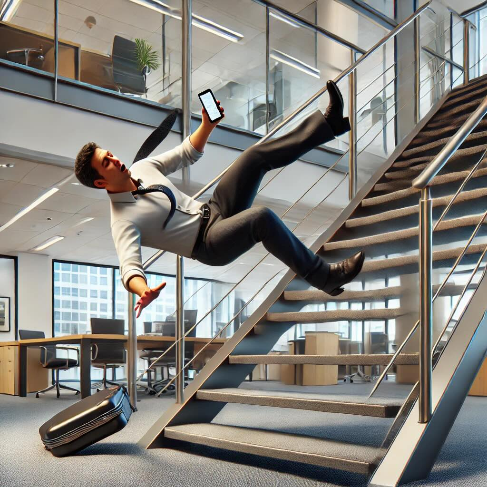

# Staircase Safety

> Slips & Falls from stairs are one of the most common workplace accidents.

<figure markdown>
  { width="450" }<figcaption>Staircase Safety</figcaption>
</figure>

Visionify's Staircase Safety Suite focuses on preventing accidents and injuries in one of the most common yet hazardous areas of any facility - staircases. This suite monitors various unsafe behaviors including failure to use handrails, running on stairs, using mobile phones while climbing/descending, and skipping steps. These behaviors are leading causes of workplace accidents, often resulting in serious injuries.

By identifying these risky behaviors in real-time, organizations can take proactive measures to prevent staircase-related incidents. The suite helps safety managers enforce proper staircase usage protocols and create awareness about safe staircase practices among employees.

---

## Staircase Safety Features

    <h3>Key Detection Capabilities</h3>
    <ul>
        <li>Running on stairs</li>
        <li>Skipping stairs</li>
        <li>Not holding bannister</li>
        <li>Mobile phone usage on stairs</li>
    </ul>

    <h3>Real-Time Announcements</h3>
    
When a violation is detected, real-time speaker announcements are made to alert the individual. We support integration with <a href="https://www.hikvision.com">Hikvision</a> and <a href="https://www.axis.com">Axis</a> IP speakers.

    <h3>Proactive Safety Changes</h3>
    
This proactive approach helps in bringing about safety changes and reducing the risk of staircase-related incidents.

---

**Table: Staircase Safety Events and Detection Details**

| Scenario name | Supported? | Event | Event Details | More Info |
| :-------------: | -- | :--------------- | :------------------------ | :------------------------ |
| Staircase Safety | ✅ | `No Bannister Usage` | Person not holding handrail while using stairs | [More details](../scenarios/staircase-safety.md){:target="_blank"} |
|                   | ✅ | `Running on Stairs` | Person running on staircase |  |
|                   | ✅ | `Phone Usage on Stairs` | Person using mobile phone while on stairs |  |
|                   | ✅ | `Skipping Steps` | Person skipping steps while using stairs |  |

---

## Learn More

- [Quick Start](../overview/quick-start.md)
- [Camera Placement Guide](../overview/camera-placement-guide.md)
- [Supported Scenarios](../overview/scenarios.md)
- [Camera Management](../overview/cameras.md)
- [FAQs](../overview/faqs.md)

---

## Contact Information

    

        <h3>contact_phone Sales Inquiries</h3>
        
Get in touch with our sales team for demos and pricing information.

        <ul class="contact-list">
            <li>Email: <a href="mailto:sales@visionify.ai">sales@visionify.ai</a></li>
            <li>Phone: +1 720-449-1124</li>
        </ul>
    

    

        <h3>support_agent Technical Support</h3>
        
Need help? Visit our support portal or contact our technical team.

        <ul class="contact-list">
            <li><a href="https://support.visionify.ai">https://support.visionify.ai</a></li>
            <li><a href="mailto:support@visionify.ai">support@visionify.ai</a></li>
        </ul>
    

    

        <h3>calendar_month Schedule a Demo</h3>
        
See VisionAI in action with a personalized demo from our team.

        

            <a href="https://cal.com/visionify/30min" class="cta-button">
                event
                Book Your Demo
            </a>
        

    

---